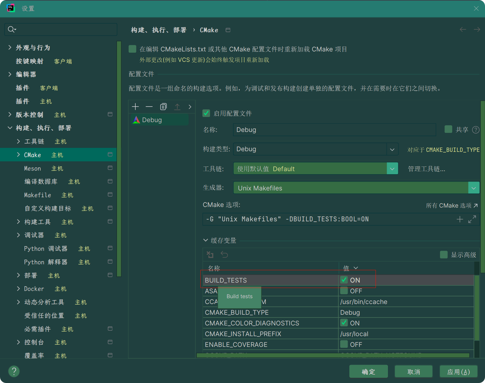

# UBS-Engine
软件定义计算，资源按需组合与分配

# ubs_engine

## 1.项目介绍 Introduction

UBSE(Unified Bus Service Engine,简称UBSE或UBS Engine)提供了ubse daemon程序及其相应的SDK开发库。开发者可以利用该SDK访问ubse daemon提供的服务，从而实现对MEM（内存）等资源的调度与管理，执行关键运维操作。

## 2.目录结构 Contents Structure

```shell
UBSEngine/
├── 3rdparty                    //第三方软件
├── conf                        //配置文件
├── doc                         //文档
├── scripts                     //脚本
├── src                         
│   ├── include                 //全局头文件
│   ├── apiserver               //北向接口暴露
│   ├── cli                     //cli代码
│   │   ├──ubse_cli_framework   //命令注册和结果回显辅助builder类
│   │   └──ubse_cert            //证书相关
│   │   
│   ├── controllers             //控制器
│   │   ├── include             //头文件  
│   │   ├── mem                 //内存池化控制器
│   │   │    ├── algorithm      //mem调度算法
│   │   │    ├── memcontroller  //内存池化控制器---文件
│   │   │    └── memscheduler   //内存池化调度器---文件
│   │   └── node                //内存池化控制器---节点的采集信息
│   │        └── nodecontroller //内存池化控制器---文件
│   │  
│   ├── framwork                //软件框架
│   │   ├── com                 //通信组件，与hcom对接，线程切换，回调
│   │   ├── config              //配置模块
│   │   ├── context             //上下文模块
│   │   ├── event               //事件中心
│   │   ├── ha                  //ha模块
│   │   ├── http                //http组件
│   │   ├── ipc                 //ipc
│   │   ├── log                 //日志组件
│   │   ├── misc                //杂项：智能指针、锁、环形队列、CRC
│   │   ├── plugin_mgr          //插件管理
│   │   ├── security            //安全组件，开源只需提权，商用版本支持使用KMC加解密
│   │   ├── serde               //序列化反序列化
│   │   ├── thread_pool         //线程池操作库，fram自身系统线程池
│   │   ├── timer               //定时器
│   │   └── xml                 //xml解析处理
│   │   
│   ├── message                 //消息
│   ├── node                    //创建数据链路
│   ├── ras                     //故障处理
│   ├── res_plugins
│   │   ├── syssentry           //syssentry对接
│   │   ├── mti                 //lcne对接
│   │   └── mmi                 //内存资源接口
│   │   
│   └── sdk                     //sdk模块
│       ├── include             //sdk的对外接口声明
│       └── sample              //sdk示例
└── test
    ├── IT
    ├── PT
    └── UT
```
阅读各个目录下的 README.md 获取更详细的说明。

## 3.架构 Architecture

UBSE 架构详细介绍请查看：[Architecture](./docs/design/architecture.md)。

## 4.功能 Function

提供了ubse daemon程序及其相应的SDK开发库。开发者可以利用该SDK访问ubse daemon提供的服务，从而实现对MEM（内存）等资源的调度与管理，执行关键运维操作。UBSE 功能介绍详见api介绍。

## 5.使用指南 Getting Started

* 用法指南

* 开发指南

* 用户手册

* 设计文档

<p style="text-align: left; margin-top: 0px; font-family: SimSun; font-size: 16px;">详见产品文档</p>

## 

### 快速入门

#### 1.开发前准备工作

#### 1.1 环境安装

根据ubs_engine 运行的硬件要求、操作系统和软件要求进行环境安装。

#### 1.2 源代码下载

```shell
git clone https://gitee.com/openeuler/ubs-engine.git
```

#### 2.构建项目

**推荐**：在 openEuler Linux (ARM64) 下执行项目构建

```shell
# 下载项目依赖的三方包（目前只支持 ARM64 版本的三方包）
bash build.sh 3rdparty

# 执行 Release 构建（没有调试信息，-O2 优化）
bash build.sh

# 执行 Debug 构建（附加调试信息）
bash build.sh -D

# 执行 RelWithDebInfo 构建（附加调试信息，-O2 优化）
bash build.sh -T RelWithDebInfo

# 执行 MinSizeRel 构建（没有调试信息，二进制文件最小构建，-Os 优化）
bash build.sh -T MinSizeRel
```
详见 [构建指导](./docs/build_install/构建指导.md)。

#### 3.打包项目

```shell
# 构建项目，并打包成 rpm 文件输出到项目顶层目录的 output/ 下。
bash build.sh package
```

#### 4.开发项目 

#### 4.1 开发常见问题 

1. 未下载安装第三方库，导致构建失败

```shell
# 构建前确认 deps 目录是否存在，以及对应的三方库是否存在
bash build.sh 3rdparty
```

2. 第三方库未更新，导致构建失败

```shell
# 清空 deps 目录，重新下载最新的第三方库
bash build.sh 3rdparty -c
```

3. 搞不懂构建类型，找不准构建产物

<p style="text-align: left; margin-top: 0px; font-family: SimSun; font-size: 16px;">参考上节的《构建项目》，清楚不同构建类型的差别：</p>

* Release (默认构建类型，生产不可调试包，代码会被优化，不含调试信息)

* Debug (调试包，代码不会应用任何优化，包含调试信息)

* RelWithDebInfo (生产调试包，代码会被优化，同时包含调试信息)

* MinSizeRel (最小生产包，生成最小的二进制，不含调试信息)

<p style="text-align: left; margin-top: 0px; font-family: SimSun; font-size: 16px;">RelWithDebInfo 主要用于 Release 与 Debug 包存在差异导致无法调试时使用该构建调试优化后的代码。
MinSizeRel 主要用于特殊场景，如要求生产包足够小的时候考虑的构建类型。</p>

4. 测试代码都爆红，找不到头文件

<p style="text-align: left; margin-top: 0px; font-family: SimSun; font-size: 16px;">项目默认构建不会包含测试代码，方便项目构建出包，推荐开发时自己打开构建选项 BUILD_TESTS。</p>



#### 4.2 开发者测试

开发者测试包括 IT 和 UT，源码都位于 test 目录下。

```shell
# 构建 IT 和 UT，并且跑 IT 和 UT 测试
bash build.sh test
# 只跑 IT 测试
bash build.sh it
# 只跑 UT 测试
bash build.sh ut
# 只跑部分测试用例
bash build.sh ut -- --gtest_filter="TestRackHttpClient.*:TestRackHttpReq.*"
# 只跑一组测试用例
bash build.sh ut -- --gtest_filter="TestRackHttpClient.*"
# 只跑一个用例
bash build.sh ut -- --gtest_filter="ClientSendSuccessfully"
```

详见 [开发者UT指导](./docs/test/单元测试开发指南.md) 。

<p style="text-align: left; margin-top: 0px; font-family: SimSun; font-size: 16px;"><span style="font-size: 14pt;font-weight: bold"><b>覆盖率报告</b></span></p>

<p style="text-align: left; margin-top: 0px; font-family: SimSun; font-size: 16px;">覆盖率报告生成的前提是单元测试通过率 100%，即如果有失败用例阻断覆盖率报告的生成。</p>

> <p style="margin-top: 0px; font-family: SimSun; font-size: 16px;">针对模块的单元测试，因为不直接接入流水线，方便模块测试快速覆盖，故放开覆盖率报告的限制，即使存在失败用例也会生成覆盖率报告。</p>

```shell
# 生成覆盖率报告，cmake-build-debug/coverage 下
bash build.sh ut -C

# 模块测试也可生成覆盖率报告，位置一致
bash build.sh rack_http_ut -C
```

<p style="text-align: left; margin-top: 0px; font-family: SimSun; font-size: 16px;">为了方便直接查看覆盖率报告，添加 <code>-H</code> 参数直接后台启动 HTTP 服务器，成功启动服务器后会打印覆盖率报告的 URL，在浏览器打开该 URL 即可访问覆盖率报告。</p>

> <p style="margin-top: 0px; font-family: SimSun; font-size: 16px;">注意：</p>
> <p style="margin-top: 0px; font-family: SimSun; font-size: 16px;">因为 cmake 自定义命令对后台命令的结束状态判断有问题，导致启动 HTTP 服务器时，cmake 命令没法退出，这时手动 Ctrl+C 退出即可，服务器依旧会在后台运行。</p>

<p style="text-align: left; margin-top: 0px; font-family: SimSun; font-size: 16px;">补充细节：HTTP 服务器会在每台机器上只创建一次，不会重复创建，也不用担心端口占用。</p>

```shell
# 后台启动 HTTP 服务器，将打印覆盖率报告的 URL
bash build.sh ut -C -H
```

### 

高级技巧

```shell
# 只构建测试，不执行
bash build.sh ut --skip-run-tests
```
