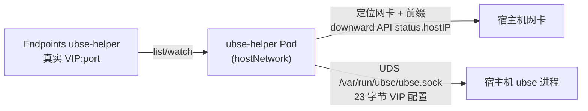

# ubse-helper 部署说明（Kubernetes）

## 1 概述

ubse-helper 是容器化 VIP（虚拟 IP）访问 helper，以 DaemonSet 方式在 Kubernetes 集群的每个节点上运行，监听 Endpoints 中维护的 VIP 真源，按节点主机 IP 定位承载网卡与掩码前缀，再经 Unix Domain Socket（UDS）将 VIP 配置注入宿主机上的 ubse 进程。

数据流如下：



关键特征：

- 以 `hostNetwork: true` 运行，直接使用宿主机网络命名空间，枚举宿主机网卡、共享 UDS socket 目录。
- Service、Endpoints、DaemonSet 三者同名，均为 `ubse-helper`（由 `fullnameOverride` 强制）。
- 容器运行用户 uid/gid 由 `helper.uid`/`helper.gid` 指定（默认 983），**必须与宿主机 ubse 用户的 uid/gid 对齐**，否则无法读写 0660 权限的 UDS socket。
- Endpoints 由 Chart 直接创建，`endpoints.addresses` 为必填项（为空时 `helm install` 模板渲染直接失败），VIP 端口复用 `service.port`（唯一端口真源，避免双处配置漂移）。

## 2 前置条件

部署前需满足以下条件：

| 类别 | 要求 |
| ---- | ---- |
| Kubernetes | 集群已就绪，节点为 openEuler Linux（ARM64）。 |
| 宿主机 ubse | 每个目标节点已安装并运行 ubse（rpm 部署），其 UDS server 监听 socket 路径为 `/var/run/ubse/ubse.sock`。 |
| 用户与目录 | 宿主机 ubse 用户的 uid/gid 须与 `helper.uid`/`helper.gid`（默认 983）对齐（socket 以 0660/ubse:ubse 方式创建）。宿主机 ubse 用户由 rpm 安装脚本动态分配 uid/gid，建议安装时固定：`UBSE_USER_UID=983 UBSE_USER_GID=983 rpm -ivh ubs-engine-*.rpm`；或部署时按节点实际值覆盖 `helper.uid`/`helper.gid`。`/var/run/ubse` 目录存在且 ubse 用户可读写。 |
| 工具 | 部署机已安装 `kubectl`、`helm`（v3）；镜像 tar 包已分发并本地导入到每个节点（无中心仓库）。 |

> 说明：helper 容器以 `helper.uid`/`helper.gid` 指定的用户运行，须与宿主机 ubse 用户的 uid/gid 一致方可读写同一 socket；不一致会导致 VIP 注入失败（connect 报 EACCES），详见 [第 7 章排障](#7-常见问题与排障)。

## 3 交付件

容器化交付产物由 `bash build.sh container` 统一打包，输出至 `output/container/`：

| 产物 | 说明 |
| ---- | ---- |
| `output/container/ubse-helper-<version>.tgz` | Helm Chart 包（version 取自 Chart.yaml，默认 `1.0.0`） |
| `output/container/ubse-helper-<tag>.tar` | 容器镜像包（OCI 格式，`docker load -i` 可导入） |

打包前脚本会清空 `output/container/` 旧产物，避免残留历史版本包。打包命令详见 [构建指导](./构建指导.md#4-打包-helm-chart-与容器镜像)。

## 4 部署流程

### 4.1 导入镜像到各节点

项目无中心镜像仓库，镜像以 tar 包交付，须分发到每个节点后本地导入（DaemonSet 的 `imagePullPolicy` 已设为 `Never`，绝不联网拉取）。

以 containerd 运行时（k8s 默认）为例：

```bash
# 将 tar 包分发到每个节点后，逐节点导入
ctr -n k8s.io images import ubse-helper-1.0.0.tar

# 校验
ctr -n k8s.io images list | grep ubse-helper
```

> 若节点使用 docker 运行时，改用 `docker load -i ubse-helper-1.0.0.tar`。
> 导入后的镜像名须与 `helper.image.repository:tag`（默认 `ubse-helper:1.0.0`）一致。

### 4.2 配置 values.yaml

可复制 [values.yaml](../../deploy/ubse-helper/values.yaml) 为自定义文件并按需修改，重点关注镜像与 Endpoints 真源：

```yaml
helper:
  # 运行 uid/gid 必须与宿主机 ubse 用户对齐，否则 socket 访问报 EACCES
  uid: 983                           # 与宿主 ubse 用户 uid 一致（UBSE_USER_UID）
  gid: 983                           # 与宿主 ubse 组 gid 一致（UBSE_USER_GID）
  image:
    repository: ubse-helper        # 本地镜像名（无 registry 前缀）
    tag: 1.0.0                     # 与导入 tar 包内镜像 tag 一致
    pullPolicy: Never              # 仅用本地导入镜像，不联网拉取
  endpointsName: ubse-helper         # Endpoints 名（与 Service 同名）
  udsDir: /var/run/ubse              # hostPath 挂载目录 + socket 路径前缀

# VIP 真源（必填，addresses 为空时 helm install 直接失败）
endpoints:
  addresses: ["192.168.100.200"]     # 真实 VIP（恰好 1 个 IPv4）
# VIP 端口复用 service.port（默认 10002），无需单独配置
```

### 4.3 安装 Chart

```bash
# 方式一：直接由源码目录安装（开发/调试）
helm install ubse-helper ./deploy/ubse-helper \
  --namespace ubse-system --create-namespace \
  -f my-values.yaml

# 方式二：由交付 chart 包安装（生产）
helm install ubse-helper output/container/ubse-helper-1.0.0.tgz \
  --namespace ubse-system --create-namespace \
  -f my-values.yaml

# 亦可通过 --set 覆盖关键项（不落盘）
helm install ubse-helper ./deploy/ubse-helper \
  --namespace ubse-system --create-namespace \
  --set helper.image.repository=ubse-helper \
  --set helper.image.tag=1.0.0 \
  --set helper.uid=$(id -u ubse) --set helper.gid=$(id -g ubse) \
  --set-json 'endpoints.addresses=["192.168.100.200"]'
```

安装完成后，Chart 将在 `ubse-system` 命名空间创建：

- DaemonSet `ubse-helper`（每个节点一个 Pod）
- Service `ubse-helper`（无 selector，经 Endpoints 承载真实 VIP）
- ServiceAccount、Role（`endpoints` 的 `get/list/watch`）、RoleBinding
- Endpoints `ubse-helper`（`addresses` 必填，为空时安装失败）

### 4.4 配置 VIP 真源

Endpoints 由 Chart 创建，VIP 变更通过修改 `endpoints.addresses` 后 `helm upgrade` 完成：

```bash
helm upgrade ubse-helper ./deploy/ubse-helper \
  --namespace ubse-system \
  --reuse-values \
  --set-json 'endpoints.addresses=["192.168.100.201"]'
```

helper 通过 list/watch 实时感知 Endpoints 变更并重新注入，无需重启 Pod。

### 4.5 验证

```bash
# 查看 DaemonSet 与 Pod 状态
kubectl -n ubse-system get ds ubse-helper
kubectl -n ubse-system get pods -o wide

# 查看 Endpoints 真源
kubectl -n ubse-system get endpoints ubse-helper -o yaml

# 查看 helper 日志（关键日志以 [VIP] 前缀）
kubectl -n ubse-system logs <pod-name> | grep '\[VIP\]'
```

预期关键日志：

```text
[VIP] hostIP=<节点IP> -> iface=eth0 prefix=24
[VIP] pushed vip cfg: addr=192.168.100.200 port=10002 prefix=24 iface=eth0
```

### 4.6 卸载

```bash
helm uninstall ubse-helper -n ubse-system
```

> 卸载会一并删除 Chart 创建的 Endpoints 真源。

## 5 配置项说明

| 配置项 | 默认值 | 说明 |
| ------ | ------ | ---- |
| `nameOverride` | `""` | 名称覆盖前缀 |
| `fullnameOverride` | `ubse-helper` | 强制 Service/Endpoints/DaemonSet 同名（**勿改**） |
| `serviceAccount.create` | `true` | 是否创建 ServiceAccount |
| `serviceAccount.name` | `ubse-helper` | ServiceAccount 名 |
| `rbac.create` | `true` | 是否创建 Role/RoleBinding（`endpoints` 读权限） |
| `service.type` | `ClusterIP` | Service 类型 |
| `service.port` | `10002` | VIP HTTP server 监听端口（与注入 payload.port 对齐；同时作为 Endpoints 端口真源） |
| `helper.uid` | `983` | 容器运行 uid，**必须与宿主机 ubse 用户 uid 对齐**（建议 rpm 安装时 `UBSE_USER_UID` 固定） |
| `helper.gid` | `983` | 容器运行 gid，**必须与宿主机 ubse 组 gid 对齐**（建议 rpm 安装时 `UBSE_USER_GID` 固定） |
| `helper.image.repository` | `ubse-helper` | 本地镜像名（无 registry 前缀） |
| `helper.image.tag` | `1.0.0` | 镜像 tag（与导入 tar 包一致） |
| `helper.image.pullPolicy` | `Never` | 仅用本地导入镜像，不联网拉取 |
| `helper.endpointsName` | `ubse-helper` | 监听/注入的 Endpoints 名 |
| `helper.udsDir` | `/var/run/ubse` | 宿主机 UDS 挂载目录 + socket 前缀 |
| `helper.terminationGracePeriodSeconds` | `30` | 优雅退出时长 |
| `helper.resources` | requests 50m/64Mi, limits 100m/128Mi | 资源配额 |
| `helper.nodeSelector` | 可选 | 按需调度约束 |
| `helper.tolerations` | 可选 | 污点容忍 |
| `endpoints.addresses` | `[]`（必填） | VIP 真源 IPv4 列表（恰好 1 个；为空时 `helm install` 模板渲染直接失败） |

## 6 运行机制与约束

### 6.1 环境变量注入

DaemonSet 通过 downward API 与环境变量注入以下信息：

| 环境变量 | 来源 | 说明 |
| -------- | ---- | ---- |
| `HOST_IP` | `status.hostIP` | 节点主机 IP，helper 据此定位目标网卡 |
| `POD_NAMESPACE` | `metadata.namespace` | 所在命名空间，用于定位 Endpoints |
| `ENDPOINTS_NAME` | values `helper.endpointsName` | 监听/注入的 Endpoints 名，默认 `ubse-helper` |
| `UDS_SOCKET_PATH` | `udsDir + /ubse.sock` | 宿主机 ubse 的 UDS 路径，默认 `/var/run/ubse/ubse.sock` |

缺少 `HOST_IP` 或 `POD_NAMESPACE` 时，helper 启动即失败退出。

### 6.2 Endpoints 契约

helper 对 VIP 真源 Endpoints 有严格契约，满足任一不满足即**不注入**并在日志中报错：

- 恰好 1 个 `subsets`
- 恰好 1 个 IPv4 地址
- 恰好 1 个 port，且 port ∈ [1024, 65535]

### 6.3 心跳重推

helper 以 30s 周期将最近一次有效 VIP 配置重推至宿主机 ubse（幂等），用于 master 重启、绑定丢失后自动恢复；已绑定则 no-op。

### 6.4 安全约束

- 容器以 `helper.uid`/`helper.gid`（默认 983）指定的非 root 用户运行，`allowPrivilegeEscalation: false`、`readOnlyRootFilesystem: true`。
- `runAsNonRoot: true` 强制非 root；uid/gid 须与宿主机 ubse 用户对齐，否则 socket 访问报 EACCES。
- `dnsPolicy: ClusterFirstWithHostNet`，保证 hostNetwork 下仍可解析集群 DNS。
- 仅授予 `endpoints` 资源的 `get/list/watch` 最小权限。

## 7 常见问题与排障

| 现象 | 可能原因 | 处理建议 |
| ---- | -------- | -------- |
| `helm install` 报 `endpoints.addresses is required` | VIP 真源未配置 | 按提示 `--set-json 'endpoints.addresses=["192.168.100.200"]'` 或在 values 文件中填写 |
| 日志 `missing env: HOST_IP/POD_NAMESPACE` | downward API 未注入 | 检查 DaemonSet 模板 env 配置是否被改动 |
| 日志 `locate iface by hostIP ... failed` | `status.hostIP` 无对应 IPv4 网卡 | 确认节点网卡持有该 hostIP 且为 IPv4 |
| 日志 `push vip cfg failed` 且连接报 EACCES | 容器 uid/gid 与宿主 ubse 用户不一致 | 核对宿主 `id -u ubse`/`id -g ubse` 与 `helper.uid`/`helper.gid`，必要时 `helm upgrade` 覆盖或重装 rpm 并固定 `UBSE_USER_UID`/`UBSE_USER_GID` |
| 日志 `push vip cfg failed`（socket 不存在） | 宿主机 ubse 未运行或 UDS 未就绪 | 确认宿主机 ubse 运行、`/var/run/ubse/ubse.sock` 存在且属主为 ubse:ubse |
| 日志 `require exactly 1 IPv4 address` | Endpoints 真源不满足契约 | 确保 Endpoints 恰好 1 个 IPv4 地址 + 1 个 port |
| 日志 `port ... out of range` | port 不在 [1024, 65535] | 修正 Endpoints port |
| 日志 `in-cluster config failed` | SA token 未挂载或 RBAC 缺失 | 确认 `serviceAccount.create` 与 `rbac.create` 为 true |
| Pod 处于 `ImagePullBackOff`/`ErrImageNeverPull` | 节点本地未导入镜像或名称不匹配 | 确认镜像已本地导入，且与 `helper.image.repository:tag` 一致 |