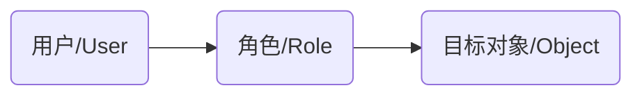
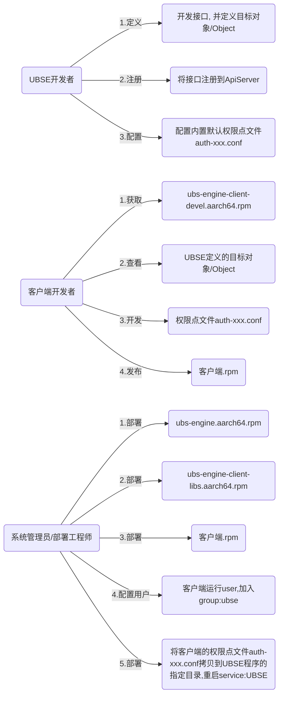
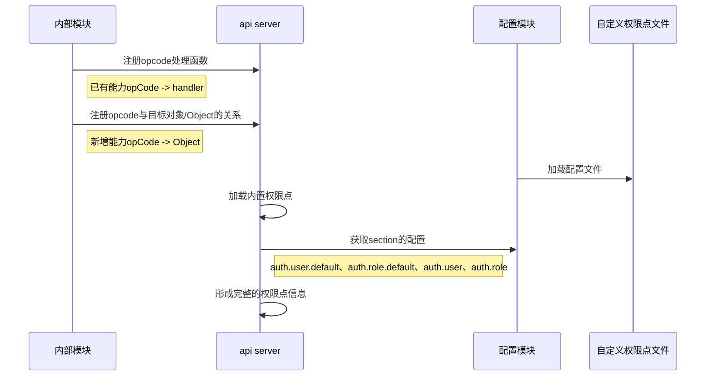
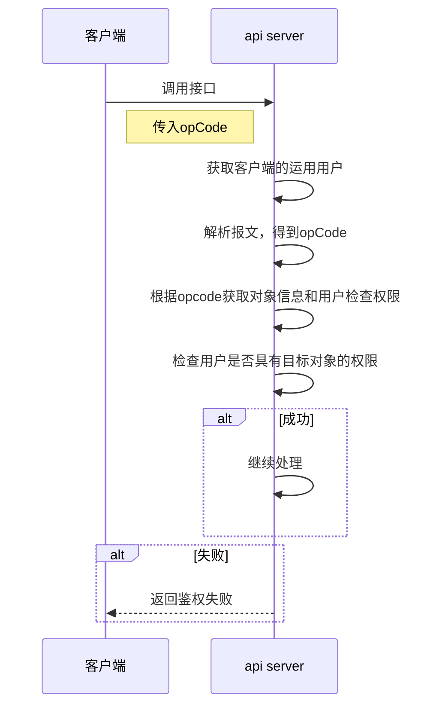

# UBSE角色访问控制设计

## 1. 目标

在整个UB系统中，UBSE为系统提供两种能力：

1. 各种UB池化资源管理能力，如内存池化调度、DPU池化调度等
2. 基于业务感知的性能/资源调优能力

基于安全的考虑，需要对单一外部用户进行权限最小化控制，在UBSE中引入“轻量化角色访问控制（RBAC）能力”

## 2. 设计方案

### 2.1 权限模型元素定义



**用户/User：**表示调用UBSE的接口的客户端，因为UBSE暴露的UDS接口，由UBSE通过OS接口自动获取username或者uid（客户端是容器应用的情况下可能没有username）；单用户/User能且只能绑定一个角色/Role

**角色/Role：**表示用户/User所绑定的角色，每个角色/Role可以绑定多个目标对象/Object

**目标对象/Object：**表示能够被操作的资源对象，表示可以对相应对象完成所有操作（简化系统复杂度，不定义基于对象的动作行为）；资源对象的取值范围，由UBSE开发过程确定，在包ubs-engine-client-devel-<version>-<release>.aarch64.rpm中可以获取

### 2.2 权限模型表达

在UBSE中权限模型通过文件表达，并将记录权限模型的文件称为：**权限点文件**

权限点文件，遵从UBSE配置文件规范，采用linux ini配置格式

```ini
[auth.user]
# Section for definition user-to-role mappings
user_a = role_a

[auth.role]
# Section for definition role-to-object mappings.
role_a = obj_a,obj_b,obj_c
```

### 2.2 系统角色及职责

* **ubse开发者**：指的是UBSE服务端接口开发者，包括UBSE对外接口以及插件对外接口
* **客户端开发者**：指的是接口调用方开发者，比如ubsmd服务



## 3. UBSE能力说明

### 3.1 Object描述

目标对象/Object描述规范: {Object}.{subObject}，举例：mem.fd

UBSE基础能力支持的Object定义查看：ubs-engine-client-devel.aarch64.rpm中文件名为ubs_engine_object_def.h的文件；

```c++
#ifndef UBS_ENGINE_OBJECT_DEF_H
#define UBS_ENGINE_OBJECT_DEF_H

#include <string>
#include <unordered_map>
#include <vector>

static const std::unordered_map<std::string, std::vector<std::string>> ALL_OBJECTS = {
    {"mem.fd",
     {"ubs_mem_fd_create", "ubs_mem_fd_create_with_lender", "ubs_mem_fd_create_with_candidate", "ubs_mem_fd_permission",
      "ubs_mem_fd_get", "ubs_mem_fd_list", "ubs_mem_fd_delete"}},
    {"mem.numa",
     {"ubs_mem_numa_create", "ubs_mem_numa_create_with_lender", "ubs_mem_numa_create_with_candidate",
      "ubs_mem_numa_get", "ubs_mem_numa_list", "ubs_mem_numa_delete"}},
    {"mem.shm",
     {"ubs_mem_shm_create", "ubs_mem_shm_create_with_affinity", "ubs_mem_shm_attach", "ubs_mem_shm_get",
      "ubs_mem_shm_list", "ubs_mem_shm_detach", "ubs_mem_shm_delete", "ubs_mem_shm_fault_get",
      "ubs_mem_shm_fault_register"}},
    {"mem.stat", {"ubs_mem_numastat_get"}},
    {"topo", {"ubs_topo_node_list", "ubs_topo_node_local_get", "ubs_topo_link_list"}}};

#endif // UBS_ENGINE_OBJECT_DEF_H
```

UBSE中插件（如virtagent）提供的Object定义查看：ubs-engine-addon-virtagent-devel.aarch64.rpm中文件名为virtagent_object_def.h的文件

### 3.2 内置权限点

UBSE内置管理员用户：ubse（UBSE进程运行用户）、root

UBSE内置管理员角色admin，用于支持管理员用户授权

UBSE内置all对象，表示所有对象

管理员角色admin，具备all对象的操控权限

内置ubse/root用户、管理员角色admin，均不能被覆盖（客户端定义的权限点文件中，用户ubse/root、角色admin，则配置不生效）

客户端定义的权限点文件中，不能包含内置用户ubse/root，一旦包含则该条配置不生效

客户端定义的权限点文件中，不能包含管理员角色admin，一旦包含则该条配置不生效

客户端定义的权限点文件中，自定义角色不允许引用all对象，一旦配置则不生效

### 3.2 默认权限点文件ubse_auth_default.conf

为了支持典型场景应用，定义默认权限点信息，简化客户端开发复杂度

默认权限点文件中使用独立section（auth.user.default、auth.role.default），与客户端自定义权限点文件的section隔离

```ini
# Default authentication configuration file
# Defines base user-role and role-permission mappings with priority flags.

[auth.user.default]
# Section for default user-to-role mappings.
ubsmd = default_ubsm
ubs-scheduler = default_op
matrixplugin = default_k8s

[auth.role.default]
# Section for default role-to-permission mappings.
default_ubsm = mem.fd,mem.numa,mem.shm,mem.stat,topo
default_op = topo
default_k8s = mem.numa,topo
```

默认权限点文件中的配置，可以被客户端自定义权限点文件的配置覆盖

如果客户端自定义权限点文件，使用auth.user.default、auth.role.default定义权限，则最终结果可能是UBSE默认权限，也可能是客户端定义的权限，因为加载顺序无法保证

如果客户端自定义权限点文件，使用auth.user、auth.role定义权限，则最终结果确定是客户端定义的权限；因为UBSE内部在合并两种section种的配置时，固定采用用户定义section覆盖default section。

## 4. 客户端自定义权限文件

### 4.1 约束

客户端自定义权限文件建议遵从如下规则：

1. 命名：auth-{module}.conf
2. 内容section：`[auth.user]`和`[auth.role]`
3. user、role的定义：不要与其他自定义文件内容重复，重复会相互覆盖
4. 不要尝试修改内置权限点的内容（配置不会生效）

### 4.2. 客户端自定义权限点文件示例

#### 4.2.1 ubsm模块配置文件（auth-ubsm.conf）

```ini
# UBSM-specific authentication configuration file
# Overrides default mappings for the UBSM module, subject to constraints.

[auth.user]
# Section for overriding user-to-role mappings in UBSM context.
# Note: Assigning 'admin' role to any user here will result in no permissions.
ubsm = ubsm_role  # Overrides user 'ubsm' to map to role 'ubsm_role' (cannot be 'admin').

[auth.role]
# Section for overriding role-to-permission mappings in UBSM context.
# Note: Including 'all' in permissions will result in no permissions for the role.
ubsm_role = apia,apib,apic  # Defines permissions 'apia', 'apib', 'apic' for role 'ubsm_role' (cannot include 'all').
```

#### 4.2.2 openstack插件配置文件（auth-virt.conf）

```ini
# UBS Virt-specific authentication configuration file
# Overrides default mappings for the Virt module.

[auth.user]
# Section for overriding user-to-role mappings in Virt context.
nova = nova  # Overrides user 'nova' to map to role 'nova' (subject to constraints).

[auth.role]
# Section for overriding role-to-permission mappings in Virt context.
nova = apia,apib,apic  # Defines permissions 'apia', 'apib', 'apic' for role 'nova'.
```

## 5. 鉴权能力工作时序

### 5.1 启动流程时序



### 5.2 鉴权过程




