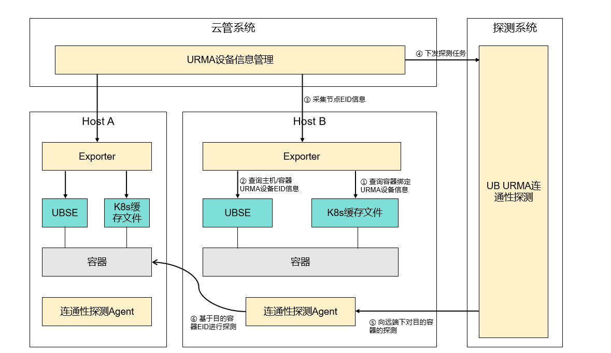

# 容器网络连通性探测

## 1. 方案背景

在传统TCP/IP网络架构中，客户普遍依赖ICMP Ping或TCP端口探测来验证主机与容器间的网络连通性。容器化环境下，运维人员需同时监控两类连通性：主机IP连通性和容器IP连通性，以确保分布式应用的正常运行。当容器通过CNI插件获得虚拟IP后，探测系统会基于IP地址矩阵执行周期性连通性检查，形成网络拓扑健康视图。

随着华为灵衢通算超节点的部署，计算节点间通信从TCP/IP协议栈切换至URMA(Unified Remote Memory Access)直通模式。URMA通过旁路内核协议栈实现微秒级远程内存访问，显著提升跨节点数据交换效率，但同时也改变了连通性验证的范式：IP地址不再是通信端点标识，取而代之的是URMA设备的全局唯一标识符EID
(Endpoint Identifier)，主机/容器通过绑定的URMA设备的EID进行URMA通信

由于URM通信完全脱离传统TCP/IP协议栈，传统Ping工具失效，必须通过专用的urma_ping工具基于EID发起端到端探测。为支撑云管系统执行全网连通性扫描，各节点需主动上报两类EID信息：

- 主机EID: 节点自身URMA设备的全局EID标识;

- 容器EID: 容器内直通的URMA设备的全局EID标识

云管采集上述信息后，探测源即可构建完整的“主机-容器”EID映射矩阵，执行跨节点，跨容器的URMA连通性探测，确保超节点网络在微秒级时延要求下仍具备可观测性与故障快速定位能力。

## 2. 方案原理

连通性探测如下：



在上述方案中，需要各层支持：

- 云管系统：支持采集不同节点主机和容器的EID信息，并下发探测任务到探测系统
- 探测系统：支持接收云管下发的探测任务，并将任务下发到对应连通性探测agent，并支持收集探测结果并上报
- 主机节点：
    - 支持采集主机/容器EID信息并上报云管系统
    - 部署连通性探测Agent，响应探测系统下发的探测任务，对目的容器/主机进行连通性探测，并返回探测结果

## 3.UBSE相关能力说明

在容器网络连通性探测方案中，需要UBSE提供主机和容器绑定URMA设备的EID信息查询能力。

### 3.1 主机EID信息查询

针对主机EID查询，需要采用如下命令：

```
$ ubsectl display node
-----------------------------------------------------------------------------------
node            role                   bonding-eid
-----------------------------------------------------------------------------------
compute01(1)    master                 4245:4944:0000:0000:0000:0000:0100:0000
```

输出字段说明：

- node: 节点信息。例：compute01(1)，节点信息由2部分分组成：括号前部分：主机名; 括号内部分：节点的槽位号
- role: 节点在集群中的角色，可选值：[master|standby|agent]
- bonding-eid: 节点bonding配置的eid

### 3.2 URMA设备EID信息查询

针对URMA设备EID查询，需要采用如下命令：

```
$ ubsectl display urma --dev urma_1,urma_2
--------------------------------------------------------------------------------------
urma-name    type   urma-eid    fe1-name   fe2-name   fe1-eid    fe2-eid     status
--------------------------------------------------------------------------------------
urma_1       share   eid0       udma1      udma49      eid1      eid2        active
urma_2       unique  eid3       udma2      udma50      eid4      eid5        inactive
```

输出字段说明：

- urma-name：bonding设备的名称
- type：bonding设备的类型
- urma-eid：bonding设备的Eid
- fe1-name: bonding设备绑定的fe1名称
- fe2-name: bonding设备绑定的fe2名称
- fe1-eid: bonding设备绑定的fe1 Eid
- fe2-eid: bonding设备绑定的fe2 Eid
- status: bonding设备状态

## 4. 参考示例

为便于客户快速构建URMA连通性探测能力，本节提供一个EID信息采集参考脚本。该脚本可自动收集节点级与容器级URMA设备的EID信息，并以Prometheus标准格式输出，供云管系统直接采集和消费。

参考示例路径为[urma_eid_collector.py](../example/urma_eid_collector.py)

### 4.1 脚本部署
在主机侧下载并部署脚本
```
curl -o /usr/local/bin/urma_eid_collector.py https://<your-repo>/urma_eid_collector.py
chmod +x /usr/local/bin/urma_eid_collector.py
```

### 4.2 前置条件检查
软件运行依赖ubsectl和dmidecode命令可以正常执行，并且以root权限运行
```
# 必需命令验证
which ubsectl dmidecode > dev/null || echo "ERROR:ubsectl or dmidecode not found"
```

### 4.3 脚本使用
```
# 基本用法，默认情况下采集结果输出到 /var/log/ub_dev_eid.prom
/usr/local/bin/urma_eid_collector.py # 或者 python3 /usr/local/bin/urma_eid_collector.py

# 脚本支持指定输出路径
/usr/local/bin/urma_eid_collector.py -o /custom/path/ub_dev_eid.prom

# 查看帮助
/usr/local/bin/urma_eid_collector.py -h
```

### 4.4 脚本输出结果说明
采集脚本会生成一个满足Prometheus格式的文件
```
# HELP urma_eid_type URMA device EID information
# TYPE urma_eid_type gauge
urma_eid_type{poduid="",container="",host_uuid="01920156-2022-xxxx-xxxx-xxxxxxxxxxxx",ub_dev="",dev_eid="8424:1234:0000:0000:0000:0000:0000:0000",ip_addr="xx.xx.xx.xx"} 0
urma_eid_type{poduid="96eead6a-0dab-xxxx-xxxx-xxxxxxxxxxxx",container="urmacontainer",host_uuid="01920156-2022-xxxx-xxxx-xxxxxxxxxxxx",ub_dev="",dev_eid="0000:1234:0000:0000:0000:0000:3200:0000",ip_addr="xx.xx.xx.xx"} 1
```

- poduid: K8s Pod的唯一标识（容器场景填充，主机场景为空字符串）
- container: 容器名称（容器场景填充，主机场景为空字符串）
- host_uuid: 主机系统UUID（所以指标相同）
- ub_dev: URMA设备名（主机场景为空字符串，容器场景为实际设备名，如bonding_dev_1）
- dev_eid: URMA设备EID信息
- ip_addr: IP信息（主机场景为kubelet监听IP，容器场景为POD的IP）
- urma_eid_type: EID类型，0表示主机EID，1表示容器EID