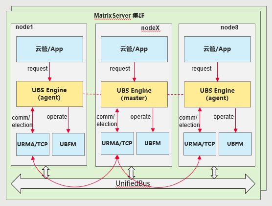
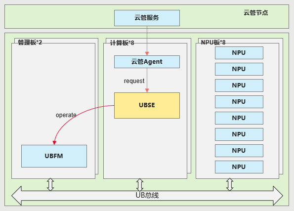
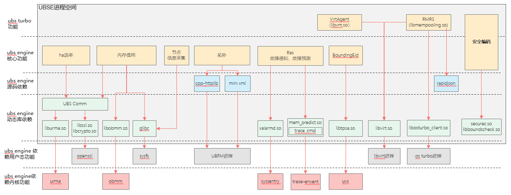
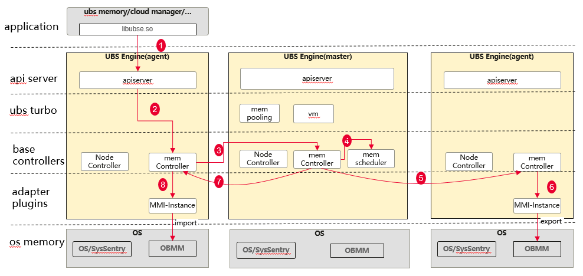
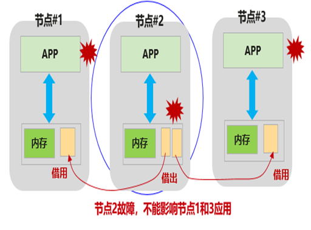
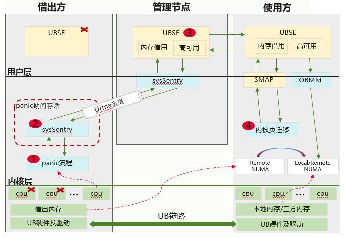
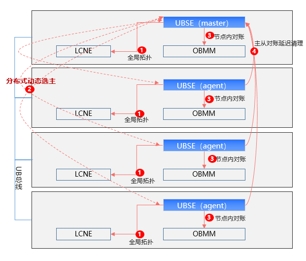
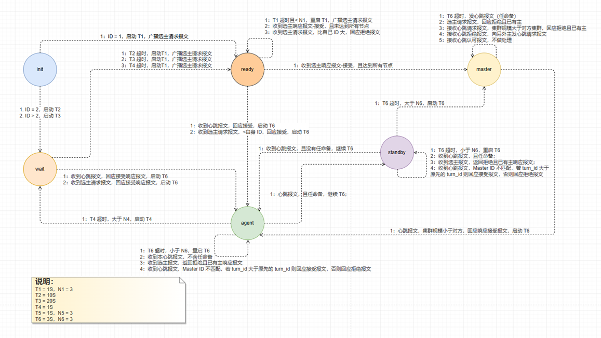
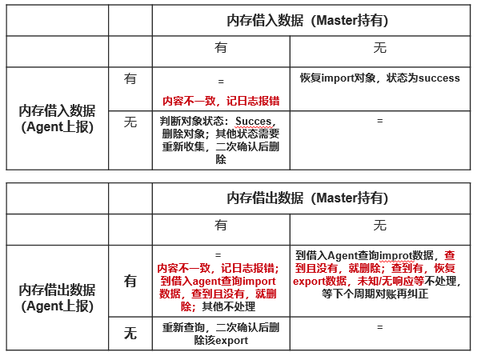
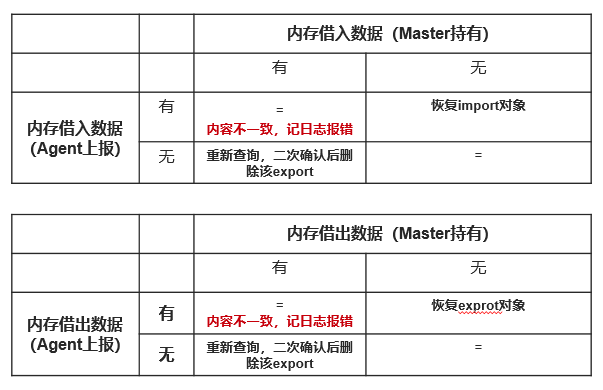

# UBS Engine架构

## 1 软件定位

**①** **池化资源管理：**提供基于负载的池化资源调度能力

- 内存池化借用能力

- DPU池化动态分配管理

- SSU池化分配管理

**②** **UBS Turbo：**基于业务负载，动态调度调优，提升业务性能

- uCache：依托 UB 平等架构内存池化基础能力，将集群节点剩余内存组成全局 IO 缓存池，加速 IO 瓶颈应用，构建基于 UB 的全局 IO 缓存池。

- RMRS：基于集群节点的内存碎片分布，依托内存池化基础能力，将集群内的内存碎片通过内存 借用进行再利用，开启更多虚机，提升资源利用率。

- VirtAgent：基于集群节点内存使用信息，依托内存池化基础能力，将集群内的内存通过内存借 用进行削峰填谷，释放虚拟化竞争力，提升虚拟化资源利用率

**③** **高可用：**超节点业务可靠性与单节点持平

- 软件去中心化，支持N-1节点故障高可用

- 池化资源故障不扩散

**④** **运维管理：**能力标准化，支持生态对接

- 与普罗生态兼容的监控度量

- 部署、巡检、日志等运维能力对接

## 2 软件部署

### 2.1 通算场景部署

均质无中心化部署，提供MatrixServer范围内统一的集群资源管理

北向为上层应用，在各节点提供SideCar接入能力

内部动态选主，数据平滑，资源请求由主节点负责资源调度决策

### 2.2 智算场景部署

单OS域内部署，只需提供单机OS域内的资源管理

北向上层应用各节点SideCar接入

与带外UBFM交互，操控UB资源

## 3 软件模块

- **libubse：**以动态库的方式，提供ubse的资源管理接口，供外部系统对接UBSE
- **ubsectl：**提供命令行功能，供外部系统对接UBSE
- **ubse-daemon：**ubse工作主进程，提供ubse的资源管理核心功能
  - **api server：**为北向系统接入，提供统一接口
  - **ubs turbo：**提供增值的调优能力，当前提供基于内存的调优能力
  - **adv controllers：**负责提供各种与业务强相关的资源管理能力，如NPU、DPU。
  - **base controllers：**提供基础类型（如内存借用归还）的资源管理能力
  - **adapter plugins：**提供各种南向对接能力（如UBFM、DPU-Driver等）

## 4 外部依赖

UBS Engine做为集群/节点UB资源管理系统，依赖系统中的UB功能，需要提前在系统中部署部署相关的功能部件

UBS Engine的依赖关系如下：

## 5 关键业务流程

### 5.1 内存借用归还流程

numa借用、确定性归属借用（FD借用）、Addr借用流程，外部调用一次借用接口，形成完整的借出借入关系

共享内存借用流程差异点：需要外部调用多次调用接口；第一次调用，执行借出；第二次开始的调用，都是执行借入

## 6 可靠性能力

### 6.1 内存池化可靠性

借出节点故障，不能影响借入节点的应用

实现如下场景的故障处理：

- **带外重启方案（BMC执行下电）**

实现对BMC下电命令劫持。该命令劫持时，客户业务暂时未受影响，因此当迁移失败时，可以定位完后，确认回迁后再进行重新下电。

-  **带内重启方案（OS内命令下电/复位）**

实现对OS重启命令劫持。该命令劫持时，借出方的用户态业务已经全部被停止，此时即使迁移失败，也需要继续执行下电/复位操作。

- **计划外（OS Panic）**

实现对Panic命令劫持。该命令劫持时，借出方的用户态业务已经全部被停止，内核进入Panic流程，中断已经被停止并且无法进行内存的申请和释放，此时即使迁移失败，也需要继续执行Panic操作。

OS Panic故障的处理流程：

①**Panic流程：**内核态延迟Panic技术，支持超时防呆能力，超时时间可配置；

②**sysSentry：**广播发送异常信息，且每秒发送一次，支持故障处理的高可用；

③**UBSE：**故障消息去重和处理流程可重入；高性能内存调度能力，调用OBMM完成快速内存借用（借用性能10ms/GB）；

④**内核页迁移：**使用“CPU多核”快速迁移数据（8GB/s，3-4核）；支持核数可配；支持绑定到管理核，消减对应用的影响；

### 6.2 软件可靠性

**①自动拓扑发现：**通过UBM的拓扑发现机制，获取全量节点连接信息

**②分布式动态选举：**基于拓扑信息，打造分布式选举机制，秒级完成选主；异常情况下，6秒级内完成重新选主；基于Urma跨节点转发能力，单链路故障对选举无影响

**③节点内对账（数据一致性）：**构建节点内与OBMM的对账机制，确保进程故障、OBMM故障，资源请求与资源配置的一致性

**④主从对账延迟清理（数据可靠性）：**构建跨节点主从对账机制，确保主备倒换、节点故障，各节点数据一致性；构建数据延迟清理机制，确保集群分裂时跨集群数据不丢失，集群合并跨集群数据合并，对业务运行无影响

#### 6.2.1 软件分布式选举

UBSE在MatrixServer内形成一个分布式系统，考虑到系统故障的在范围和时机上不可控，UBSE通过分布式选举能力解决1~N-1节点/UBSE部件故障问题

以下是对分布式选举能力的关键评价指标：

- **选举正确性：**确保只有一个主节点在任何时间存在，避免出现多个主节点；确保选举过程中遵循优先级规则，高优先级节点最终成为主节点；每个节点的状态应根据选举结果和当前网络状态正确地从 init 转换到 master, standby或 agent
- **选举延迟：**节点开始启动到选举完成并确定主节点的时间；节点接收到选举报文后发出的响应报文的时间
- **系统容错性：**当主节点或其他节点失效时，系统能否快速恢复并选举出新的主节点或其他节点，保证系统的可用性；在网络分区的情况下，系统是否能继续保持一致性和高可用性，避免出现脑裂等问题，或者即使出现脑裂，也能对外服务

如下图，表示UBSE分布式选举的完整状态转换流程：

#### 6.2.2 内存数据对账

- **周期对账：**对账只完成master、agent间的mem controller数据对账，不与OBMM进行周期对账；对账周期为5分钟，不可配置；周期对账时，将该节点集群状态迁移到Smoothing状态，通知mem controller、mem scheduler，禁止新业务接入，从而实现并发控制
- **流程归一化：**“周期对账”、“初始启动对账”，逻辑合一

numa借用、确定性归属借用（FD借用）、Addr借用，详细对账逻辑如下：

- **对账的处理原则：**内存借入方数据以agent（obmm）为准，内存借出方数据以借入方为准。

共享内存借用，详细对账逻辑如下：

- **对账的处理原则：**内存借入/借出都以agent（obmm）为准；单边数据不处理，导出节点故障，保留导入信息；导入节点重启，自动删除导入信息，需要节点上重新import才能使用；要求逐个删除导入，才能最终完成集群ShareMem删除（即导入N次，就要删除N次），才能使用同名，重新创建共享内存

