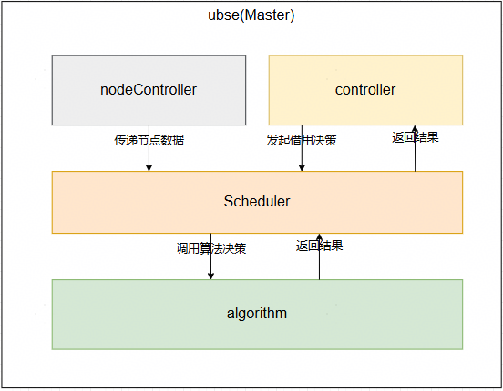
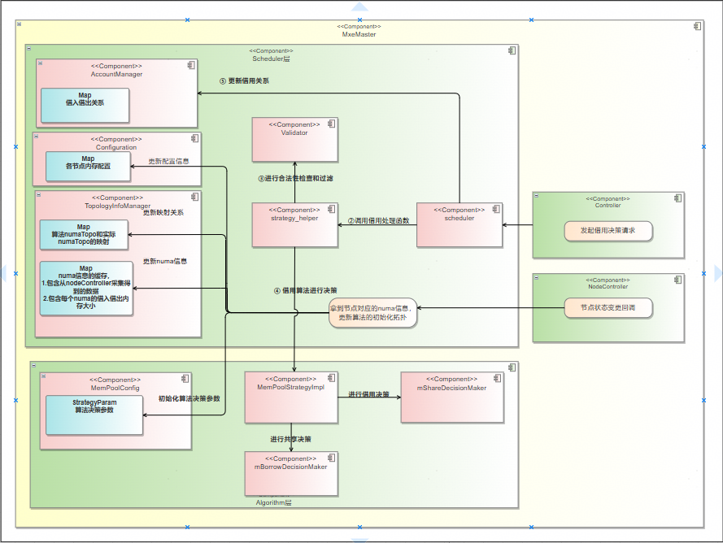
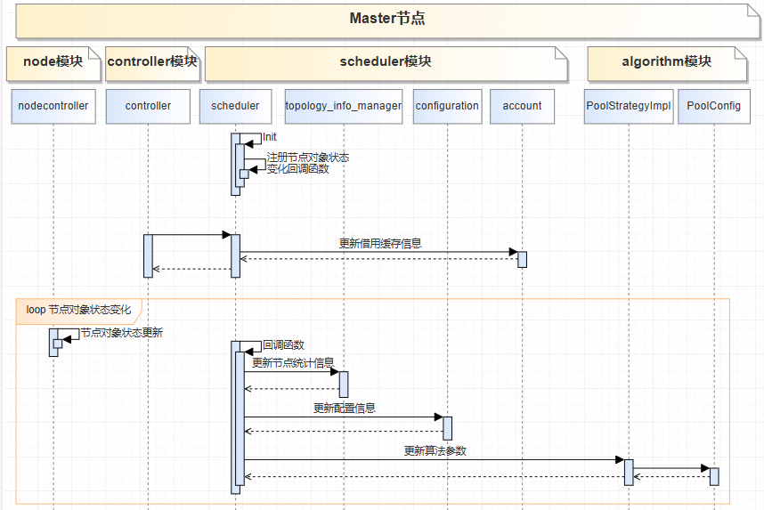
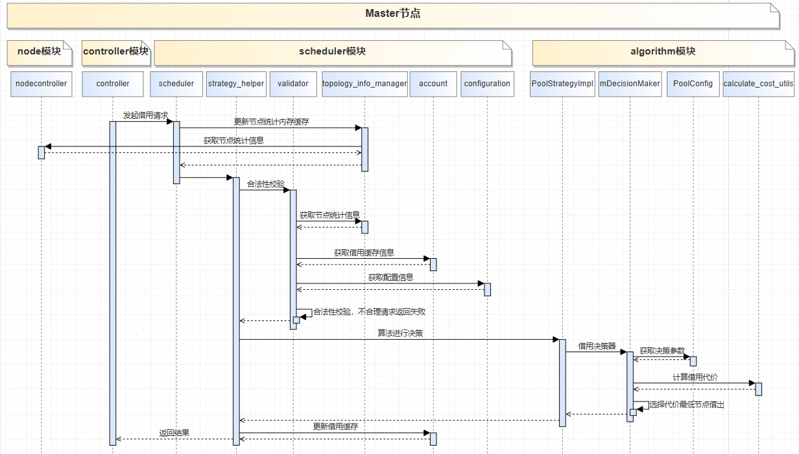
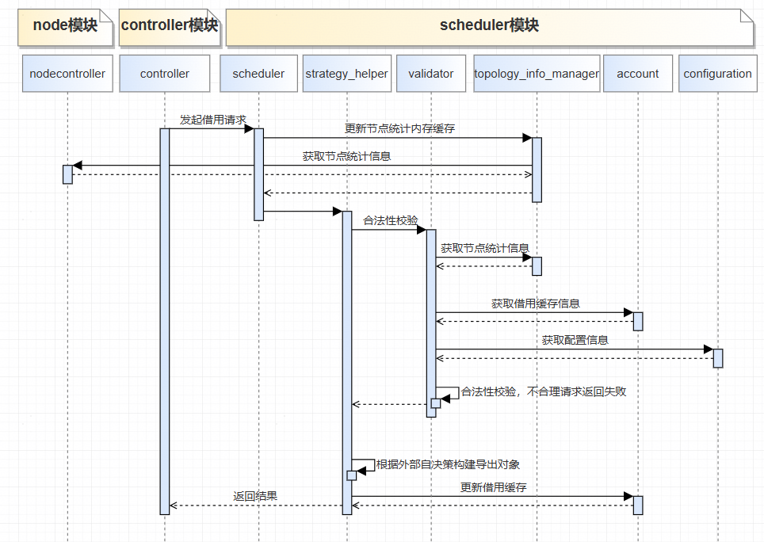

# 内存借用决策原理

## 1 内存借用决策模块的上下文
内存借用决策模块作为核心模块，通过从node模块获取到各节点信息，处理来自controller模块的借用请求。


## 2 内存借用决策模块的设计原则及能力规格

### 2.1 内存借用决策模块设计原则

综合内存借用合理性、可靠性，内存借用决策设计原则如下：

**①原则1**：确保借出节点有可用的内存。
解释：验证借出节点是否有足够的可用内存资源，以避免资源不足导致的借用失败或系统不稳定。

**②原则2**：节点下线、故障节点不参与借用。
解释：故障节点或已下线的节点不参与内存借用，以确保借用过程的稳定性和可靠性。

**③原则3**：避免借用成环。
解释：一个节点不能同时作为借入节点和借出节点，以避免形成借用环，导致资源死锁或循环借用问题。

### 2.2 能力规格

**①** 支持Fd、Numa、Addr和Share四种借用方式。
解释：软件支持通过文件描述符（Fd）、NUMA架构（Numa）、确定性迁移（Addr）以及内存共享（Share）四种方式实现内存借用。

**②** 借用决策仅在主节点执行。
解释：借用决策的逻辑仅由主节点负责执行，以确保决策的一致性和效率。

**③** 对外部请求进行严格参数校验。
解释：对所有外部传入的借用请求进行参数校验，确保参数的合理性和合法性，避免无效或错误的借用操作。

**④** Numa和Share支持指定同平面借用
解释：在Numa和Share借用方式中，支持指定从同一平面的socket借出内存，以提高内存访问速度和效率。

**⑤** 支持4K页,2M/1G大页内存借用
解释：软件适配多种内存页类型，包括4K页、2M页和1G页，能够根据底层硬件特性执行对应的内存借用操作。

**⑥** Share借用支持指定共享域共享内存
解释：在Share借用方式中，支持指定共享域，使得同一共享域内的节点可以互相共享内存资源。

**⑦** 支持配置组内借用策略
解释：根据用户配置，软件仅允许同一组内的节点互相借用内存，不同组的节点之间不进行内存借用。

**⑧** 支持配置指定节点专用于借出
解释：根据用户配置，软件可以指定某些节点作为内存借出方，专注于为其他节点提供内存资源。


## 3.内存借用模块分解

### 3.1 模块分解


### 3.2 关键处理流程

### 3.2.1 初始化

scheduler内部会对借用记录和统计信息进行缓存和更新，缓存数据的更新主要可以分为某个节点初始化流程的数据恢复和借用归还等正常流程中的数据更新两大类。 数据更新的流程都是跟对象管理进行交互，对象管理通过状态机进行管理。

在初始化过程中，主要有以下步骤：
1. 注册节点状态变更的回调函数。
2. 利用导入和导出对象，分别恢复借用记录和共享记录。

当节点状态变更时：
1. 更新scheduler模块的配置参数和节点统计信息。
2. 初始化底层算法的参数。

### 3.2.2 标准借用流程

根据标准借用流程图，内存借用决策的标准流程如下：
1. 从controller模块接收内存借用请求 
2. 通过validator模块进行严格的参数验证和过滤 
3. 调用决策算法进行借用决策，根据时延、平衡性等代价指标选出最优借出numa 
4. 更新account模块中的借入借出关系账本信息 
5. 构造借用决策结果并返回给controller模块

### 3.2.3 外部自决策场景

根据外部自决策场景流程图，流程如下：
1. 从controller模块接收内存借用请求
2. 通过validator模块进行严格的参数验证和过滤
3. 根据外部自决策构造导出导入对象
4. 更新account模块中的借入借出关系账本信息
5. 返回结果给controller模块


## 4 内部模块schdeuler模块说明
scheduler模块作为对接controller和node模块，调度接口不对外，主要是内部模块间的交互使用。 封装了与controller模块和node模块的接口

### 4.1 对外接口描述
```angular2html
    /* *
     * @brief   scheduler模块的初始化函数
     * @return uint32_t    0：操作成功；非0：操作失败
     */
    uint32_t Init(); // 主要是注册Node状态变化的回调函数
    
    /* *
     * @brief   Node状态发生变化后的回调函数
     * @param nodeInfo      [IN] 节点相关信息
     * @return uint32_t    0：操作成功；非0：操作失败
     */
    uint32_t UbseMemNodeObjChangeHandler(const ubse::nodeController::UbseNodeInfo &nodeInfo); // 注册给nodeController
    
    /* *
     * @brief   fd借用import对象状态发生变化之后，算法的处理函数
     * @param importObj      [IN]/[OUT] fd类型借用内存导入对象
     * @return uint32_t    0：操作成功；非0：操作失败
     */
    uint32_t UbseMemFdImportObjStateChangeHandler(UbseMemFdBorrowImportObj &importObj);
    
    /* *
     * @brief   fd借用export对象状态变化的处理函数
     * @param exportObj      [IN]/[OUT] addr类型借用内存导出对象
     * @return uint32_t    0：操作成功；非0：操作失败
     */
    uint32_t UbseMemFdExportObjStateChangeHandler(UbseMemFdBorrowExportObj &exportObj);
    
    /* *
     * @brief   numa借用import对象的算法处理函数
     * @param importObj      [IN]/[OUT] numa类型借用内存导入对象
     * @return uint32_t    0：操作成功；非0：操作失败
     */
    uint32_t UbseMemNumaImportObjStateChangeHandler(UbseMemNumaBorrowImportObj &importObj);
    
    /* *
     * @brief   numa借用export对象状态变化的处理函数
     * @param exportObj      [IN]/[OUT] numa类型借用内存导出对象
     * @return uint32_t    0：操作成功；非0：操作失败
     */
    uint32_t UbseMemNumaExportObjStateChangeHandler(UbseMemNumaBorrowExportObj &exportObj);
    
    /* *
     * @brief   shm借用import对象状态变化的处理函数
     * @param importObj      [IN]/[OUT] shm类型借用内存导入对象
     * @return uint32_t    0：操作成功；非0：操作失败
     */
    uint32_t UbseMemShmImportObjStateChangeHandler(UbseMemShareBorrowImportObj &importObj);
    
    /* *
     * @brief   shm借用export对象状态变化的处理函数
     * @param exportObj      [IN]/[OUT] shm类型借用内存导出对象
     * @return uint32_t    0：操作成功；非0：操作失败
     */
    uint32_t UbseMemShmExportObjStateChangeHandler(UbseMemShareBorrowExportObj &exportObj);
    
    /* *
     * @brief   addr借用import对象状态变化的回调函数
     * @param importObj      [IN]/[OUT] addr类型借用内存导入对象
     * @return uint32_t    0：操作成功；非0：操作失败
     */
    uint32_t UbseMemAddrImportObjStateChangeHandler(UbseMemAddrBorrowImportObj &importObj);
    
    /* *
     * @brief   addr借用export对象状态变化的处理函数
     * @param exportObj      [IN]/[OUT] addr类型借用内存导出对象
     * @return uint32_t    0：操作成功；非0：操作失败
     */
    uint32_t UbseMemAddrExportObjStateChangeHandler(UbseMemAddrBorrowExportObj &exportObj);
    
    /* *
     * @brief   主备切换之后，清理算法缓存数据
     * @return void
     */
    void ClearCacheValue();
    
    /* *
     * @brief   节点状态变更的回调函数
     * @param nodeInfo      [IN]/[OUT] 节点信息
     * @return uint32_t    0：操作成功；非0：操作失败
     */
    uint32_t UbseMemNodeObjChangeHandler(const ubse::nodeController::UbseNodeInfo &nodeInfo);
```

### 4.2 内部模块strategy_helper说明
#### 4.2.1 概述
负责提供内存借用决策的算法支持和策略处理功能。该模块作为内存借用决策系统的重要组成部分，为不同借用方式（NUMA、Fd、Share、Addr）提供统一的策略处理接口。

#### 4.2.2 接口描述
```angular2html
    /* *
     * @brief   初始化算法
     * @return uint32_t    0：操作成功；非0：操作失败
     */
    UbseResult Init();
    
    /* *
     * @brief   Fd内存借用处理函数
     * @param req           [IN] fd借用请求参数
     * @param algoResult    [IN]/[OUT] 借用决策结果
     * @param checkMaskCode [IN] 过滤参数
     * @return uint32_t     0：操作成功；非0：操作失败
     */
    UbseResult FdMemoryBorrow(const ubse::mem::obj::UbseMemFdBorrowReq &req, ubse::mem::obj::UbseMemAlgoResult &algoResult, uint64_t checkMaskCode);
    
    /* *
     * @brief   Numa内存借用处理函数
     * @param req           [IN] fd借用请求参数
     * @param algoResult    [IN]/[OUT] 借用决策结果
     * @param checkMaskCode [IN] 过滤参数
     * @return uint32_t     0：操作成功；非0：操作失败
     */
    UbseResult NumaMemoryBorrow(const ubse::mem::obj::UbseMemNumaBorrowReq &req, ubse::mem::obj::UbseMemAlgoResult &algoResult, uint64_t checkMaskCode);
    
    /* *
     * @brief   Share内存借用处理函数
     * @param req           [IN] Share借用请求参数
     * @param algoResult    [IN]/[OUT] 借用决策结果
     * @param checkMaskCode [IN] 过滤参数
     * @return uint32_t     0：操作成功；非0：操作失败
     */
    UbseResult ShareMemoryBorrow(const ubse::mem::obj::UbseMemShareBorrowReq &req, ubse::mem::obj::UbseMemAlgoResult &algoResult, uint64_t checkMaskCode);
    
    /* *
     * @brief   Addr内存借用处理函数
     * @param req           [IN] Addr借用请求参数
     * @param algoResult    [IN]/[OUT] 借用决策结果
     * @param checkMaskCode [IN] 过滤参数
     * @return uint32_t     0：操作成功；非0：操作失败
     */
    UbseResult AddrMemoryBorrow(const ubse::mem::obj::UbseMemAddrBorrowReq &req, ubse::mem::obj::UbseMemAlgoResult &algoResult, uint64_t checkMaskCode);
    
    /* *
     * @brief   用户指定借用处理函数
     * @param req           [IN] 借用请求参数
     * @param algoResult    [IN]/[OUT] 借用决策结果
     * @param checkMaskCode [IN] 过滤参数
     * @return uint32_t     0：操作成功；非0：操作失败
     */
    UbseResult MemoryBorrowAccordingToUserRequest(ReqType &req, ubse::mem::obj::UbseMemAlgoResult &algoResult, uint64_t checkMaskCode);
```

### 4.3 内部模块validator说明
#### 4.3.1 概述
validator是内存借用决策系统中的参数校验和过滤模块，负责对内存借用请求进行严格的参数验证和过滤处理，确保借用操作的合理性和安全性。

#### 4.3.2 关键参数
```angular2html
struct NumaStatus {
    NumaStatus() = default;
    time_t timestamp{}; /* 数据采集的时间，格式：Unix时间戳，单位秒 */
    MemLoc numa{};      /* numa的具体位置，hostId、socketId、numaId 都是必填 */
    uint64_t memTotal{}; /* 本地的内存容量，不包含借入内存、借出内存、共享内存，单位：Byte */
    uint64_t memUsed{}; /* memTotal 中已使用的内存容量，单位：Byte */
    uint64_t memFree{}; /* memTotal 中没有使用的内存容量，单位：Byte */
};

struct NumaLedgerStatus {
    NumaLedgerStatus() = default;
    MemLoc numa{};          /* numa的具体位置，hostId、socketId、numaId 都是必填 */
    uint64_t memBorrowed{}; /* 已借入的内存容量，单位：Byte */
    uint64_t memLent{};     /* 已借出的内存容量，单位：Byte */
    uint64_t memShared{};   /* 提供共享内存的容量，单位：Byte */
};

struct DebtDetail {
    DebtDetail() = default;
    // 每个numa的内存借入账务情况，numa的globalIndex必须与 StrategyParam 的 availNumas 的 index 保持一致；
    // map<int16_t, uint64_t>的key为借出方numa的globalIndex，value为内存借用总量（不包含已经归还的内存，单位：Byte）；
    std::map<int16_t, uint64_t> numaDebts[NUM_TOTAL_NUMA]{};
};

struct UbseStatus {
    UbseStatus() = default;
    NumaStatus numaStatus[NUM_TOTAL_NUMA]; /* 各numa的内存状态, 长度与StrategyParam.numAvailNumas保持一致 */
    NumaLedgerStatus
    numaLedgerStatus[NUM_TOTAL_NUMA]; /* 各numa的借入借出状态, 长度与StrategyParam.numAvailNumas保持一致 */
    DebtDetail debtDetail{};              /* 系统详细借用账本 */
};
```

#### 4.3.2 接口描述
```angular2html
    /* *
    * @brief   初始化节点数据、账本数据
    * @param nodeDatas           [IN] 节点数据
    * @return uint32_t     0：操作成功；非0：操作失败
    */
    UbseMemValidator()
    {
        InitStatus();
    };
    
    /* *
    * @brief   获取节点数据、账本数据
    * @return UbseStatus     节点数据、账本数据
    */
    inline tc::rs::mem::UbseStatus GetUbseStatus()
    {
        return ubseStatus;
    }
    
    /* *
    * @brief   根据过滤逻辑更新节点、账本数据
    * @return UbseStatus     节点数据、账本数据
    */
    UbseResult CheckAndFilterParam();
```

### 4.4 内部模块topology_info_manager说明
#### 4.4.1 概述
UbseMemTopologyInfoManager 是内存借用决策系统中的节点拓扑信息管理模块，负责维护和管理整个系统中所有节点的拓扑结构信息、NUMA信息、节点状态等关键数据，为内存借用决策提供准确的拓扑信息支持。

#### 4.4.2 关键参数
```angular2html
std::vector<NodeData> mNodeDataList;  // 节点数据
std::unordered_map<NodeId, std::shared_ptr<MemNodeInfo>> mNodeIdMap;  // 节点ID到节点数据的map
std::unordered_map<NodeIndex, std::shared_ptr<MemNodeInfo>> mNodeIndexMap;  // 节点数据到算法自规划节点数据的map
NodeIndex mCurNodeIndex;  // 当前节点索引
GlobalNumaIndex mCurGlobalNumaIndex;  // 当前numa索引
std::unordered_map<UbseMemNumaIndexLoc, UbseMemNumaLoc> mNumaLoc2IndexMap;  // numa索引到numa的映射
std::unordered_map<UbseMemNumaLoc, UbseMemNumaIndexLoc> mNumaLoc2IdMap;  // numa到numa索引的映射
```

#### 4.4.3 接口描述
```angular2html
    /* *
     * @brief   初始化节点数据
     * @param nodeDatas           [IN] 节点数据
     * @return uint32_t     0：操作成功；非0：操作失败
     */
    UbseResult NodesInit(const std::vector<strategy::NodeDataWithNumaInfo> &nodeDatas); 
    
    /* *
     * @brief   更新节点socket信息和numa信息
     * @param nodeDatas           [IN] 节点数据
     */
    void UpdataNodeMesgInfo(const std::vector<strategy::NodeDataWithNumaInfo> &nodeDatas);
    
    /* *
     * @brief   算法参数的填充
     * @param strategyParam       [IN]/[OUT] 算法参数
     */
    bool FillStrategyParam(tc::rs::mem::StrategyParam &strategyParam);
```

### 4.5 内部模块configuration说明
#### 4.5.1 概述
configuration是内存借用决策系统中的配置管理模块，负责管理系统运行时的各种配置参数，为内存借用决策提供配置支持。该模块通过统一的接口管理内存借用相关的配置信息，确保系统能够根据用户配置灵活调整行为。

#### 4.5.2 关键参数
```angular2html
struct NodeConfig {
    bool lender;
    UbseAllocator allocator;
    uint32_t blocksize;
    uint32_t pmdMapping;
};

std::unordered_map<std::string, NodeConfig> nodeConfigs;
uint64_t maxBorrowSize{};
uint64_t maxSocketImportSize{};
```
#### 4.5.3 接口描述
```angular2html
    /* *
    * @brief   设置配置参数
    * @param blockSize           [IN] 节点Map信息
    * @return void     
    */
    void SetConfig(const NodeInfoMap &nodeMap);
    
    /* *
    * @brief   检查各节点配置参数是否合法
    * @return bool            true：合法；false：非法
    */
    bool IsConfValid() const;
    
    /* *
    * @brief   获取芯片表项内存拆分粒度大小
    * @param blockSize           [IN]/[OUT] 节点数据
    * @return bool     true：获取成功；false：获取失败
    */
    [[nodiscard]] bool GetBlockSize(uint32_t &blockSize) const;

    /* *
    * @brief   获取Obmmm分配器类型
    * @param allocator           [IN]/[OUT] 分配器
    * @return bool     true：获取成功；false：获取失败
    */
    [[nodiscard]] bool GetObmmAllocator(UbseAllocator &allocator) const;
    
    /* *
    * @brief   获取节点的PmdMapping，控制节点上numa可借出内存比率
    * @param nodeId               [IN] 节点ID
    * @return std::optional<uint32_t>     节点上对应的PmdMapping
    */
    std::optional<uint32_t> GetPmdMapping(const std::string &nodeId) const;
```

### 4.6 内存模块account说明
#### 4.6.1 概述
UbseMemAccount是内存借用决策系统中的借入借出关系缓存管理模块，负责维护和管理内存借用及共享过程中的借入借出关系信息。该模块通过BorrowAccount和ShareAlgoAccount两个核心类来分别处理不同借用方式的账户信息管理。

#### 4.6.2 关键参数
```angular2html
/* 账本ID*/
struct AlgoAccountID {
   std::string requestName;
   std::string nodeId;
   BorrowedType type;
};

/* 账本数据缓存*/
std::map<AlgoAccountID, std::shared_ptr<BaseAlgoAccount>> algoAccountMap{};
```

#### 4.6.3 接口描述
```angular2html
    /* *
    * @brief   更新借用缓存的状态
    * @param name                [IN] 借用名称
    * @param state               [IN] 借用状态
    * @param algoResult          [IN] 借用决策结果
    * @param state               [IN] 借用类型
       */
    static void UpdateAlgoAccountState(const std::string &name, UbseMemState state, const UbseMemAlgoResult &algoResult, BorrowedType type);
    
    /* *
    * @brief   根据借用结果创建账本
    * @param name                [IN] 借用名称
    * @param algoResult          [IN] 借用决策结果
    * @param state               [IN] 借用类型
    * @return std::shared_ptr<BaseAlgoAccount>     账本缓存
    */
    std::shared_ptr<BaseAlgoAccount> CreateAccountByAlgoResult(const std::string &name, const ubse::mem::obj::UbseMemAlgoResult &algoResult, BorrowedType type);
    
    /* *
    * @brief   根据账本ID获取对应账本信息
    * @param algoAccountID       [IN] 借用名称
    * @return std::shared_ptr<BaseAlgoAccount>     账本缓存
       */
    std::shared_ptr<BaseAlgoAccount> GetAlgoAccount(const AlgoAccountID &algoAccountID);
```

## 5 内存模块algorithm模块说明

### 5.1 内部模块MemPoolStrategyImpl说明
#### 5.1.1 模块概述
MemPoolStrategyImpl是内存借用决策系统中的核心算法实现模块，负责具体的内存借用和共享决策逻辑。该模块实现了内存借用决策的完整算法流程，包括参数校验、系统状态初始化、代价计算、决策选择等关键功能。

#### 5.1.2 关键参数
```angular2html
std::unique_ptr<MemPoolConfig> mConfig; /* 内存池算法静态配置类 */
SysStatus memSysStatus = {};      /* 系统状态信息, 决策前以socket、host为粒度完成内存状态统计 */
DebtDetail mDebtDetail = {};      /* 系统详细借用账本, 决策前将输入参数的账本备份至成员变量中 */
std::unique_ptr<BorrowDecisionMaker> mBorrowDecisionMaker;
std::unique_ptr<ShareDecisionMaker> mShareDecisionMaker;
```

#### 5.1.3 接口描述
```angular2html
    /**
     * @brief 决策借用请求
     * @param borrowRequest [IN] 借用请求方信息(借用请求方位置, 借用量大小, 借用紧急程度)
     * @param ubseStatus [IN] 发起请求时系统状态信息(各numa内存状态, 各numa借用共享状态, 各节点间借用债务数)
     * @param result [OUT] 借用请求决策结果(借出numa数量, 借出numa位置, 借入numa位置, 各numa内存借用量)
     * @return       0：决策成功；非0：决策失败
     */
     BResult MemoryBorrow(const BorrowRequest &borrowRequest, const UbseStatus &ubseStatus, BorrowResult &result) override;
    
     /**
     * @brief 决策共享请求
     * @param shareRequest [IN] 共享请求方(指定共享节点、共享域，申请内存量，紧急程度)
     * @param ubseStatus [IN] 发起请求时系统状态信息(各numa内存状态, 各numa借用共享状态, 各节点间借用债务数)
     * @param result [OUT] 共享请求决策结果
     * @return        0：决策成功；非0：决策失败
     */
     BResult MemoryShare(const ShareRequest &shareRequest, const UbseStatus &ubseStatus, ShareResult &result) override;
    
    /**
    * @brief 初始化
    * @param param   [IN] 内存池算法静态配置
    * @return        0：初始化成功；非0：初始化失败
    */
     BResult Init(const StrategyParam &param) override;
    
     /**
     * @brief 将ubseStatus.debtDetails保存至成员变量中, 并将其转换为DebtInfo (每一对节点间的内存借用量)
     * @param ubseStatus [IN] 发起请求时系统状态信息(各numa内存状态, 各numa借用共享状态, 各节点间借用债务数)
     * @return
     */
     BResult InitDebtInfo(const UbseStatus &ubseStatus);
    
     /**
     * @brief 根据调用决策时各numa状态, 初始化各numa, socket, host状态(sysStatus成员变量)
     * @param ubseStatus [IN] 发起请求时系统状态信息(各numa内存状态, 各numa借用共享状态, 各节点间借用债务数)
     */
     BResult InitSysStatus(const UbseStatus &ubseStatus);
```


### 5.2 内部模块MemPoolConfig说明
#### 5.2.1 模块概述
MemPoolConfig是内存借用决策系统中的配置管理模块，负责存储和管理算法决策所需的各种静态配置参数。该模块在系统初始化阶段加载配置信息，并提供相关查询接口，为内存借用决策算法提供必要的参数支持。

#### 5.2.2 关键参数
```angular2html
struct StrategyParam {
    StrategyParam() = default;
    int32_t numHosts{};                  /* UbseServer可用host总数 */
    int32_t numAvailNumas{};             /* UbseServer可用numa总数 */
    MemLoc availNumas[NUM_TOTAL_NUMA]{}; /* 可用numa列表, 仅使用数组前numAvailNumas个位置 */
    /* 含义: 是否填写numaLatencies. true表示填写numaLatencies, 认为所有host全连接; false表示填写hostMeshLocs, 自动计算时延 */
    /* 配置建议: 1630代际必须配置为true, 填写numaLatencies; 1650代际建议配置为false, 填写hostMeshLocs, 自动计算链路时延信息 */
    bool enableCustomLatencies{true};
    MeshLoc hostMeshLocs
        [NUM_HOSTS]{}; /* 1650代际host拓扑坐标, 数组下标表示hostId: x表示host所在列编号, y表示host所在行编号 */
    /* 每两个numa之间的访存时延，index与availNumas一致 */
    int32_t numaLatencies[NUM_TOTAL_NUMA_FULLY_CONNECTED][NUM_TOTAL_NUMA_FULLY_CONNECTED]{};
    int32_t memHighLineL0[NUM_HOSTS]{
        0}; /* 低紧急程度下借用水线, 通常设定为内存子系统的借用水线，单位%，每个host可以单独配置 */
    /* 中等紧急程度下借用水线, 通常高于内存子系统的借用水线，单位%，每个host可以单独配置, memHighLineL1必须大于memHighLineL0 */
    int32_t memHighLineL1[NUM_HOSTS]{0};
    int32_t memLowLine[NUM_HOSTS]{0};             /* 归还内存的水线，单位%，每个host可以单独配置 */
    int32_t numaMemCapacities[NUM_TOTAL_NUMA]{0}; /* 每个numa的总内存容量，不考虑借入和借出，单位:MB */
    int32_t maxMemBorrowed[NUM_HOSTS]{};          /* host的借入内存容量上限,单位:MB */
    int32_t maxMemLent[NUM_HOSTS]{};              /* host的借出内存容量上限，单位:MB */
    int32_t maxMemShared[NUM_HOSTS]{};            /* host本地提供共享内存的容量上限，单位:MB */
    int32_t maxMemOut[NUM_HOSTS]{};               /* host能够提供的内存容量上限（用于借出或共享）, 单位: MB */
    int32_t maxBorrowHosts[NUM_HOSTS]{};          /* 借入内存的提供方host数量上限 */
    int32_t maxMemSizePerBorrow{};                /* 单笔借用的借用量上限，单位:MB */
    int32_t unitMemSize{128};                     /* 各numa借出、共享内存的最小单元, 单位:MB */
    int32_t memOutHardLimit[NUM_TOTAL_NUMA]{0};   /* [适配硬分区环境] 每个numa的预留内存池大小, 单位: MB */
    WatermarkGrain watermarkGrain{};              /* 水线触发的统计粒度 */
    AlgoMode algoMode{AlgoMode::SELF_DEVELOPED};  /* 算法选择开关, 默认选择自研算法 */
    BorrowAlgoParam borrowParam{};                /* 借用算法参数 */
    ShareAlgoParam shareParam{};                  /* 共享算法参数 */
};
```


### 5.3 内部模块BorrowDecisionMaker说明
#### 5.3.1 模块概述
BorrowDecisionMaker是内存借用决策系统中的核心算法模块，专门负责处理内存借用请求的决策逻辑。该模块基于MemPoolConfig提供的配置参数和MemPoolStrategyImpl提供的系统状态信息，实现多种借用决策策略，包括贪心策略和评分策略，为内存借用请求提供最优的借出方选择。
#### 5.3.2 接口描述
```angular2html
    /**
    * @brief 贪心策略, 筛选满足借用约束的剩余内存最多的numa
    * @param borrowRequest [IN] 借用请求方信息(借用请求方位置, 借用量大小, 借用紧急程度)
    * @param sysStatus [IN] 系统numa, socket, host状态
    * @param idxMaxFree [OUT] 最优numa的index
    * @param maxNumaFreeSizeBytes [OUT] 最优numa的剩余内存容量
    * @return
    */
    BResult SelectOptimalNumaGreedy(const BorrowRequest &borrowRequest, const SysStatus &sysStatus, int &idxMaxFree, uint64_t &maxNumaFreeSizeBytes) const;
    
    /**
    * @brief 基于贪心策略选择借入方和借出方
    * @param borrowRequest [IN] 借用请求方信息(借用请求方位置, 借用量大小, 借用紧急程度)
    * @param sysStatus [IN] 系统numa, socket, host状态
    * @param borrowResult [OUT] 借用请求决策结果(借出numa数量, 借出numa位置, 借入numa位置, 各numa内存借用量)
    * @return
    */
    BResult DetermineLenderGreedy(const BorrowRequest &borrowRequest, const SysStatus &sysStatus, BorrowResult &borrowResult) const;
    
    /**
     * @brief 基于时延选择借入方numa位置
     * @param borrowRequest
     * @param borrowResult
     */
    void GetBorrowerNuma(const BorrowRequest &borrowRequest, BorrowResult &borrowResult) const;

    /**
    * @brief 独立借用请求决策器, 贪心策略
    * @param borrowRequest [IN] 借用请求方信息(借用请求方位置, 借用量大小, 借用紧急程度)
    * @param ubseStatus [IN] 发起请求时系统状态信息(各numa内存状态, 各numa借用共享状态, 各节点间借用债务数)
    * @param borrowResult [OUT] 借用请求决策结果(借出numa数量, 借出numa位置, 借入numa位置, 各numa内存借用量)
    * @return
    */
    BResult MemoryBorrowGreedy(const BorrowRequest &borrowRequest, const UbseStatus &ubseStatus, BorrowResult &borrowResult) const;
    
    /**
    * @brief 判断目标socket是否在候选集内, 仅适用于借用请求
    * @param requestLoc [IN] 借用请求的请求方
    * @param targetLoc [IN] 目标socket
    * @param sysStatus [IN] 系统numa, socket, host状态
    * @return
    */
    bool LenderFilter(MemLoc requestLoc, MemLoc targetLoc, const SysStatus &sysStatus) const;
    
    /**
    * @brief 计算所有候选socket的借用代价
    * @param borrowRequest [IN] 借用请求方信息
    * @param sysStatus [IN] 系统numa, socket, host状态
    * @param numAvailSockets [IN] 系统socket总数, memConfig->mNumAvailSockets
    * @param targetSockets [IN] 系统所有socket列表(resLen=0表示socket不可借), 调用时预留空间mConfig->mNumAvailSockets
    * @param socketCosts [OUT] 各socket的借用代价, 调用时预留空间mConfig->mNumAvailSockets
    * @return
    */
    BResult ComputeSocketCosts(const BorrowRequest &borrowRequest, const SysStatus &sysStatus, int numAvailSockets,
                               std::vector<TargetSocket> &targetSockets, std::vector<double> &socketCosts) const;
    
    /**
    * @brief 系统socket初筛, 并计算所有候选socket的借用代价(ComputeSocketCosts)
    * @param borrowRequest [IN] 借用请求方信息
    * @param sysStatus [IN] 系统numa, socket, host状态
    * @param socketResults [OUT] 各socket的numa拆分结果(未确定借入方位置), 调用时预留空间mConfig->mNumAvailSockets
    * @param socketCosts [OUT] 各socket的借用代价, 调用时预留空间mConfig->mNumAvailSockets
    * @return
    */
    BResult GetSocketBorrowCost(const BorrowRequest &borrowRequest, const SysStatus &sysStatus,
                                std::vector<BorrowResult> &socketResults, std::vector<double> &socketCosts) const;
    
    /**
    * @brief 从所有socket中选择借用代价最低的topK个socket, 保存结果(以拆分numa形式存储)
    * @param borrowRequest [IN] 借用请求的请求方信息
    * @param sysStatus [IN] 系统numa, socket, host状态
    * @param topK [IN] 目标topK
    * @param borrowResults [IN] 借用决策的topK最优决策结果(未确定借入方numa位置), borrowResults.lenderLength=0表示socket不可借
    * @return
    */
    BResult SelectTopKBorrow(const BorrowRequest &borrowRequest, const SysStatus &sysStatus, int topK, BorrowResult *borrowResults) const;
    
    /**
    * @brief 确定借出方socket对应的借入方numa位置, 并保存决策结果(borrowResult)
    * @param requestLoc [IN] 借用请求的请求方信息
    * @param sysStatus [IN] 系统numa, socket, host状态
    * @param borrowResult [IN] 借用决策的决策结果(已确定借入方numa位置), borrowResults.lenderLength=0表示socket不可借
    * @return
    */
    BResult Borrower2Numa(MemLoc requestLoc, const SysStatus &sysStatus, BorrowResult &borrowResult) const;
    
    /**
    * @brief 独立借用请求决策器, 评分策略
    * @param borrowRequest [IN] 借用请求方信息(借用请求方位置, 借用量大小, 借用紧急程度)
    * @param ubseStatus [IN] 发起请求时系统状态信息(各numa内存状态, 各numa借用共享状态, 各节点间借用债务数)
    * @param borrowResult [OUT] 借用请求决策结果(借出numa数量, 借出numa位置, 借入numa位置, 各numa内存借用量)
    * @return
    */
    BResult SingleMemBorrow(const BorrowRequest &borrowRequest, const UbseStatus &ubseStatus, BorrowResult &borrowResult);
```


### 5.4 内部模块ShareDecisionMaker说明
#### 5.4.1 模块概述
ShareDecisionMaker是内存借用决策系统中的共享决策算法模块，专门负责处理内存共享请求的决策逻辑。该模块基于MemPoolConfig提供的配置参数和MemPoolStrategyImpl提供的系统状态信息，实现内存共享的决策算法，包括自研算法和贪心算法两种策略，为内存共享请求提供最优的共享方选择。

#### 5.4.2 接口描述
```angular2html
    /**
    * @brief 共享决策-自研算法
    *
    * @param shareRequest [IN] 共享请求方(指定共享节点、共享域，申请内存量，紧急程度)
    * @param ubseStatus [IN] 发起请求时系统状态信息(各numa内存状态, 各numa借用共享状态, 各节点间借用债务数)
    * @param result [OUT] 共享请求决策结果
    * @return
    */
    BResult MemoryShare(const ShareRequest &shareRequest, const UbseStatus &ubseStatus, ShareResult &result) const;
    
    /**
    * @brief 候选集筛选函数完成后，针对Socket拆分为Numa节点，进行分数的计算和结果的更新
    *
    * @param shareRequest [IN] 共享请求方(指定共享节点、共享域，申请内存量，紧急程度)
    * @param targetLoc [IN] 借出方numa位置
    * @param regionStatus [IN] 系统各域内存状态
    * @param tmpInfo [IN] 共享算法中间暂存结果以及Urgent Level、RequestSize
    * @param result [OUT] 共享请求决策结果
    * @return
    */
    BResult ShareScoreAndFilter(const ShareRequest &shareRequest, MemLoc targetLoc, const RegionStatus &regionStatus,
                                struct TmpResult &tmpInfo, ShareResult &result) const;
    
    /**
    * @brief 共享决策-Greedy算法
    *
    * @param shareRequest [IN] 共享请求方(指定共享节点、共享域，申请内存量，紧急程度)
    * @param ubseStatus [IN] 发起请求时系统状态信息(各numa内存状态, 各numa借用共享状态, 各节点间借用债务数)
    * @param result [OUT] 共享请求决策结果
    * @return
    */
    BResult MemoryShareGreedy(const ShareRequest &shareRequest, const UbseStatus &ubseStatus, ShareResult &result) const;

```

### 5.5 内部模块calculate_cost_utils说明
#### 5.5.1 模块概述
calculate_cost_utils是内存借用决策系统中的代价计算工具模块，专门负责实现各种内存借用和共享决策中使用的代价计算算法。该模块提供了完整的代价计算函数集合，包括时延代价、域平衡代价、Socket平衡代价、可靠性代价、NUMA数量代价和水线惩罚代价等，为决策算法提供精确的代价评估能力。
#### 5.5.2 接口描述
```angular2html
    /**
    * @brief 计算请求方与目标socket的时延评分, 适用于借用、归还、共享请求.
    * @param requestLocBR [IN] 借用和归还请求的请求方, 共享请求无需该参数
    * @param requestSizeS [IN] 共享请求的内存申请量, 借用和归还请求无需该参数
    * @param targetSocket [IN] 目标socket. 借用, 共享请求的目标socket为numa拆分结果; 归还请求的目标socket为待归还借用债务
    * @param requestMode [IN] 请求类型, 借用、归还或共享
    * @return
    */
    double LatencyScore(MemLoc requestLocBR, int32_t requestSizeS, const TargetSocket &targetSocket,
                        RequestMode requestMode) const;

    /**
    * @brief 每条决策计算评分前, 统计各域的内存状态. 仅节点非全连接场景下需要计算.
    * @param sysStatus [IN] 系统numa, socket, host状态
    * @param regionStatus [IN] 系统各域内存状态
    * @return
    */
    double GetRegionStatus(const SysStatus &sysStatus, RegionStatus &regionStatus) const;

    /**
    * @brief 计算域均衡性评分, 适用于借用、归还、共享请求
    * @param targetSocket [IN] 目标socket. 借用, 共享请求的目标socket为numa拆分结果; 归还请求的目标socket为待归还借用债务
    * @param requestMode [IN] 请求类型
    * @param regionStatus [IN] 系统各域内存状态
    * @return
    */
    double RegionBalanceScore(const TargetSocket &targetSocket, RequestMode requestMode, const RegionStatus &regionStatus) const;

    /**
    * @brief 计算目标socket的均衡性评分, 适用于借用、归还、共享请求.
    * @param targetSocket [IN] 目标socket. 借用, 共享请求的目标socket为numa拆分结果; 归还请求的目标socket为待归还借用债务
    * @param requestMode [IN] 请求类型, 借用、归还或共享
    * @param sysStatus [IN] 系统numa, socket, host状态
    * @return
    */
    double BalanceScore(const TargetSocket &targetSocket, RequestMode requestMode, const SysStatus &sysStatus) const;

    /**
    * @brief 计算目标socket的可靠性评分, 适用于借用、归还、共享请求.
    * @param requestLocBR [IN] 借用和归还请求的请求方, 共享请求无需该参数
    * @param targetSocket [IN] 目标socket. 借用, 共享请求的目标socket为numa拆分结果; 归还请求的目标socket为待归还借用债务
    * @param requestMode [IN] 请求类型, 借用、归还或共享
    * @param sysStatus [IN] 系统numa, socket, host状态
    * @return
    */
    double ReliabilityScore(MemLoc requestLocBR, const TargetSocket &targetSocket, RequestMode requestMode,
                            const SysStatus &sysStatus) const;

    /**
    * @brief 计算目标socket的numa拆分评分, 适用于借用、共享请求, 归还请求无需该评分
    * @param requestSize [IN] 借用量、共享量
    * @param targetSocket [IN] 目标socket. 借用, 共享请求的目标socket为numa拆分结果
    * @return
    */
    static double DivideNumaScore(int32_t requestSize, const TargetSocket &targetSocket);

    /**
    * @brief 当请求紧急程度为L1、L2时, 若socket提供内存触发L0水线, 则借用代价增加惩罚项
    * @param requestSize [IN] 内存申请量
    * @param targetSocket [IN] socket的内存提供情况
    * @param sysStatus [IN] 系统numa, socket, host状态
    * @return
    */
    double PenaltyScore(int32_t requestSize, TargetSocket targetSocket, const SysStatus &sysStatus) const;
```