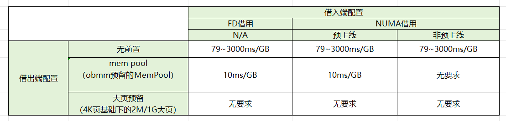

## 1 名词解释
借入端: 内存池化借用能力中使用远端内存的节点
借出端: 内存池化借用能力中提供远端内存的节点
FD借用:  内存池化借用的一种类型，借用完成会在借入方形成句柄文件，通过mmap打开句柄文件即可使用远端内存
NUMA借用: 内存池化借用的一种类型，借用完成会在借入方形成一个远端NUMA节点，通过操作系统的NUMA接口即可使用远端内存
[OBMM](https://atomgit.com/openeuler/obmm): 执行内存借出、借入的模块。在借出端负责执行内存导出，在借入端负责执行内存导入形成FD或者NUMA。
MemPool: OBMM中用于内存导出加速的内存池，OBMM优先从池中导出内存，内存池无空余内存，OBMM会从常规内存中导出内存，此时性能较差
预上线：加速NUMA借用上线速度的一种机制。该机制通过提前分配和形成远端NUMA并绑定物理地址空间，在真实借用发生时，只需要将远端内存和物理地址进行绑定即可，达到加速的目的。

## 2 借用性能说明

> 注: 
要求1：确保ubse的配置为 `obmm.memory.block.size=1024`；
要求2：确保printk日志级别为4。在借入端和借出端执行 `echo 4 4 1 7 > /proc/sys/kernel/printk`进行设置；
要求3：确保MemPool的大小满足`mempool_size / 本地NUMA数 > 单次借用内存大小`

## 3 配置说明
- 配置预上线能力请参考ubse[《配置说明》](../config/配置说明.md)
- 配置`obmm.memory.block.size`请参考ubse[《配置说明》](../config/配置说明.md)
- 配置2M/1G大页请参考OS能力
- 配置MemPool请参考[OBMM组件相关说明](https://atomgit.com/openeuler/obmm/blob/master/doc/obmm.md)
