# 单元测试开发指南

>本指南旨在帮助开发者为 `ubs_engine` 项目编写高质量的 C++ 单元测试（Unit Test, UT）。我们将介绍整体测试框架、环境搭建、用例编写规范以及运行与覆盖率分析方法，确保代码质量可控、可维护。

## 1 测试框架说明

我们采用 **Google Test (GTest)** 作为核心单元测试框架，并结合 **MockCpp** 实现对外部依赖的行为模拟，以支持复杂模块的隔离测试。

### 1.1 技术栈

| 工具                                                         | 用途                                           |
| ------------------------------------------------------------ | ---------------------------------------------- |
| [GoogleTest](https://google.github.io/googletest/)           | C++ 单元测试框架，提供断言、测试套件管理等功能 |
| [MockCpp](https://github.com/sinojelly/mockcpp)              | 轻量级 C++ Mock 框架，用于接口打桩与行为验证   |
| CMake                                                        | 构建系统，自动化编译与链接测试目标             |
| Bash Script                                                  | 封装构建脚本 (`build.sh`)，简化操作流程        |

### 1.2 编译构建

单元测试使用cmake进行构建和管理，详细内容在`test/UT`目录下可以进行查看

## 2 环境准备

1. 开发环境搭建参考 [《构建指导》](../build_install/构建指导.md)

2. 推荐在 `openEuler Linux (ARM64) `下执行项目构建，进入ubs_engine所在目录

   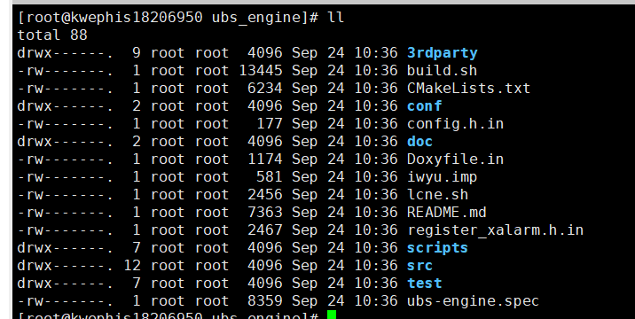

3. 执行以下命令

```shell
bash build.sh ut
```

## 3 增加单元测试用例

### 3.1 场景一：向已有测试文件补充用例

> 背景假设：
>
> 开发者想针对当前的业务代码 `src/framework/misc/ubse_str_util.cpp`中的`ConvertStrToUint32` 函数添加测试用例，当前在`test/UT/utils/test_ubse_str_util.cpp`已经存在部分用例

#### 3.1.1 前置条件

1. 确定`src/framework/misc/ubse_str_util.cpp`所在的库名

   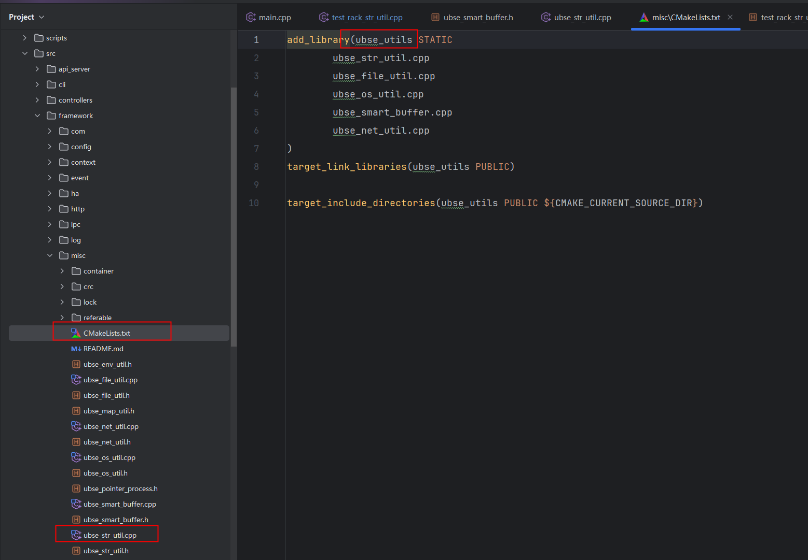

2. 找到`test/UT/utils`中的`CmakeLists`，此处已对待测业务代码所在库进行引入（add_ut宏的作用为创建一个新的库，该库已经依赖传入的库）。可以看到目前针对`src/framework/misc/ubse_str_util.cpp` 存在已有的测试用例。

   

#### 3.1.2 新增测试代码

在`test/UT/utils/test_ubse_str_util.cpp`中新增如下代码

```cpp
TEST_F(TestRackStrUtil, ConvertStrToUInt32_Valid)
{
    std::string str = "1234567";
    const int MOCK_VALUE_FOR_VALID = 1234567;
    uint32_t outValue;
    EXPECT_EQ(ConvertStrToUint32(str, outValue), UBSE_OK);
    EXPECT_EQ(outValue, MOCK_VALUE_FOR_VALID);
}
```

#### 3.1.3 验证用例

在`ubs_engine`目录下对用例进行用例验证

执行`bash build.sh ut -- --gtest_filter="TestRackStrUtil.ConvertStrToUInt32_Valid"`

其中`TestRackStrUtil`为**`TestSuite`**名，`ConvertStrToUInt32_Valid`为**`TestName`**

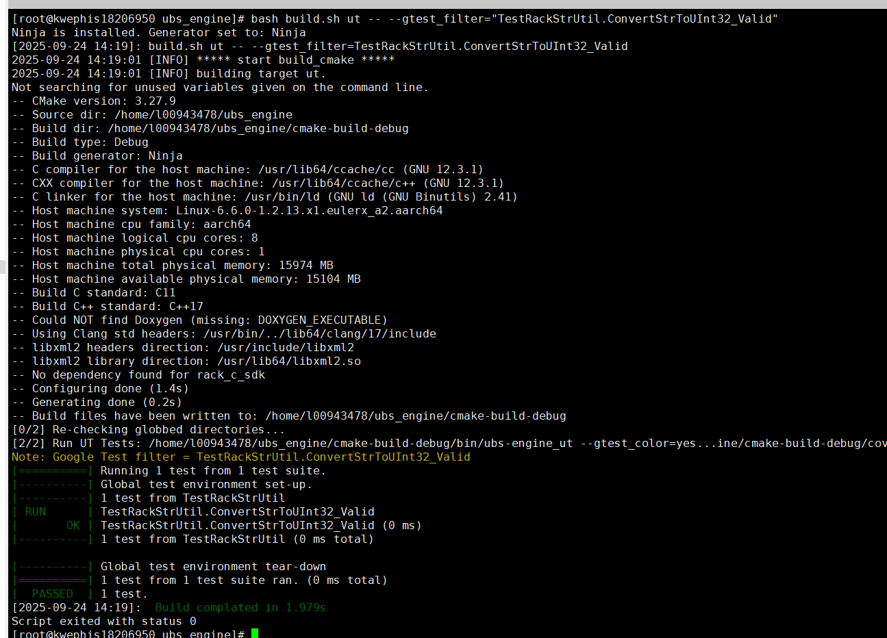

### 3.2 场景二：为新业务模块创建全新单元测试

> 背景假设：
>
> 开发者在当前项目基础上，增加了新的业务功能，希望对新的业务代码编写对应的单元测试。以本项目的`ubse_log`模块为例，开发者完成了`ubse_log`模块，代码位于`src/framework/log`，目前需要进行单元测试

#### 3.2.1 查找模块名

查看`src/framework/log`下日志模块的`CMakeLists`库名为`ubse_log`

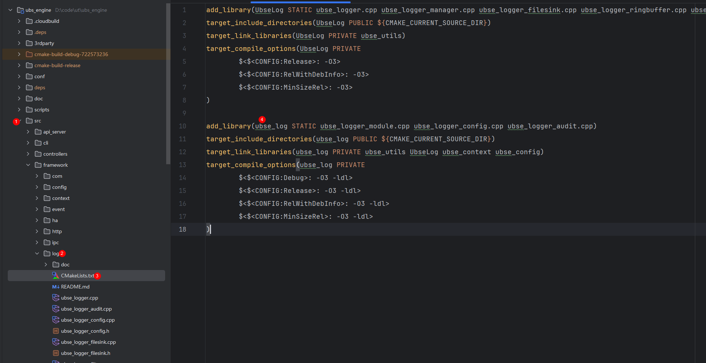

#### 3.2.2 增加模块UT目录

在 `test/UT`目录下新建 `log`目录，并创建`CMakeLists.txt`文件，在`CMakeLists.txt`文件中加入如下内容

```cmake
add_ut(ubse_log)
```

>开发一个模块的测试代码时，只需要add_ut一次即可。在该目录添加模块的其它测试代码时，若不依赖其它库，不需要改动CMake文件。若依赖其它库
>
>则可以再添加target_link_libraries
>
>示例：
>
>```cmake
>add_ut(ubse_log)
># add_ut 功能见下方注释， xxxModuleName为依赖的其它库
>target_link_libraries(ubs-engine_ubse_log_ut PRIVATE xxxModuleName)
>```

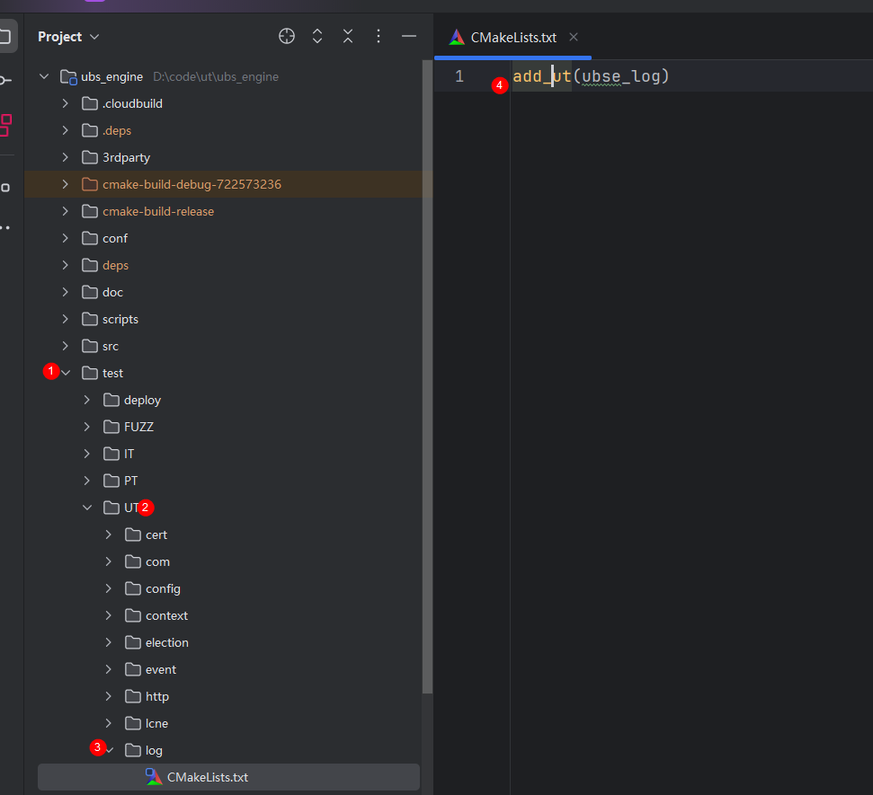

>```cmake
>🔍 add_ut特性说明：
>自动生成名为 ${PROJECT}_${MODULE}_ut 的可执行文件；
>自动发现并注册所有 TEST / TEST_F 用例；
>链接 GTest、MockCpp 及被测模块；
>支持 -fno-access-control 编译选项，允许测试直接访问私有成员（谨慎使用）；
>
># ubs_engine/scripts/cmake/utils.cmake 
>macro(add_ut module)
>    set(UT_BINARY ${CMAKE_PROJECT_NAME}_${module}_ut)
>    file(GLOB_RECURSE TEST_SOURCES LIST_DIRECTORIES false
>            ${CMAKE_CURRENT_SOURCE_DIR}/*.cpp
>            ${CMAKE_CURRENT_SOURCE_DIR}/*.h
>    )
>    add_executable(${UT_BINARY} EXCLUDE_FROM_ALL ${TEST_SOURCES} ${CMAKE_SOURCE_DIR}/test/UT/main.cpp)
>    target_link_libraries(${UT_BINARY} PUBLIC
>            mockcpp
>            googletest
>            pthread
>            ${module}
>    )
>    # 打破控制权限
>    target_compile_options(${UT_BINARY} PRIVATE -fno-access-control ${DEBUG_FLAGS})
>    set_target_properties(${UT_BINARY} PROPERTIES LINK_FLAGS "-Wl,--as-needed")
>    set(RUN_TEST "${CMAKE_BINARY_DIR}/bin/${UT_BINARY} \
>       --gtest_output=xml:${CMAKE_BINARY_DIR}/coverage/${module}_detail.xml")
>    # 处理透传参数
>    set(TRANS_PARAMS $ENV{TRANS_PARAMS})
>    if (DEFINED TRANS_PARAMS AND NOT "${TRANS_PARAMS}" STREQUAL "")
>        set(RUN_TEST "${RUN_TEST} ${TRANS_PARAMS}")
>    endif ()
>    if (SKIP_RUN_TESTS)
>        set(RUN_TEST "echo 'Skip run test, only build binary ${CMAKE_BINARY_DIR}/bin/${UT_BINARY}'")
>    endif ()
>    add_custom_target(${module}_ut
>            COMMAND bash -c "${RUN_TEST}" || true
>            COMMENT "Run testing: ${RUN_TEST}"
>    )
>    add_dependencies(${module}_ut ${UT_BINARY})
>    gtest_discover_tests(${UT_BINARY} PROPERTIES LABELS "${module}")
>endmacro()
>```

#### 3.2.3 模块UT代码加入编译链

打开`test/UT`的`CMakeLists.txt`文件，加入对被测代码的链接，以及测试代码的引入。

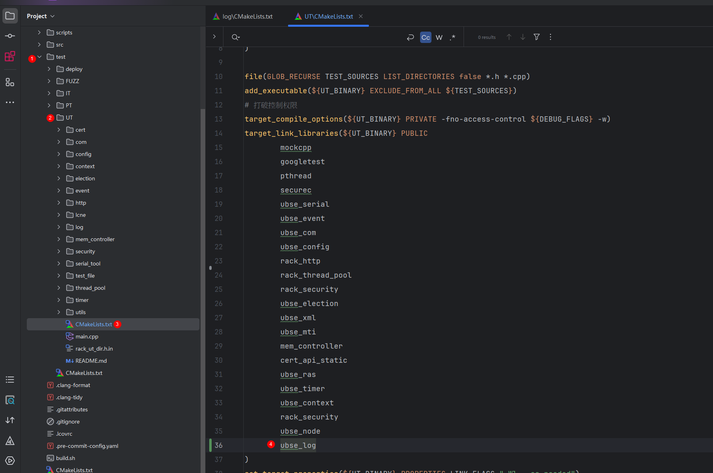

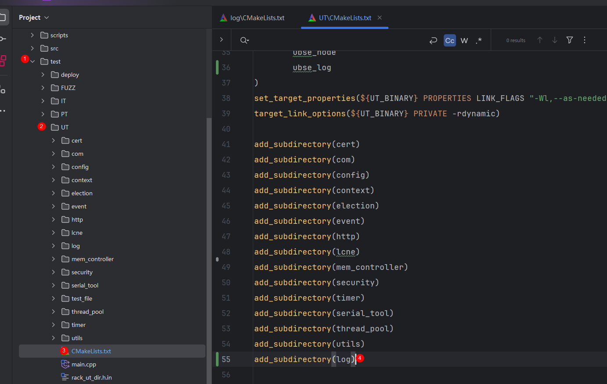

#### 3.2.4 开发UT代码

在`test/UT/log`目录下新建测试文件`test_ubse_logger.h`和`test_ubse_logger.cpp`，完成对具体的业务代码的测试，在`TestUbseLogger`测试套中写了一个测试用例

```c++
// `test_ubse_logger.h`
#ifndef UBSE_MANAGER_TEST_UBSE_LOGGER_ENTRY_H
#define UBSE_MANAGER_TEST_UBSE_LOGGER_ENTRY_H
#include <iostream>
#include "gtest/gtest.h"
#include "mockcpp/mockcpp.hpp"
#include "securec.h"
// 被测业务代码
#include "ubse_logger.cpp"
#include "ubse_logger.h"
#include "ubse_logger_manager.h"
namespace ubse::ut::log {
class TestUbseLogger : public testing::Test {
public:
    TestUbseLogger();
    virtual void SetUp(void);
    virtual void TearDown(void);
};
}
#endif // UBSE_MANAGER_TEST_UBSE_LOGGER_ENTRY_H
```

```cpp
// `test_ubse_logger.cpp`

#include "test_ubse_logger.h"
namespace ubse::ut::log {
using namespace ubse::ut;
using namespace ubse::log;
TestUbseLogger::TestUbseLogger() {}
void TestUbseLogger::SetUp(void)
{
    Test::SetUp();
}
void TestUbseLogger::TearDown(void)
{
    Test::TearDown();
}
TEST_F(TestUbseLogger, TestoperatorChar)
{
    UbseLoggerEntry UbseLoggerEntry("test_log", UbseLogLevel::INFO, "Test.log", "TestFunction", 1);
    char data = 'a'; // 设置要写入的char型数据为a
    UbseLoggerEntry << data;
    std::ostringstream os;
    UbseLoggerEntry.OutPutLog(os);
    std::string str = os.str();
    str = DeleteOther(str);
    EXPECT_EQ(str, "a\n");
}
}
```

#### 3.2.5 运行模块的UT代码

在ubs_engine目录下运行`bash build.sh ut -- --gtest_filter="TestUbseLogger.TestoperatorChar"`查看用例运行情况

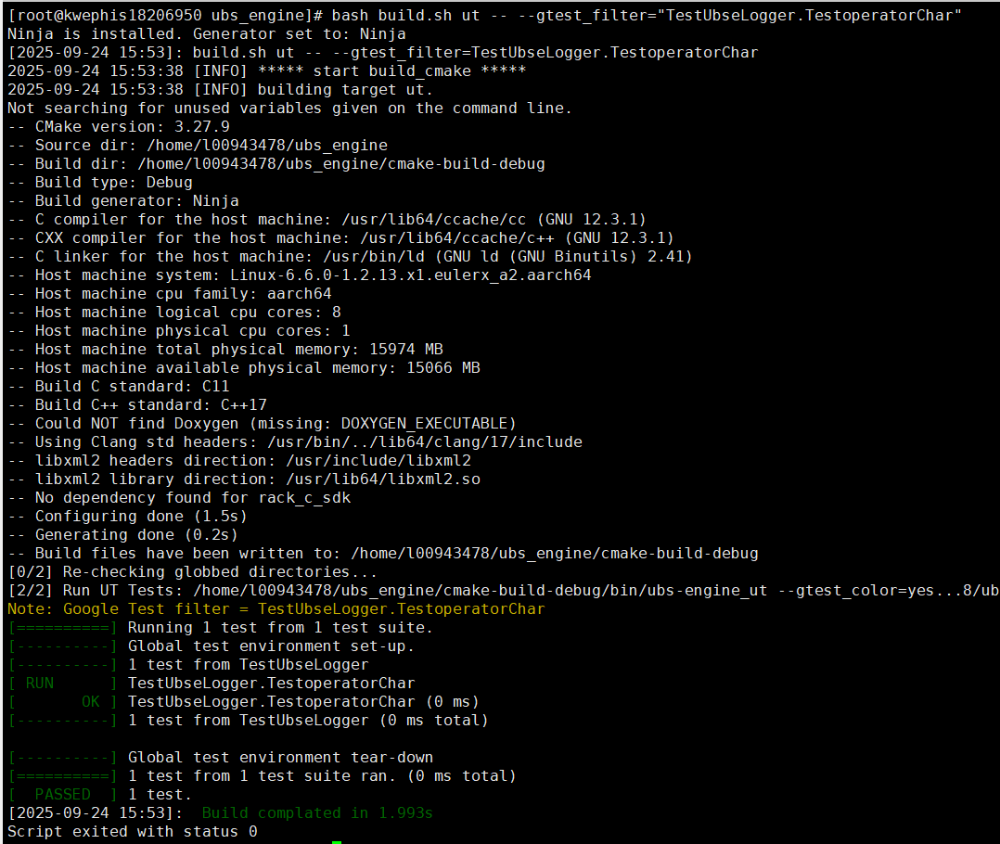

## 4 单元测试用例执行粒度

### 4.1 执行全部单元测试

```shell
bash build.sh ut
```

>📌 输出汇总所有测试结果，统计通过/失败数量。

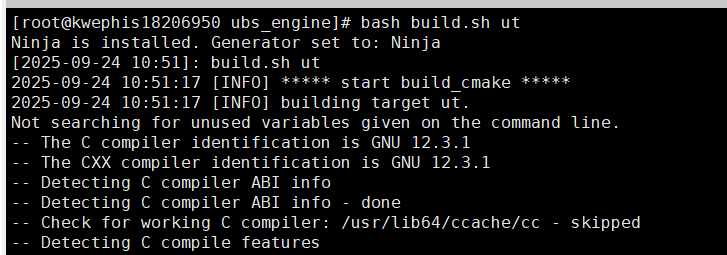

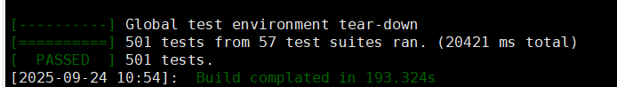


### 4.2 运行单组单元测试

假设想要运行`ubs_engine/test/UT/mem_controller/test_request_helper.cpp`中的全部用例

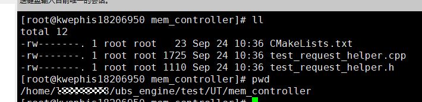

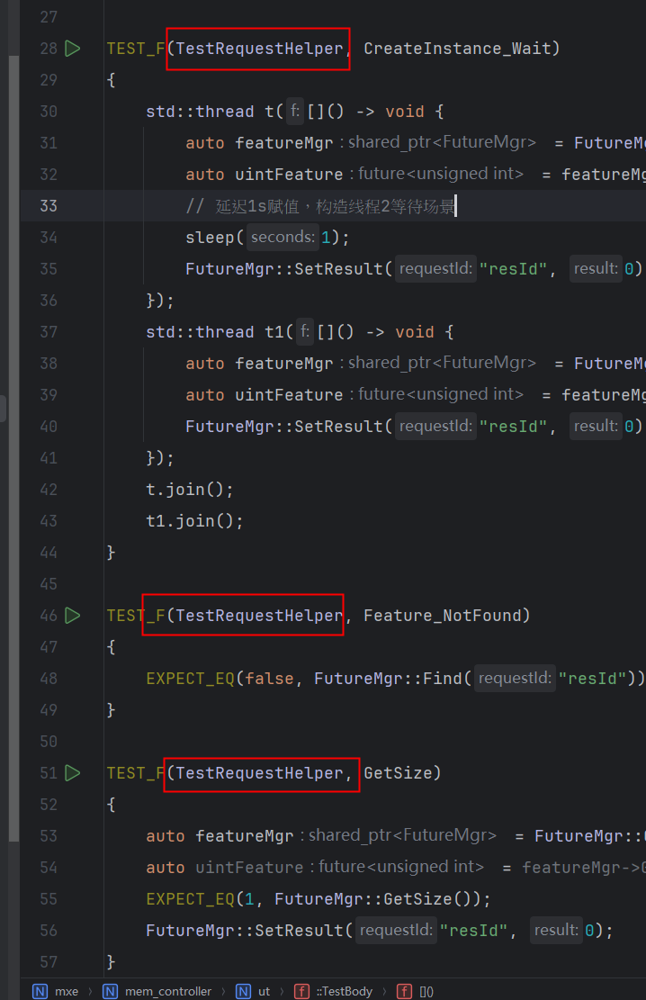

执行如下命令

```shell
bash build.sh ut -- --gtest_filter="TestRequestHelper.*"
```

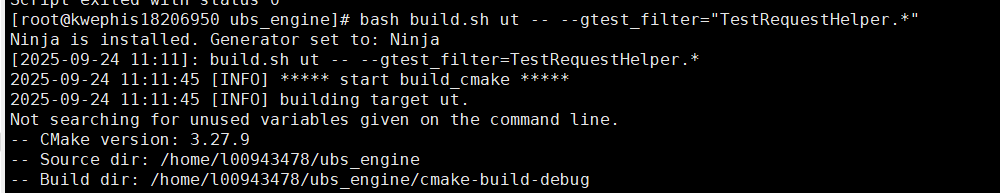

执行结束，显示如下测试结果

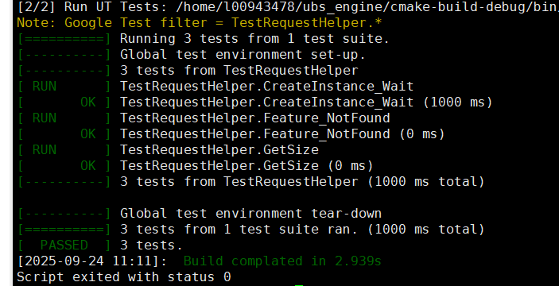

### 4.3 运行单个测试用例

假设想要运行`ubs_engine/test/UT/mem_controller/test_request_helper.cpp`中的一个用例`TEST_F(TestRequestHelper, CreateInstance_Wait)`

执行如下命令

```shell
bash build.sh ut -- --gtest_filter="TestRequestHelper.CreateInstance_Wait"
```

>💡 提示：`--gtest_filter` 支持通配符（`*`）、排除（`-`）等语法，详见 GTest 文档。

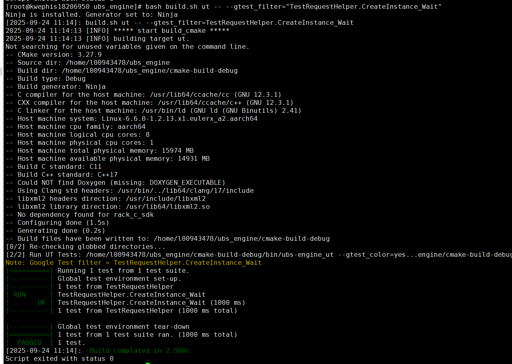

## 5 单元测试报告生成

>⚠️ 注意：只有当所有单元测试 **100% 通过**时，才允许生成覆盖率报告（CI 流水线强制校验）。

```shell
# 生成覆盖率报告，cmake-build-debug/coverage 下
bash build.sh ut -C
```

> 📁 默认路径：`./cmake-build-debug/coverage/index.html`

将生成的测试报告使用`scp`或者`xftp`等工具下载到本地进行查看
