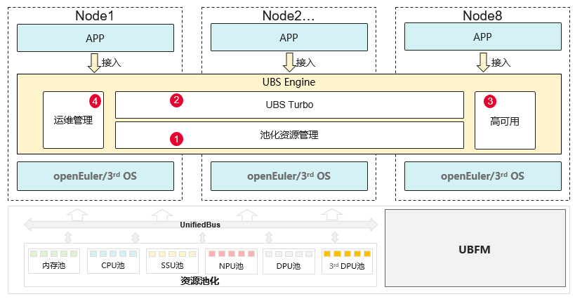
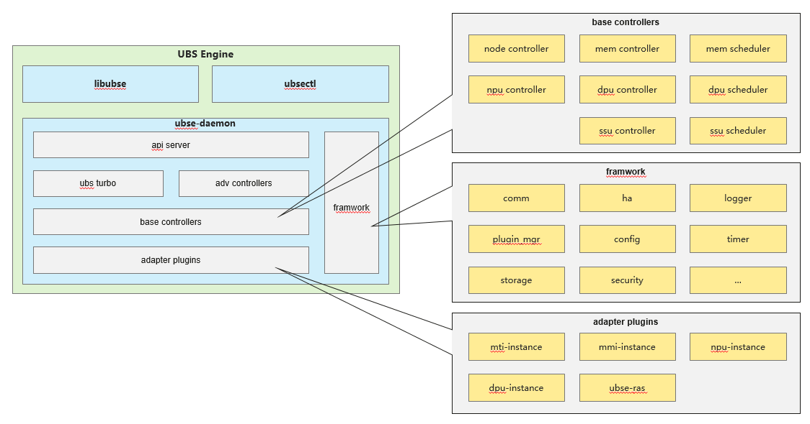

# UBSE指导文档（JD POC）

## 目录

[1 UBSE 概述](#ubse-概述)

[1.1 简介](#简介)

[1.2 项目核心能力](#项目核心能力)

[1.3 项目代码架构](#项目代码架构)

[2 配套说明](#配套说明)

[2.1 软件版本配套说明](#软件版本配套说明)

[2.2 硬件版本配套说明](#硬件版本配套说明)

[3 API&&CLI&&环境变量说明](#apicli环境变量说明)

[3.1 SDK接口说明](#sdk接口说明)

[3.2 CLI使用说明](#cli使用说明)

[3.3 环境变量说明](#环境变量说明)

[4 安装运行说明](#安装运行说明)

[4.1 软件包准备](#软件包准备)

[4.2 安装说明](#安装说明)

[4.3 配置说明](#配置说明)

[4.4 常用命令](#常用命令)

[4.5 高安环境部署](#安装说明)

[5 问题排查定位指导](#问题排查定位指导)

[5.1 日志说明](#日志说明)

[5.2 常见问题排查定位](#常见问题排查定位)

---

## UBSE 概述

### 简介

UBSE（UB Service Core Engine, 下文简称UBSE或UBS Engine）提供了ubse daemon程序及其相应的SDK开发库。开发者可以利用该SDK访问ubse daemon提供的服务，从而实现对内存等资源的调度与管理，执行关键运维操作。

### 项目核心能力

UBSE支持内存、DPU资源池化管理与动态调度，支持分布式自选主，实现N-1高可用。UBSE能充分发挥灵衡计算系统在内存池化、UB通信、分布式操作等方面的独特优势。封装高阶系统服务，并提供各种SDK使能各种场景的应用加速，可总结为下述四大核心能力：

- **内存资源池化**：将物理内存抽象为可调度资源池。
- **按需分配与回收**：支持细粒度、低延迟的内存分配策略。
- **SDK 支持**：提供 C/C++/GO/Python SDK，便于集成到上层应用。
- **高可用与安全机制**：内置 HA 模块与加密支持。

UBSE软件核心能力如下图所示



### 项目代码架构

UBSE软件代码架构如下图所示



- **libubse**：以动态库的方式，提供ubse的资源管理接口，供外部系统对接UBSE。
- **ubsectl**：提供命令行功能，供外部系统对接。
- **ubse-daemon**：ubse工作主进程，提供ubse的资源管理核心功能。
  - **api server**：为北向系统接入，提供统一接口。
  - **ubs turbo**：提供增值的调优能力，当前提供基于内存的调优能力。
  - **adv controllers**：负责提供各种与业务强相关的资源管理能力，如NPU、DPU。
  - **base controllers**：提供基础类型（如内存借用归还）的资源管理能力。
  - **adapter plugins**：提供各种南向对接能力（如UBFM、DPU-Driver等）。

UBSE项目代码架构如下所示：

```text
## 项目代码架构说明
UBSEngine/
├── 3rdparty                    //第三方软件
├── conf                        //配置文件
├── doc                         //文档
├── scripts                     //脚本
├── src                         
│   ├── include                 //全局头文件
│   ├── apiserver               //北向接口暴露
│   ├── cli                     //cli代码
│   │   ├──ubse_cli_framework   //命令注册和结果回显辅助builder类
|   │   └──ubse_cert            //证书相关
│   │   
│   ├── controllers             //控制器
│   │   ├── include             //头文件  
│   │   ├── mem                 //内存池化控制器
│   │   |    ├── algorithm      //mem调度算法
│   │   │    ├── memcontroller  //内存池化控制器---文件
│   │   │    └── memscheduler   //内存池化调度器---文件
│   │   └── node                //内存池化控制器---节点的采集信息
│   │        └── nodecontroller //内存池化控制器---文件
│   │   ├── urmacontroller      //urma设备控制器---文件
│   │  
│   ├── framwork                //软件框架
│   │   ├── com                 //通信组件，与hcom对接，线程切换，回调
│   │   ├── config              //配置模块
│   │   ├── context             //上下文模块
│   │   ├── event               //事件中心
│   │   ├── ha                  //ha模块
│   │   ├── http                //http组件
│   │   ├── ipc                 //ipc
│   │   ├── log                 //日志组件
│   │   ├── misc                //杂项：智能指针、锁、环形队列、CRC
│   │   ├── plugin_mgr          //插件管理
│   │   ├── security            //安全组件，开源只需提权，商用版本支持使用KMC加解密
│   │   ├── serde               //序列化反序列化
│   │   ├── thread_pool         //线程池操作库，fram自身系统线程池
│   │   ├── timer               //定时器
│   │   └── xml                 //xml解析处理
│   │   
│   ├── message                 //消息
│   ├── node                    //创建数据链路
│   ├── ras                     //故障处理
│   ├── res_plugins
│   │   ├── syssentry           //syssentry对接
│   │   ├── mti                 //ubm对接
│   │   └── mmi                 //内存资源接口
│   │   
│   └── sdk                     //sdk模块
│       ├── include             //sdk的对外接口声明
│       └── sample              //sdk示例
└── test
    ├── IT
    └── UT
```

---

## 配套说明

### 软件版本配套说明

| 环境及工具 | 最低版本要求 | 说明 |
| :--- | :--- | :--- |
| 操作系统 | 推荐 openEuler 24.03 LTS SP3或更高版本 | - |
| 编译工具链 | CMake ≥ 3.22, GCC ≥ 9.3 | - |
| 依赖库 | 详见构建指导章节 | - |

### 硬件版本配套说明

| 部件名称 | 最小硬件要求 | 说明 |
| :--- | :--- | :--- |
| 架构 | AArch64 | 支持Arm的64位架构。 |
| CPU | 华为鲲鹏920系列CPU | - |
| 内存 | 不小于4GB（为了获得更好的应用体验，建议不小于8GB） | - |
| 硬盘 | 为了获得更好的应用体验，建议不小于120GB | - 支持IDE、SATA、SAS等接口的硬盘。<br>- 用DIF功能的NVMe盘，需要对应驱动支持，如果无法使用，请联系硬件厂商。 |

---

## API&&CLI&&环境变量说明

### SDK接口说明

#### ubs_urma_dev_get:查询独占/共享urma设备信息

- **接口概述**

  ```c
  /**
  * @brief 查询指定类型的urma设备信息
  *
  * @param urma_devices [out] urma设备信息列表，调用者需要释放该内存
  * @param urma_cnt [out] urma设备信息数量
  * @return #UBSE_OK 0 成功
  *         UBS_ERR_NULL_POINTER:空指针;
  *         UBS_ENGINE_ERR_CONNECTION_FAILED:连接UBSE服务端失败;
  *         UBS_ENGINE_ERR_AUTH_FAILED:UBSE服务端鉴权不通过;
  *         UBS_ENGINE_ERR_TIMEOUT:UBSE服务端处理超时;
  *         UBS_ENGINE_ERR_INTERNAL:UBSE服务端内部错误
  */
  int32_t ubs_urma_dev_get(urma_device_t **urma_devices, uint32_t *urma_cnt);
  ```

- **数据结构**

  ```c
  #define UBS_URMA_NAME_MAX 32 // 包含结束符长度
  typedef struct{
      char name[UBSE_MAX_URMA_ID_LENGTH];
      uint32_t healthy;
      uint64_t hw_res_id; //第一个vfe的iouId-entityId
  } urma_device_t;

  ```

- **参数**

  | **name** | **IN/OUT** | **description** |
  | :--- | :--- | :--- |
  | urma_devices | OUT | 所有urma设备信息 |
  | urma_cnt |OUT | 所有urma设备数量 |

#### ubs_urma_dev_alloc:分配urma设备

- **接口概述**

  ```c
  /**
  * @brief 分配指定的urma设备
  *
  * @param name [in] urma设备名称，长度不能超过32（含/0）
  * @param dev_info [in/out] 分配urma设备的路径，需要调用方申请内存
  * @return #UBSE_OK 0 成功
  *         UBS_ERR_NULL_POINTER:空指针;
  *         UBS_ENGINE_ERR_OUT_OF_RANGE:name参数超出范围;
  *         UBS_ENGINE_ERR_CONNECTION_FAILED:连接UBSE服务端失败;
  *         UBS_ENGINE_ERR_AUTH_FAILED:UBSE服务端鉴权不通过;
  *         UBS_ENGINE_ERR_TIMEOUT:UBSE服务端处理超时;
  *         UBS_ENGINE_ERR_INTERNAL:UBSE服务端内部错误
  */
  int32_t ubs_urma_dev_alloc(const char* name, ubs_urma_dev_path_t * dev_info);
  ```

- **数据结构**

  ```c
  #define UBS_MAX_URMA_PATH_LENGTH 64 // 包含结束符长度
  #define UBS_VFE_PATH_NUM 2

  typedef struct {
      char bonding_path[UBS_MAX_URMA_PATH_LENGTH];
      char bonding_eid[UBS_MAX_URMA_PATH_LENGTH];
      char vfe_path[UBS_VFE_PATH_NUM][UBS_MAX_URMA_PATH_LENGTH];
  } ubs_urma_dev_info_t;

  ```

- **参数**

  | name | IN/OUT | description |
  | :--- | :--- | :--- |
  | name | IN | 分配urma设备名称（固定最大长度,含'/0'）32 |
  | dev_info | OUT | 分配设备的路径 |

### CLI使用说明

#### 查询URMA设备信息与状态

- **用法**

    ```shell
    ubsectl display urma --node {node-id}  --dev {urma_name}
    ```

- **输入参数说明**

  | **字段名** | **字段描述**                 | **字段取值**                          |
  | :--- |:-------------------------|:----------------------------------|
  | --node <br>-n | 节点id <br>字段可选，不传默认查询本节点  | 数字，取值范围 1-255                     |
  | --dev <br>-d | 设备名称 <br>字段可选，不传默认查询所有设备 | urma设备名称，批量查询时用,分隔，如urma_1,urma_2 |

- **输出信息说明**

| 字段名       | 字段描述                     | 取值范围                  |
|-----------| ---------------------------- |-----------------------|
| urma-name | bonding设备的名称           | 字符串                   |
| dev-eid   | bonding设备的 Eid            | 字符串                   |
| dev1_name | bonding设备绑定的fe名称     | 字符串                   |
| dev2_name | bonding设备绑定的fe名称     | 字符串                   |
| dev1_eid  | bonding设备绑定的fe1 Eid    | 字符串                   |
| dev2_eid  | bonding设备绑定的fe2 Eid    | 字符串                   |
| status    | urma设备状态                 | 可选值： [ active \| inactive ] |


- **输出示例**

  ```shell
  $ ubsectl display urma --dev urma_1,urma_2
  ----------------------------------------------------------------------------------------------------------
  urma-name      dev-eid     dev1-name         dev2-name         dev1-eid         dev2-eid        status 
  ----------------------------------------------------------------------------------------------------------
  urma_1         eid0         udma1            udma49             eid1            eid2            active
  urma_2         eid3         udma2            udma50             eid4            eid5            inactive
  ----------------------------------------------------------------------------------------------------------
  ```

- **自动补全**

  执行以下命令提供ubsectl命令补全

  ```shell
  dnf install bash-completion
  ```

### 环境变量说明

| 参数名称 | 参数类型 | 参数说明 | 取值范围 | 缺省值 |
| :--- | :--- | :--- | :--- | :--- |
| HCOM_CONNECTION_SEND_TIMEOUT_SEC | string | socket发送超时，影响RPC建链超时时间。 | 0~7200（单位秒），0为不设超时时间 | 1 |
| HCOM_CONNECTION_RECV_TIMEOUT_SEC | string | socket接收超时，影响RPC建链超时时间。 | 0~7200（单位秒）,0为不设超时时间 | 1 |

环境变量设置示例如下：

```bash
export HCOM_CONNECTION_SEND_TIMEOUT_SEC=30
export HCOM_CONNECTION_RECV_TIMEOUT_SEC=30
```

---

## 安装运行说明

### 软件包准备

| 软件包名称 | 软件包说明 |
| :--- | :--- |
| ubs-engine-*x.x.x-x*.aarch64 | 主程序包，包含UBSE核心功能与CLI工具。 |
| ubs-engine-client-libs-*x.x.x-x*.aarch64 | UBSE对外开放的客户端库，支持三方程序使用该库访问UBSE。 |
| ubs-engine-client-devel-*x.x.x-x*.aarch64 | 开发工具包，用于开发人员使用。 |
| ubs-engine-debuginfo-*x.x.x-x*.aarch64 | 主程序运行包含的debug日志信息。 |

### 安装说明

#### 安装注意事项

- 需切换为root用户执行安装与启动。
- 使用ubsectl前需要先启动UBSE。
- 初始安装由安装者保证环境纯净，如环境不纯净则会使用环境中的配置文件，可能会导致业务功能运行异常。
- 开启mempooling/vm插件时，如果其中之一启动失败，UBSE进程也会启动失败。
- 进程启动失败时，systemd会重试启动进程，时间间隔为5s，直到进程启动成功或停止UBSE服务为止。

#### 安装步骤

##### ubs-engine

- 执行 `rpm -ivh ubs-engine-x.x.x-x.aarch64.rpm`

- **安装注意事项**
  - ubs-engine安装依赖OpenSSL的开发包，通过包管理工具安装openssl-devel。
  - ubs-engine安装依赖libboundscheck.so和libhcom.so.*，需先安装libboundscheck和ubs-comm-lib，否则会安装失败。
  - ubs-engine RPM包安装依赖UBM，如果UBM服务未安装，UBSE服务安装可能会失败。

##### ubs-engine-client-libs

- 执行 `rpm -ivh ubs-engine-client-libs-x.x.x-x.aarch64.rpm`

- **安装注意事项**
  - ubs-engine-client-libs安装依赖libboundscheck.so，需先安装libboundscheck，否则会安装失败。

##### ubs-engine-client-devel

- 执行 `rpm -ivh ubs-engine-client-devel-x.x.x-x.aarch64.rpm`

- **安装注意事项**
  - 开发包需要依赖客户端包，即ubs-engine-client-devel依赖ubs-engine-client-libs，安装ubs-engine-client-devel前需要安装ubs-engine-client-libs。

##### ubs-engine-debuginfo

- 执行 `rpm -ivh ubs-engine-debuginfo-x.x.x-x.aarch64.rpm`

- **目录结构**

| 内容 | 说明 |
| :--- | :--- |
| /var/log/ubse/ubse.log | UBSE主进程的日志内容 |

##### 启动服务

- **启动服务**：`systemctl start ubse`

- **查询服务状态**：`systemctl status ubse`
  - 状态为active即表示服务已经启动

- **查询服务对应进程**，观察进程是否存在：`ps -ef | grep /usr/bin/ubse`

### 配置说明

#### 配置参数说明

| 配置文件路径 | 配置文件名称 | 是否需进行配置 | 说明 |
| :--- | :--- | :--- | :--- |
| /etc/ubse | ubse.conf | 是 | UBSE通用配置文件。 |

| 所属配置节 | 参数 | 说明 | 取值 | 配置节点 |
| :--- | :--- | :--- | :--- | :--- |
| [ubse.log] | log.level | 日志级别。 | 默认值：INFO<br>取值范围：DEBUG, INFO, WARN, ERROR, CRIT<br>参数配置取值范围之外或错误值都会被重置为默认值。 | 所有节点 |
| [ubse.log] | log.max.fileSize | 绕接日志文件的大小。 | 默认值：20<br>单位：MB<br>取值范围：[2, 20]<br>参数配置取值范围之外或错误值都会被重置为默认值。 | 所有节点 |
| [ubse.log] | log.fileNums | 日志文件最大绕接数量。 | 默认值：20<br>取值范围：[1, 200]<br>参数配置取值范围之外或错误值都会被重置为默认值。 | 所有节点 |
| [ubse.log] | log.queue.maxItem | 日志缓冲区最大缓存量条数。如果超过该值，则覆盖最初的日志。 | 默认值：4096<br>单位：条<br>取值范围：[64, 4096]<br>参数配置取值范围之外或错误值都会被重置为4096。 | 所有节点 |
| [ubse.log] | log.sys.open | syslog记录日志开关。 | 默认值：false<br>取值范围：true, false<br>参数配置取值范围之外或错误值都会被重置为默认值。 | 所有节点 |
| [ubse.log] | log.sys.type | syslog记录日志类型。 | 默认值：user<br>取值范围：kern, user, mail, daemon, auth, syslog, lpr, news, uucp, cron, authpriv, ftp, or local0~7。<br>参数配置取值范围之外或错误值都会被重置为默认值。 | 所有节点 |
| [ubse.election] | heartbeat.timeInterval | 发送心跳间隔时间，单位毫秒。 | 默认值：2000<br>单位：毫秒<br>取值范围：[1000, 60000]<br>参数配置取值范围之外的值会被重置为默认值。 | 所有节点 |
| [ubse.election] | heartbeat.lostThreshold | 备节点心跳丢失次数阈值。 | 默认值：3<br>取值范围：[3, 20]<br>参数配置取值范围之外的值会被重置为默认值。 | 所有节点 |
| [ubse.rpc] | request.timeout | 通信接口的超时时间。 | 默认值：60<br>单位：秒<br>取值范围：[0,65535]<br>如果取值超过范围，则取默认值60。 | 所有节点 |
| [ubse.rpc] | cluster.ipList | rpc使用tcp协议时的集群各节点ip地址。 | 默认用#注释该参数，即默认使用urma通信<br>若使用tcp通信，取消#注释并配置该参数<br>参考值：192.168.100.100-192.168.100.103。 | 所有节点 |
| [ubse.rpc] | cert.use | rpc安全证书能力开关。 | 默认值：true（开启证书能力）<br>取值范围：[true，false]<br>如果取值超过范围，则取默认值true。 | 所有节点 |
| [ubse.ubfm] | ubse.server.port | HTTP TCP服务器端口号。 | 默认开启该配置项，配置UBSE与UBM的通信端口，取值范围：[1024,65535]<br>参数配置取值范围之外或错误值都会被重置为8082。<br>若关闭该配置，UBSE与UBM之间节点内采用UDS通信。 | 所有节点 |
| [ubse.ubfm] | ubm.server.port | 向UBM进程发送消息的端口。 | 如果UBM部署到高安环境，开启该配置项，配置UBSE与UBM的通信端口，取值范围：[1024,65535]<br>参数配置取值范围之外或错误值都会被重置为8799。<br>默认关闭该配置，UBSE与UBM之间节点内采用UDS通信。 | 所有节点 |
| [ubse.memory] | obmm.memory.block.size | 内存块大小 | 不涉及，不需要修改| 所有节点 |

#### 配置示例

```text
[ubse.log]

#Log level. The value can be DEBUG, INFO (default value), WARN, ERROR, or CRIT. Any invalid value will be reset to INFO.
log.level=INFO

#Size of the log file to be wrapped, in MB. The value range is [2, 20]. Any invalid value will be reset to 20.
log.max.fileSize=20

#Maximum number of log files that can be wrapped. The value range is [1, 200]. Any invalid value will be reset to 20.
log.fileNums=20

#Maximum number of logs that can be cached in the log buffer. If the number of cached logs exceeds the value, the earliest logs are overwritten. Value range: [64,4096]. Any invalid value will be reset to 4096.
log.queue.maxItem=4096

#Syslog switch.The value can be true or false(default value). Any invalid value will be reset to false.
log.sys.open=false

#Syslog type.The value can be kern, user(default value), mail, daemon, auth, syslog, lpr, news, uucp, cron, authpriv, ftp, or local0~7. Any invalid value will be reset to user.
log.sys.type=user

[ubse.election]

#Interval at which the Master node sends heartbeat messages, in milliseconds. The value range is from 1000 to 60000. Any invalid value will be reset to 2000.
heartbeat.timeInterval=2000

#Threshold for the number of lost standby node heartbeats. The value ranges from 3 to 20. Any invalid value will default to 3.
heartbeat.lostThreshold=3

[ubse.rpc]

#The timeout for calling the rpc interface, in seconds, the default time is 60s. The value range is from 0 to 65535. Any invalid value will be reset to 60.
request.timeout=60

#When the communication mode is TCP, configure the IP addresses of all nodes within the cluster. Continuous IP address segments are supported, with segments separated by a hyphen (-). Both address segments and individual addresses can coexist, separated by a comma (,).
cluster.ipList=192.168.100.100-192.168.100.102,192.168.100.104

#Whether to enable TLS certificate authentication
true: Enable TLS authentication and use certificates for secure communication
false: Disable TLS authentication, communication will be unencrypted
Note: This feature can only be enabled under the TCP protocol.
cert.use=true

[ubse.ubfm]

#Port number of the http tcp server. The value range is [1024, 65535]. Any invalid value will be reset to 8082.
ubse.server.port=8082

#Set the Port for Sending Messages to the ubm. The value range is [1024, 65535]. Any value out of range is reset to 8799
The value must match the ubm listening port.
ubm.server.port=8799

[ubse.memory]

#The default value is 128. If this parameter is set, the value must be greater than 128 MB.
obmm.memory.block.size=128

```

### 常用命令

- **启动服务**

  ```bash
  systemctl start ubse
  ```

- **停止服务**

  ```bash
  systemctl stop ubse
  ```

- **重启服务**

  ```bash
  systemctl restart ubse
  ```

- **查看服务状态**

  ```bash
  systemctl status ubse
  ```
  
- **查看服务日志**

  ```bash
  tail -f /var/log/ubse/ubse.log
  ```

- **查看服务配置**

  ```bash
  cat /etc/ubse/ubse.conf
  ```

## 问题排查定位指导

### 日志说明

UBSE的主进程的日志内容存放信息如表所示，其中日志等级可由配置项设置，重启后生效。

| 内容 | 说明 |
| :--- | :--- |
| /var/log/ubse/ubse.log | UBSE主进程的日志内容 |

日志结构：【日志文件地址】【时间】【日志等级】【进程号】【线程号】【代码文件】【具体日志信息】

### 常见问题排查定位

#### UBSE进程启动失败

- **故障现象**

  通过 `systemctl status ubse` 查看UBSE服务，出现服务不断重启。通过命令 `journalctl -u ubse` 查看UBSE的错误日志。当看到 `Run failed` 的日志时，可以具体看哪个模块启动异常。

  例如出现以下报错：

  ```terminal
  Jan 26 18:51:06 Master ubse[3328879]: UbseContext::StartModule-Module: ubse::config::UbseConfModule started. StartTime: 0ms
  Jan 26 18:51:06 Master ubse[3328879]: UbseContext::StartModule-Module: ubse::log::UbseLoggerModule started. StartTime: 0ms
  Jan 26 18:51:06 Master ubse[3328879]: UbseContext::StartModule-Module: ubse::task_executor::UbseTaskExecutorModule started. StartTime: 0ms
  Jan 26 18:51:06 Master ubse[3328879]: UbseContext::StartModule-Module: ubse::event::UbseEventModule started. StartTime: 0ms
  Jan 26 18:51:06 Master ubse[3328879]: UbseContext::StartModule-Module: ubse::mti::UbseUBMModule started. StartTime: 0ms
  Jan 26 18:51:06 Master ubse[3328879]: UbseContext::StartModule-Error: starting module api::server::UbseApiServerModule Error code: 4
  Jan 26 18:51:06 Master ubse[3328879]: UbseContext::StartBaseModule-Error: starting base module failed.
  Jan 26 18:51:06 Master ubse[3328879]: UbseContext::Run failed
  ```

- **问题原因**

  UbseApiServerModule启动失败，如下原因导致：

  1. `/run/ubse/ubse.sock` 文件权限异常。
  2. `/run/ubse/ubse.sock` 被改成文件夹。

- **故障识别**

  查看文件类型是否为sock文件，权限是否为660，属主为ubse。

- **故障处理方法**

  如果文件类型或权限不符合，则删除 `/run/ubse/ubse.sock` 和 `/var/run/ubse/ubse.sock`，通过命令 `systemctl restart ubse` 重启ubse服务，由ubse服务重新创建。

#### UBSE多节点组集群失败

- **故障现象**

命令 `sudo -u ubse /bin/ubsectl display cluster`，详细日志如下：

```shell
[root@Worker6 ~]# sudo -u ubse /bin/ubsectl display cluster
ERROR: Internal error with error code 5
```

查看日志 `cat /var/log/ubse/ubse.log | grep MTI`，详细日志如下：

```shell
[2026-01-27 00:10:35.368 +0800][ERROR][7760][281473097170976][ubse_UBM_topology.cpp:UbseDevGetTopology:254] [MTI] get UBM topology info is failed.
[2026-01-27 00:10:35.368 +0800][ERROR][7760][281473097170976][ubse_UBM_topology.cpp:Start:60] [MTI] Obtain topology or cna information provided by UBM is failed.
[2026-01-27 00:10:35.368 +0800][ERROR][7760][281473097170976][ubse_UBM_busInstance.cpp:QueryBusinstance:59] [MTI] Access the UBM BusInstance information interface via HTTP is failed. ErrorCode=268701716
[2026-01-27 00:10:38.369 +0800][ERROR][7760][281473097170976][ubse_UBM_topology_client.cpp:GetTopology:37] [MTI] Access the UBM topology information interface via HTTP is failed. ErrorCode=268701716
[2026-01-27 00:10:38.369 +0800][ERROR][7760][281473097170976][ubse_UBM_urma_eid.cpp:GetUrmaEid:114] [MTI] Access the UBM UrmaEid information interface via HTTP is failed. ErrorCode=268701716
[2026-01-27 00:10:38.369 +0800][ERROR][7760][281473097170976][ubse_UBM_node_info.cpp:QueryAllUBMIODieInfo:41] [MTI] Access the UBM IO DIE information interface via HTTP is failed. ErrorCode=268701716
[2026-01-27 00:10:38.369 +0800][ERROR][7760][281473097170976][ubse_UBM_host_info.cpp:QueryUBMHostInfo:41] [MTI] Access the UBM logic entities information interface via HTTP is failed. ErrorCode=268701716
[2026-01-27 00:10:41.369 +0800][ERROR][7760][281473097170976][ubse_UBM_sub_topo_change_info.cpp:SubUBMLinkInfo:88] [MTI] Subscribe to UBM topology change notifications is failed. ErrorCode=268701716
[2026-01-27 00:10:41.369 +0800][WARN][7760][281473097170976][ubse_UBM_topology.cpp:Start:56] [MTI] SubUBMLinkInfo is failed.
[2026-01-27 00:10:41.369 +0800][ERROR][7760][281473097170976][ubse_UBM_topology.cpp:UbseDevGetTopology:254] [MTI] get UBM topology info is failed.
[2026-01-27 00:10:41.369 +0800][ERROR][7760][281473097170976][ubse_UBM_topology.cpp:Start:60] [MTI] Obtain topology or cna information provided by UBM is failed.
[2026-01-27 00:10:41.369 +0800][ERROR][7760][281473097170976][ubse_UBM_busInstance.cpp:QueryBusinstance:59] [MTI] Access the UBM BusInstance information interface via HTTP is failed. ErrorCode=268701716
```

- **问题原因**

UBM服务异常。

- **故障处理方法**

参考UBM定位文档进一步定位问题。

#### UBSE出现多主问题

- **故障现象**

  命令 `sudo -u ubse /bin/ubsectl display cluster`，节点1详细日志如下：

  ```shell
  node          role                bonding-eid
  computer01(1) master 4245:4944:0000:0000:0000:0000:0100:0000
  -(2)           -     4245:4944:0000:0000:0000:0000:0200:0000
  -(3)           -     4245:4944:0000:0000:0000:0000:0300:0000
  -(4)           -     4245:4944:0000:0000:0000:0000:0400:0000
  ```

  命令 `sudo -u ubse /bin/ubsectl display cluster`，节点2详细日志如下：

  ```shell
  node          role                bonding-eid
  -(1)           -     4245:4944:0000:0000:0000:0000:0100:0000
  computer02(2) master 4245:4944:0000:0000:0000:0000:0200:0000
  -(3)           -     4245:4944:0000:0000:0000:0000:0300:0000
  -(4)           -     4245:4944:0000:0000:0000:0000:0400:0000
  ```

  通过 `cat /var/log/ubse/ubse.log | grep "\\[ELECTION\\] Connect failed:"` 查看日志：

  ```shell
  [2026-01-26 17:06:10.034+08:00][WARN][1413269][281469431498624][c0df932d-e50a-4a4a-883e-efe461666895][ubse_election_comm_mgr.cpp:Connect:65] [ELECTION] Connect failed: 4245:4944:0000:0000:0000:0000:0300:0000
  [2026-01-26 17:06:10.594+08:00][WARN][1413269][281469448406912][b5e65d0c-e1e0-44cb-9996-789ae2ae0012][ubse_election_comm_mgr.cpp:Connect:65] [ELECTION] Connect failed: 4245:4944:0000:0000:0000:0000:0200:0000
  [2026-01-26 17:06:10.911+08:00][WARN][1413269][281469465315200][4375895e-096e-44c0-bb15-62964d30190b][ubse_election_comm_mgr.cpp:Connect:65] [ELECTION] Connect failed: 4245:4944:0000:0000:0000:0000:0400:0000
  [2026-01-26 17:06:27.233+08:00][WARN][1413269][281469473769344][2433ea60-415e-4056-bd27-1307672e3da1][ubse_election_comm_mgr.cpp:Connect:65] [ELECTION] Connect failed: 4245:4944:0000:0000:0000:0000:0800:0000
  [2026-01-26 17:06:29.839+08:00][WARN][1413269][281469439952768][d4746c21-e778-432b-b911-1df68451055a][ubse_election_comm_mgr.cpp:Connect:65] [ELECTION] Connect failed: 4245:4944:0000:0000:0000:0000:0600:0000
  [2026-01-26 17:06:29.846+08:00][WARN][1413269][281469423044480][be23527a-e306-4410-8a81-be4c6f8176d0][ubse_election_comm_mgr.cpp:Connect:65] [ELECTION] Connect failed: 4245:4944:0000:0000:0000:0000:0500:0000
  [2026-01-26 17:06:29.915+08:00][WARN][1413269][281469456861056][f2c2509f-f9b2-421b-8ae3-275655ab3d84][ubse_election_comm_mgr.cpp:Connect:65] [ELECTION] Connect failed: 4245:4944:0000:0000:0000:0000:0700:0000
  ```

  日志显示当前节点（computer01）与其它部署节点（computer02）建链失败。

- **问题原因**

  通信链路建立失败。

- **故障处理方法**

  基于如 `281469448406912` 的线程号过滤日志，`cat /var/log/ubse/ubse.log | grep "281469448406912"`，详细日志如下：

  ```shell
  [2026-01-26 17:09:35.409+08:00][INFO][1413269][281469448406912][b5e65d0c-e1e0-44cb-9996-789ae2ae0012][ubse_com_engine.cpp:UbseComRpcConnect:1451] rpc connect start, node ip: 4245:4944:0000:0000:0000:0000:0200:0000, node port: 999, channel type: 0
  [2026-01-26 17:09:52.457+08:00][ERROR][1413269][281469448406912][b5e65d0c-e1e0-44cb-9996-789ae2ae0012][HCOM ub_urma_wrapper_public_jetty.cpp:43] Failed to import public jetty
  [2026-01-26 17:09:53.506+08:00][ERROR][1413269][281469448406912][b5e65d0c-e1e0-44cb-9996-789ae2ae0012][HCOM net_ub_driver_oob_public_jetty.cpp:89] Failed to connect to server public jetty
  [2026-01-26 17:09:53.506+08:00][ERROR][1413269][281469448406912][b5e65d0c-e1e0-44cb-9996-789ae2ae0012][HCOM service_imp.cpp:679] Failed to connect , as 100
  [2026-01-26 17:09:53.506+08:00][ERROR][1413269][281469448406912][b5e65d0c-e1e0-44cb-9996-789ae2ae0012][HCOM service_imp.cpp:598] Failed to DoConnect, result: 100
  [2026-01-26 17:09:53.506+08:00][WARN][1413269][281469448406912][b5e65d0c-e1e0-44cb-9996-789ae2ae0012][ubse_com_engine.cpp:CreateChannel:391] Create channel failed, peer info is 4245:4944:0000:0000:0000:0000:0200:0000:999 for 100
  [2026-01-26 17:09:53.506+08:00][WARN][1413269][281469448406912][b5e65d0c-e1e0-44cb-9996-789ae2ae0012][ubse_election_comm_mgr.cpp:Connect:65] [ELECTION] Connect failed: 4245:4944:0000:0000:0000:0000:0200:0000
  ```

参考HCOM定位文档进一步定位问题。

#### UBSE查urma bonding设备信息不全

- **故障现象**

  `urma_admin show` 查看bonding设备不全，缺少部分设备信息。

- **问题原因**

  1. 向URMA下发拓扑失败。
  2. 调用URMA接口激活设备失败。

- **故障识别**

  通过 `cat /var/log/ubse/ubse.log | grep "Failed to set uvs info, ret="` 发现存在错误日志打印，表明向URMA下发拓扑失败。

  通过 `cat /var/log/ubse/ubse.log | grep "Failed to activate bonding device for eid="` 发现有错误日志打印，表明调用URMA接口激活设备失败。

- **故障处理方法**

  根据识别结果参考URMA的定位定界进一步定位。

### 常见错误码说明及处理建议

#### CLI错误码及处理建议

命令 `ubsectl display urma --node {node-id}  --dev {urma_name}`

| **错误或错误码** | **错误描述** | **处理建议** |
| :--- | :--- | :--- |
| ERROR: Invalid request param,The option is as follow: node-id(1 ~ max node-id) | 参数n/node输入的值不在正确范围内 | 输出1~max_id的节点id |
| ERROR: Internal error. | 所查节点UBSE进程内部错误 | 检查UBSE进程状态 |
| ERROR: Node state is abnormal, maybe fault or node down. | 所查节点状态异常，可能节点故障或节点下线 | 检查所查节点状态 |

#### SDK错误码及处理建议

| **错误或错误码** | **错误描述** | **处理建议** |
| :--- | :--- | :--- |
| UBS_ERR_IPC_CONNECTION_FAILED (错误码=20) | IPC消息发送或者连接失败 | 重试 |
| UBS_ERR_IPC_SERVICE_UNAVAILABLE (错误码=22) | 该服务不可用 | 检查节点UBSE状态 |
| UBS_ERR_TIMED_OUT (错误码=43) | 调用SDK服务超时 | 检查UBSE状态并重试 |
| UBS_ERR_NOT_SUPPORTED (错误码=41) | 该操作不支持 | 检查入参范围 |
| UBS_ERR_DAEMON_INTERNEL (错误码=53) | UBSE内部错误 | 检查UBSE进程状态 |
| UBS_ERR_DAEMON_INTERNEL (错误码=53) | UBSE内部错误 | 检查UBSE进程状态 |
| UBS_ERR_ERR_INTERNEL (错误码=1005) | UBSE客户端解析数据失败 | 检查ubse错误日志|
| UBS_ERROR_NOT_EXIST (错误码=1007) | 设备资源不存在 | 检查UBSE错误日志 |
