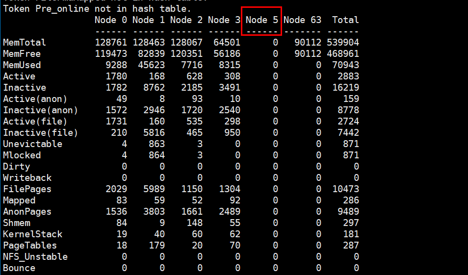
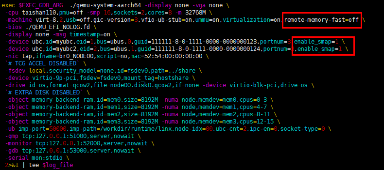
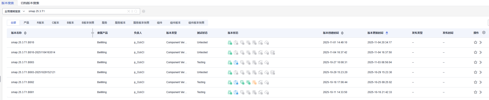
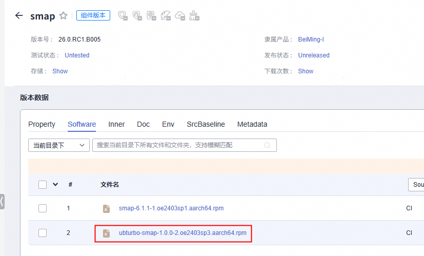
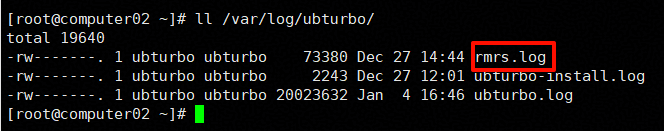
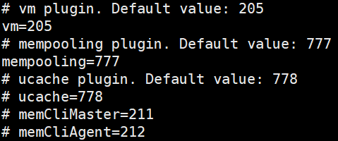
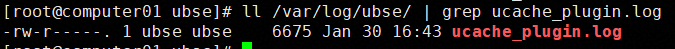

# UBS RMRS 安装指导书

## 前言

**概述**

本文档详细的描述了UBS turbo相关组件流程以及具体的操作指导，同时提供了常见的问题解答及故障处理方法。

## 环境要求

**最小硬件要求**

硬件要求如[表1](#table1)所示。

**表 1**  最小硬件要求<a id="table1"></a>

|部件名称|最小硬件要求|说明|
|--|--|--|
|架构|AArch64|支持Arm的64位架构。|
|CPU|华为鲲鹏920系列CPU|-|
|内存|不小于4GB（为了获得更好的应用体验，建议不小于8GB）|-|
|硬盘|为了获得更好的应用体验，建议不小于120GB|支持IDE、SATA、SAS等接口的硬盘。使用DIF功能的NVMe盘，需要对应驱动支持，如果无法使用，请联系硬件厂商。|

## 获取软件包

**获取软件包**

**表 1**  软件包获取

|软件包名称|软件包说明|
|--|--|
|ubturbo-smap-*x.x.x-x*.oe2403sp3.aarch64.rpm|SMAP软件安装包。|
|ham-*x.x.x-x*.oe2403sp1.aarch64.rpm|HAM软件安装包。|
|rmrs-*x.x.x-x*.x1.eulerx_a2.aarch64.rpm|MemPooling软件安装包。|
|ubs-engine-ucache-x.x.x-x.x.oe2403sp3.aarch64.rpm|UBS Engine UCache软件安装包。|
|ubturbo-ucache-x.x.x-x.oe2403sp3.aarch64.rpm|UB TURBO UCache软件安装包。|

## 组件安装

> [!IMPORTANT] 须知
> OS相关特性组件安装支持手动安装和脚本安装，二选一即可。CI上使用自动化脚本安装，此外可以使用手动安装。

### 安装SMAP

**前提条件**

- 安装前先创建ubturbo用户和用户组，配置免密登录，命令如下：

    ```shell
    groupadd -r ubturbo
    useradd -r -g ubturbo -s /sbin/nologin ubturbo
    touch /etc/sudoers.d/ubturbo
    echo "ubturbo ALL=(root) NOPASSWD:/usr/local/bin/cat.sh" > /etc/sudoers.d/ubturbo
    ```

- 当前部署环境需开启ACPI，并提前安装obmm、URMA、libvirt库和numactl库。执行以下命令关闭numa\_balancing和透明大页。

    ```shell
    echo 0 > /proc/sys/kernel/numa_balancing
    echo 0 > /proc/sys/vm/compaction_proactiveness
    echo never > /sys/kernel/mm/transparent_hugepage/defrag
    echo never > /sys/kernel/mm/transparent_hugepage/enabled
    ```

- 虚拟化场景需要安装libvirt，并且参考[配置QEMU和libvirt](#配置qemu和libvirt)进行配置，然后启动服务。容器场景略过此步骤。

    ```shell
    yum install -y qemu*
    yum install -y libvirt*
    # 进行libvirt配置
    systemctl start libvirtd
    ```

    **图 1**  远端NUMA示例
    

- 由于SMAP与HCOM对obmm均有依赖，若先安装SMAP再安装HCOM会导致HCOM出现异常，因此建议安装SMAP前先安装HCOM，安装方式参见《BeiMing 26.0.RC1 UBS Comm用户指南》 \> 安装HCOM。
- 在仿真环境中，当使用SMAP硬件判热功能时，需要以TCG模式启动仿真环境，并对qemu-system-aarch64进程添加enable\_smap=1的传参（添加位置示例如[图2](#fig2)），且设置remote-memory-fast字段为off。

    在当前仿真环境下，采用后端启动方式时，需修改/workdir/scripts/node.sh；采用前端使用方式时，需修改/workdir/scripts/gen/node00.gen.sh和/workdir/scripts/gen/node01.gen.sh。

    **图 2**  示例配置 <a id="fig2"></a>
    

- /dev/shm/smap\_config保存了NUMA和进程配置等信息，使用SMAP动态库的进程如果需要切换用户，则需要先删除该文件。
- smap的period.config文件依赖ubturbo-rmrs组件，若环境上未安装ubturbo-rmrs，则需手动创建目录/opt/ubturbo/conf，且确保目录权限和smap权限一致。
- SMAP运行依赖cat.sh脚本，脚本路径为/usr/local/bin/cat.sh，需确保脚本有执行权限。

    ```shell
    #!/bin/bash
    # 用法: cat.sh <pid> [<filename>]
    # 输出: /proc/<pid>/<filename> 的内容，如果没有提供 <filename>，默认为 numa_maps
    echo "UID=$(id -u), EUID=$(id -ru)" >&2
    if [ $# -lt 1 ]; then
      echo "Usage: $0 <pid> [<filename>]" >&2
      exit 1
    fi
    PID=$1
    FNAME=${2:-numa_maps}  # 如果第二个参数为空，使用默认值 numa_maps
    # 校验 PID 必须是数字
    if ! [[ "$PID" =~ ^[0-9]+$ ]]; then
      echo "Invalid input: PID must be a numeric value" >&2
      exit 1
    fi
    # 可白名单限制
    ALLOWED_FILES=("numa_maps" "smaps" "status" "maps" "cmdline" "environ" "comm")
    if [[ ! " ${ALLOWED_FILES[*]} " =~ " $FNAME " ]]; then
      echo "Invalid filename: $FNAME is not allowed" >&2
      exit 1
    fi
    FILE="/proc/$PID/$FNAME"
    if [ -f "$FILE" ]; then
      /usr/bin/cat "$FILE"
    else
      echo "File not found: $FILE" >&2
      exit 1
    fi
    ```

### 安装步骤

**安装步骤**

1. 安装SMAP。

    从CMC对应仓库获取软件包。

    ```shell
    rpm -ivh ubturbo-smap-x.x.x-x.oe2403sp3.aarch64.rpm
    ```

    **图 1**  SMAP cmc仓库
    
    

    **图 2**  SMAP rpm包
    
    

2. 载入扫描驱动。

    >[!IMPORTANT] 须知
    >BeiMing-I 26.0.RC1.B020 仿真版本smap驱动随仿真安装后，放置于/ko/smap目录下。

    ```shell
    cd /lib/modules/smap
    insmod smap_tracking_core.ko
    ```

    - 安装smap\_histogram\_tracking.ko。

        ```shell
        insmod smap_histogram_tracking.ko
        ```

    - 安装smap\_access\_tracking.ko。

        > [!NOTE] 说明 
        >- 需使能SMAP硬件判热功能，则增加enable\_hist=1
        >- ko的插入顺序在smap\_histogram\_tracking.ko之后。

        ```shell
        insmod smap_access_tracking.ko smap_scene=2
        ```

3. 检查扫描驱动是否载入成功。

    ```shell
    lsmod | grep tracking
    ```

    - 查询到插入的3个ko，则表示载入成功，示例如下：

        ```shell
        [root@computer01 smap]# lsmod | grep smap
        smap_access_tracking       118784  0
        smap_histogram_tracking    24576  1 smap_access_tracking
        smap_tracking_core         20480  1 smap_access_tracking
        ```

4. 虚拟化场景需安装qemu-system-aarch64。

    ```shell
    yum install qemu-system-aarch64 -y
    ```

5. 进入以下目录，载入迁移驱动。

    ```shell
    cd /lib/modules/smap
    ```

    - 容器场景。

        ```shell
        insmod smap_tiering.ko  smap_pgsize=0 smap_scene=2
        ```

    - 虚拟化场景/HAM场景。

        ```shell
        insmod smap_tiering.ko  smap_scene=2
        ```

6. 检查迁移驱动是否载入成功，返回SMAP信息即表示安装成功。

    ```shell
    lsmod | grep smap
    ```

### 安装HAM

> [!IMPORTANT] 须知 
> 源端及目的端配置防火墙策略、关闭SELinux请参考[开启防火墙端口](#开启防火墙端口)和[关闭SELinux](#关闭selinux)。

#### 安装步骤

**前提条件**

已安装obmm、SMAP、内存子系统、ubs-engine。

**安装步骤**

1. 安装libvirt和QEMU相关包。

    ```shell
    yum install -y libvirt*
    yum install -y qemu*
    yum install -y edk2-aarch64.noarch
    ```

2. 配置QEMU和libvirt配置文件及配置步骤参见[配置QEMU和libvirt](#配置qemu和libvirt)。

    > [!NOTE] 说明
    >安装HAM和安装虚拟化极速热迁移相关包，配置文件相同，如已完成配置，无需重复进行配置。

3. 安装HAM rpm包。

    ```shell
    yum install -y ham
    ```

> [!IMPORTANT] 须知
> B003至B019版本若需要在UB硬件环境进行确定性迁移性能验证，则需替换QEMU、SMAP、hisi刷Cache驱动包，安装包参见对应B版本inner目录。

### 安装MemPooling

> [!IMPORTANT] 须知
> 
>- 当前引入UBTurbo新架构后，MemPooling组件由MemPooling插件与RMRS插件组成。
>- MemPooling插件安装在UBS Engine中，RMRS插件安装在UBTurbo中。
>- UBTurbo默认安装RMRS插件，但是要手动打开配置项。

**前提条件**

1. SMAP、UBS Engine、UBTurbo。
2. 根据业务场景选择是否安装libvirt组件：
    a. 容器场景无需安装libvirt。
    b. 虚机场景需安装libvirt，并且参考[配置QEMU和libvirt](#配置qemu和libvirt)进行配置，然后启动服务。

        ```
        yum install -y qemu*
        yum install -y libvirt*
        //进行libvirt配置
        systemctl start libvirtd
        ```

3. 容器场景开启pagecache迁移功能时，需要执行以下命令关闭文件页的透明大页。

    ```shell
    echo never > /sys/kernel/mm/transparent_hugepage/file_enabled
    ```

**UBTurbo、UBS Engine和Mempooling组件安装与启动**

> [!IMPORTANT] 须知 
> 
>- 此安装和启动顺序仅需在单节点内保证即可。
>- 以下仅阐述安装和启动顺序，详细说明请查阅组件的对应章节。
>- 在容器超分场景，启用Pagecache远端迁移功能时，需要插入ucache.ko。

1. 安装UBTurbo。
2. 安装UBS Engine。
3. 安装MemPooling组件。
4. 启动/重启UBTurbo。

    ```shell
    systemctl restart ubturbo
    ```

5. 启动/重启UBS Engine。

    ```shell
    systemctl restart ubse
    ```

**RMRS插件安装**

> [!IMPORTANT] 须知
> 
>- RMRS插件安装和运行在UBTurbo中。
>- 在所有节点都需执行。

1. 将UBTurbo用户加入libvirt组。

    RMRS插件中需要通过libvirt采集虚机相关信息，当前UBTurbo进程默认无法访问libvirt服务，需要将UBTurbo用户加入libvirt组，才能调用libvirt相关功能，命令如下：

    ```shell
    usermod -aG libvirt ubturbo
    ```

    检查是否添加成功，输出内容包含libvirt则表示添加成功：

    ```shell
    groups ubturbo
    
    ```

    输出示例如下：

    ```shell
    ubturbo : ubturbo libvirt
    ```

    如果此前UBTurbo服务已经启动，则需要重启UBTurbo服务使上述属组修改生效：

    ```shell
    systemctl restart ubturbo
    ```

2. 检查库文件、配置文件如下所示：

    ```shell
    /opt/ubturbo/lib/librmrs_ubturbo_plugin.so  
    /opt/ubturbo/conf/plugin_rmrs.conf
    ```

3. 修改UBTurbo的准入配置。

    1. /opt/ubturbo/conf/plugin\_rmrs.conf

        ```shell
        turbo.plugin.name=rmrs
        turbo.plugin.pkg=librmrs_ubturbo_plugin.so
        rmrs.ucache.enable=false
        ```

        参数说明如[表1](#table2)所示。

        **表 1**  参数说明 <a id="table2"></a>

        |参数名称|参数值|说明|
        |--|--|--|
        |turbo.plugin.name|默认值：rmrs|UBTurbo插件名。|
        |turbo.plugin.pkg|默认值：librmrs_ubturbo_plugin.so|包名。|
        |rmrs.ucache.enable|默认值：false取值范围：truefalse|容器超分场景，是否开启Pagecache迁移功能。|

    2. 在/opt/ubturbo/conf/ubturbo\_plugin\_admission.conf中取消“rmrs=777”的注释。

        参数示例如下：

        ```shell
        # code 必须大于200
        
        rmrs=777
        #turbo_ucache=778
        ```

        **表 2**  新增参数说明

        |序号|参数|说明|取值|配置节点|应用场景|
        |--|--|--|--|--|--|
        |1|rmrs|rmrs插件。|默认值：777|所有节点|通算虚拟化场景|

    3. 重启UBTurbo后，通过查看/var/log/ubturbo/rmrs.log日志文件，检查RMRS插件是否启动成功。

        **图 1**  rmrs.log日志文件
        
        

        ```shell
        cat /var/log/ubturbo/rmrs.log | grep "RMRS plugin initialization succeed."
        ```

        输出以下信息，则代表RMRS插件启动成功。

        ```shell
        RMRS plugin initialization succeed.
        ```

**MemPooling插件安装步骤**

1. MemPooling插件安装和运行在UBSE中，UB环境下需手动安装。

    ```shell
    rpm -ivh ubs-engine-rmrs-*.aarch64.rpm
    ```

2. 检查库文件、配置文件、头文件路径如下所示：

    ```shell
    /usr/lib64/libmempooling.so  
    /etc/ubse/plugins//plugin_mempooling.conf 
    /usr/local/mempooling/include/mempooling/mempooling_interface.h
    ```

3. 参数配置说明。
   
    1. /etc/ubse/plugins/plugin\_mempooling.conf

        ```shell
        ubse.plugin.name=mempooling
        ubse.plugin.pkg=libmempooling.so
        
        # 容器超分场景，是否启用PageCache迁移功能
        ucache.enable=false
        rmrs.ipc.timeout=60
        # 内存碎片场景，是否必须同平面(true:必须同平面，false:优先同平面)
        rmrs.fragment.mustSamePlane=true
        # 内存碎片场景，借用是否切分为4G粒度（true:切分，false:不切分）
        rmrs.fragmemt.enableBorrowSplit=true
        # 超分场景，是否为虚机多numa场景（true:虚机多numa场景，false:单numa场景）overcommit.enableMultiNuma=false
        ```

        参数说明如[表3](#table3)所示。

        **表 3**  参数说明 <a id="table3"></a>

        |参数名称|参数值|说明|
        |--|--|--|
        |ubse.plugin.name|默认值：mempooling|MemPooling插件名称。|
        |ubse.plugin.pkg|默认值：libmempooling.so|包名。|
        |rmrs.fragment.mustSamePlane|默认值：true单位：bool配置范围：truefalse|内存碎片场景，内存借用、迁出策略、迁出执行、故障处理，是否必须同平面。true：必须同平面。false：优先同平面。|
        |ucache.enable|默认值：false单位：bool配置范围：truefalse|容器超分场景，是否启用PageCache迁移功能。|
        |rmrs.ipc.timeout|默认值：60单位：秒|和osturbo的插件rmrs之间IPC通信的超时时间。|
        |rmrs.fragmemt.enableBorrowSplit|默认值：true单位：bool配置范围：truefalse|内存碎片场景，借用是否切分为4G粒度。true：切分false：不切分|
        |overcommit.enableMultiNuma|默认值：false单位：bool配置范围：truefalse|内存超分场景：是否为虚机多numa场景。true：虚拟机多NUMA场景false：单NUMA场景|

    2. /etc/ubse/ubse\_plugin\_admission.conf，新增参数“mempooling=777”。

        **图 2**  ubse\_plugin\_admission.conf参数示例

        

        **表 4**  新增参数说明

        |序号|参数|说明|取值|配置节点|应用场景|
        |--|--|--|--|--|--|
        |1|mempooling|MemPooling插件。|默认值：777|所有节点|通算虚拟化场景|

    3. 重启ubse后，通过查看有无生成mempooling\_plugin.log日志文件，检查mempooling.so是否启动成功。

        ```shell
        [root@computer01 ubse]# ll /var/log/ubse/mempooling_plugin.log 
        -rw-r----- 1 ubse ubse 19319995 Nov 10 16:46 /var/log/ubse/mempooling_plugin.log
        ```

### 安装UCache

> [!IMPORTANT] 须知
>当前引入UBTurbo新架构后，UCache组件由UBS Engine插件与UBTurbo插件组成。

**前提条件**

1. 已安装SMAP、UBS Engine、UB Turbo。
2. 执行以下命令关闭文件页的透明大页。

    ```shell
    echo never > /sys/kernel/mm/transparent_hugepage/file_enabled
    ```

**UBS Engine UCache组件安装与启动**

1. UBS Engine UCache插件安装和运行在UBSE中。

    ```shell
    rpm -ivh ubs-engine-ucache-x.x.x-x.x.oe2403sp3.aarch64.rpm
    ```

2. 检查库文件、配置文件、头文件路径如下所示：

    ```shell
    /usr/lib64/libucache_plugin.so
    /etc/ubse/plugins/plugin_ucache.conf
    ```

3. 参数配置说明。
    1. 配置/usr/local/softbus/ctrlbus/conf/plugin\_ucache.conf文件。

        ```shell
        ubse.plugin.name=ucache
        ubse.plugin.pkg=libucache_plugin.so
        # 采集间隔
        ucache.export.interval=10
        # 借用策略粒度
        strategy.borrow_size=1073741824
        # 借用策略最大输出动作数量
        strategy.maxActionSize=10
        # 借用策略平衡阈值
        strategy.balanceThreshold=1.5
        # 借用策略最小借用稀缺度
        strategy.scarcityThreshold=0.01
        # 瓶颈识别 - 阈值（类型：uint32, 单位：kb/s, 默认配置：10240 kb/s）
        bottleneck.threshold=10240
        # 瓶颈识别 - 短窗口长度（类型：uint32，单位：秒，默认配置：180秒）
        bottleneck.short.size=180
        # 瓶颈识别 - 短窗口阈值（类型：uint32，单位：百分比，默认配置：70%）
        bottleneck.short.threshold=70
        # 瓶颈识别 - 长窗口长度（类型：uint32，单位：秒，默认配置：600秒）
        bottleneck.long.size=600
        # 瓶颈识别 - 长窗口阈值（类型：uint32，单位：百分比，默认配置：30%）
        bottleneck.long.threshold=30
        # 借用策略数据最大可靠周期
        strategy.maxReliableTimes=3
        # master主流程间隔时间（s）
        master.masterInterval=10
        # 最大借用内存量，Byte
        master.maxBorrowSize=1073741824
        ```

        参数说明如[表1 参数说明](#table4)所示。

        **表 1**  参数说明 <a id="table4"></a>

        |参数名称|参数值|说明|
        |--|--|--|
        |ubse.plugin.name|默认值：ucache|ucache插件名称。|
        |ubse.plugin.pkg|默认值：libucache_plugin.so|包名。|
        |ucache.export.interval|默认值：2单位：秒配置范围：> 0|采集间隔，整数型。参数不在配置范围，插件初始化失败。|
        |strategy.borrow_size|默认值：1073741824单位：字节配置范围：[134217728,4294967296]|用16进制表示，单次借用或归还动作操作的最小内存大小。参数不在配置范围，插件初始化失败。|
        |strategy.maxActionSize|默认值：10配置范围：>=0|借用策略动作集动作的最大数量，整数型。参数不在配置范围，插件初始化失败。|
        |strategy.balanceThreshold|默认值：1.5配置范围：>=1|借用策略中平衡阈值，节点的平衡状态如果大于平衡阈值将会发生借用调度来平衡系统，浮点型。参数不在配置范围，插件初始化失败。|
        |strategy.scarcityThreshold|默认值：0.01配置范围：>=0|发起借用动作时的最小内存稀缺度，浮点型。参数不在配置范围，插件初始化失败。|
        |bottleneck.threshold|默认值：10240单位：KB/s配置范围：[1,10*1024*1024]|应用瓶颈识别的阈值，来判断PageCache in和IO读写带宽，整数型。参数不在配置范围，则采用默认值。|
        |bottleneck.short.size|默认值：180单位：秒配置范围：[30,1200]|应用瓶颈识别的短窗口长度，整数型。参数不在配置范围，则采用默认值。|
        |bottleneck.short.threshold|默认值：70单位：百分比配置范围：[0,100]|应用瓶颈识别的短窗口阈值，整数型。参数不在配置范围，则采用默认值。|
        |bottleneck.long.size|默认值：600单位：秒配置范围：[90,3600]|应用瓶颈识别的长窗口长度，整数型。参数不在配置范围，则采用默认值。|
        |bottleneck.long.threshold|默认值：30单位：百分比配置范围：[0,100]|应用瓶颈识别的长窗口阈值，整数型。参数不在配置范围，则采用默认值。|
        |strategy.maxReliableTimes|默认值：3配置范围：[1,10]|借用策略数据最大可靠周期数，每个周期的时间由master.masterInterval 决定，整数型。参数不在配置范围，则采用默认值。|
        |master.masterInterval|默认值：3单位：秒配置范围：[1,15]|master主流程间隔时间，整数型。|
        |master.maxBorrowSize|默认值：1073741824单位：字节配置范围：strategy.borrow_size的正整数倍|最大借用内存量，整数型。参数不在配置范围，插件初始化失败。|

    2. 修改/etc/ubse/ubse\_plugin\_admission.conf，启用“ucache=778”。

        ```shell
        # vm plugin. Default value: 205
        # vm=205
        # mempooling plugin. Default value: 777
        # mempooling=777
        # ucache plugin. Default value: 778
        ucache=778
        ```

        **表 2**  新增参数说明

        |序号|参数|说明|取值|配置节点|应用场景|
        |--|--|--|--|--|--|
        |1|ucache|UCache插件。|默认值：778|所有节点|通算大数据场景|

    3. 重启ubse后，通过查看有无生成ucache\_plugin.log日志文件，检查UBS Engine UCache是否启动成功。

        **图 1**  ucache日志文件

        

**UB Turbo UCache组件安装与启动**

1. UB Turbo UCache插件安装和运行在UB Turbo中。

    ```shell
    rpm -ivh ubturbo-ucache-*.aarch64.rpm
    ```

2. 检查库文件、配置文件、头文件路径如下所示：

    ```shell
    /opt/ubturbo/lib/libucache_os_turbo_plugin.so
    /opt/ubturbo/conf/plugin_turbo_ucache.conf
    ```

3. 参数配置说明。

    1. /usr/local/softbus/ctrlbus/conf/plugin\_ucache.conf

        ```shell
        turbo.plugin.name=ucache
        turbo.plugin.pkg=libucache_os_turbo_plugin.so
        # Migration execution interval
        migrate.migrateInterval=1000
        ```

        参数说明如[表1 参数说明](#table5)所示。

        **表 3**  参数说明 <a id="table5"></a>

        |参数名称|参数值|说明|
        |--|--|--|
        |turbo.plugin.name|默认值：ucache|ucache插件名称。|
        |turbo.plugin.pkg|默认值：libucache_os_turbo_plugin.so|包名。|
        |migrate.migrateInterval|默认值：1000单位：毫秒配置范围：> 0|迁移间隔，整数型。参数不在配置范围，插件初始化失败。|

    2. 修改/opt/ubturbo/conf/ubturbo\_plugin\_admission.conf，启用“turbo\_ucache=778”。

        ```shell
        # code 必须大于200
        # rmrs=777
        turbo_ucache=778
        ```

        **表 4**  新增参数说明

        |序号|参数|说明|取值|配置节点|应用场景|
        |--|--|--|--|--|--|
        |1|turbo_ucache|UCache插件。|默认值：778|所有节点|通算大数据场景|

    3. 重启ubturbo后，通过查看有无生成ucache\_plugin.log日志文件，检查UB Turbo UCache是否启动成功。

        返回信息示例如下：

        ```shell
        [root@computer03 ubse]# ll /var/log/ubturbo/ | grep ucache
        -rw-------. 1 ubturbo ubturbo 13941 Feb 24 15:25 ucache_plugin.log
        ```

## 常用操作

### 开启防火墙端口

UBS相关组件和服务在安装过程中需要开启对应防火墙端口以确保安装进程和相关服务能够正常启动。若在安装部署和服务启动过程中未开启相关防火墙端口，将导致相关组件及服务不能够正常使用或安装失败。若需手动开启工具所需防火墙端口，则可通过执行以下步骤进行。

> [!NOTE] 说明
> 
>- 以下命令中的端口参数port是UBS组件安装过程中设置的端口号，请根据实际情况修改。
>- 若用户还配置了硬件防火墙，则需要用户联系相关的网络管理员同步完成对硬件防火墙的配置，开通需要访问的端口。
>- 开启防火墙端口需先开启防火墙，具体需要进行放行的端口号参见[防火墙放行端口说明](#防火墙放行端口说明)。

1. 执行以下命令查看防火墙是否开启：

    ```shell
    systemctl status firewalld
    ```

    显示“inactive”表示防火墙没有开启，请跳过以下所有步骤。

2. 执行以下命令查看端口是否开通：

    ```shell
    firewall-cmd --query-port=port/tcp
    ```

    提示“no”表示端口未开通。

3. 执行以下命令永久开通端口：

    ```shell
    firewall-cmd --add-port=port/tcp --permanent
    ```

    提示“success”表示开通成功。

4. 执行以下命令重新载入配置。

    ```shell
    firewall-cmd --reload
    ```

5. 再次执行以下命令查看端口是否开通：

    ```shell
    firewall-cmd --query-port=port/tcp
    ```

    提示“yes”表示端口已开通。

    > [!NOTE] 说明
    >
    > - 如果想要移除端口，请执行以下命令：
    >
    >    ```shell
    >    firewall-cmd --permanent --remove-port=port/tcp
    >    ```
    >
    >    提示“success”表示端口移除成功。
    >    移除成功后再执行以下命令重新载入配置。
    >    
    >    ```shell
    >    firewall-cmd --reload
    >    ```
    >
    > - 若操作系统中没有firewalld，则需要先安装firewalld，再执行以上命令。

## 关闭SELinux

- **临时关闭**

    > [!NOTE] 说明
    >
    > - 服务器重启后失效，工具使用过程中可能会出现服务异常。
    > - 当SELinux已经永久关闭时，执行sestatus会返回如下信息，此时无需执行临时关闭操作。
    >    
    >    ```shell
    >    [root@localhost ~]# sestatus
    >    SELinux status:                 disabled
    >    ```

    1. 执行以下命令查询SELinux状态。

        ```shell
        sestatus
        ```

        “Current mode”显示“enforcing”表示SELinux已开启强制模式。

    2. 执行如下命令将SELinux模式设置为“disabled”。

        ```shell
        setenforce 0
        ```

    3. 再次查询SELinux状态。

        “Current mode”显示“permissive”表示SELinux已临时关闭强制模式。

- **永久关闭**
  
    1. 执行以下命令查询SELinux状态。

        ```shell
        sestatus
        ```

        “SELinux status”显示“enabled”表示SELinux已开启。

    2. 执行如下命令修改“/etc/selinux/config”文件。

        ```shell
        vi /etc/selinux/config
        ```

    3. 按“i”进入编辑模式，将“SELINUX=enforcing”改为“SELINUX=disabled”。
    4. 按“ESC”，输入“:wq”，按“Enter”保存并退出。
    5. 重启服务器，参考[重启服务器](#重启服务器)。
    6. 执行以下命令重启服务器。

        ```shell
        reboot
        ```

    7. 再次查询SELinux状态。

        “SELinux status”显示“disabled”表示SELinux已关闭。

## 重启服务器

- 单机环境下可通过执行**reboot**命令进行重启。
- 4P环境下可通过执行**reboot**命令进行重启。
- 8P环境下，HCCS需依靠整机AC重启，UB支持通过执行**reboot**命令进行重启。

## 配置QEMU和libvirt

### UB仿真环境

**前提条件**

- 修改/etc/bashrc文件，添加环境变量并保存：

    ```shell
    export LIBVIRT_LOG_OUTPUTS="2:file:/var/log/libvirt/libvirtd.log"
    export LIBVIRT_DEBUG=2
    ```

- 同时安装HAM和虚拟化极速热迁移相关包时，配置文件相同，配置步骤相同，无需重复配置。
- 执行以下命令查询设备文件，并根据实际返回信息进行修改/etc/libvirt/qemu.conf文件里的/dev/uburma/xxx、/dev/ummu/xxx。

    ```shell
    ll /dev/uburma/
    ll /dev/ummu/
    ```

> [!NOTE] 说明
> 
> - 默认情况下，QEMU 的日志等级设置为 info，如需修改日志等级（性能场景日志等级需小于或等于info）：
>
>    1. 编辑/etc/qemu/qemu.conf文件。
>    2. 修改log\_level配置项的值并保存文件。
> 
> - log\_level 的修改仅对在此之后创建的虚拟机生效，已创建的虚拟机将不会受到影响。

**操作步骤**

1. 安装完成后，需配置源端、目的端相关文件。

    > [!NOTE] 说明
    > 源端是指迁移发起端节点，目的端是虚拟机要迁移的目的地主机节点。

    - “/etc/libvirt/qemu.conf”

        ```shell
        user = "root" # 非强制要求root权限，用户可自行配置
        group = "root" # 非强制要求root权限，用户可自行配置
        namespaces = []
        cgroup_controllers = [ "cpu","devices", "memory", "blkio", "cpuset","cpuacct" ]
        cgroup_device_acl = [
        "/dev/null", "/dev/full", "/dev/zero",
        "/dev/random", "/dev/urandom",
        "/dev/ptmx", "/dev/kvm",
        "/dev/rtc","/dev/hpet","/dev/mem",
        "/dev/ham_migrate",
        "/dev/infiniband/rdma_cm",
        "/dev/obmm",
        "/dev/uburma/roceo1",
        "/dev/uburma/roceo2",
        "/dev/uburma/roceo3",
        "/dev/uburma/roceo4",
        "/dev/uburma/udma0",
        "/dev/uburma/udma3",
        "/dev/ummu/tid"
        ]
        max_files = 4096
        max_core = "unlimited"
        seccomp_sandbox = 0
        migration_address = "0.0.0.0"
        ```

    - “/etc/libvirt/libvirtd.conf”

        ```shell
        keepalive_interval = 40
        keepalive_count = 20
        listen_tls = 0
        listen_tcp = 1
        tcp_port = "16509"
        listen_addr = "0.0.0.0"
        unix_sock_group = "libvirt"
        unix_sock_ro_perms = "0770"
        unix_sock_rw_perms = "0770"
        auth_unix_ro = "none"
        auth_unix_rw = "none"
        auth_tcp = "none"
        auth_tls = "none"
        log_level = 2
        log_outputs="2:file:/var/log/libvirt/libvirtd.log"
        host_uuid = "43ae7267-97e7-4eff-a273-e739ce486d99" #源端、目的端不同
        ```

        > [!NOTE] 说明
        >源端、目的端的host\_uuid可以通过以下命令获取。
        > 
        >```shell
        >uuidgen
        >```

    - “/usr/lib/systemd/system/libvirtd.service”，将Environment=LIBVIRTD\_ARGS的字段值修改为 "--listen"。

        ```shell
        Environment=LIBVIRTD_ARGS="--listen"
        ```

2. 配置libvirt。

    1. 禁用libvirt服务。

        ```shell
        systemctl mask libvirtd.socket libvirtd-ro.socket libvirtd-admin.socket libvirtd-tcp.socket libvirtd-tls.socket
        ```

    2. 完成后，重新加载配置。

        ```shell
        systemctl daemon-reload
        ```

    3. 重启libvirt服务。

        ```shell
        systemctl restart libvirtd
        ```

    4. 检查libvirt服务状态。

        ```shell
        重启后查看服务状态，确保服务处于“active (running)”状态
        systemctl status libvirtd
        ```

3. 配置日志转储策略文件“/etc/logrotate.d/libvirtd”，用户可以根据需求自行配置，如下示例将会保存7天的libvirt日志。

    > [!IMPORTANT] 须知
    > Libvirt将始终使用UTC来进行日志记录，如果系统时间设置为CST时区，则libvirtd日志时间与系统时间存在8个小时时差。

    ```shell
    /var/log/libvirt/libvirtd.log {
            daily   # 每天轮转一次日志
            missingok  # 如果日志文件不存在，不报错
            rotate 7  # 保留最近7次轮转的日志（即7天）
            compress  # 压缩旧日志（默认用gzip，扩展名为.gz）
            delaycompress  # 延迟压缩：本次轮转的日志不压缩，下次轮转时再压缩
            copytruncate  # 复制原日志文件后截断，避免重启服务
    }
    ```

### 配置SSH密钥认证

**配置Windows公私钥**

1. 打开本地cmd终端。
2. 执行如下命令生成公私钥对。

    **ssh-keygen -m PEM -t rsa -b 3072**

    过程中需要：

    - （可选）输入保存的文件名，默认为在“C:\\Users\\_username_\\.ssh”目录下保存为“id\_rsa”（私钥）和“id\_rsa.pub”（公钥）文件。
    - （可选）设置密钥的密码口令。

    回显信息如下：

    ```shell
    Generating public/private rsa key pair. 
     Enter file in which to save the key (C:\Users\username\.ssh\id_rsa): 
     Enter passphrase (empty for no passphrase): 
     Enter same passphrase again: 
     Your identification has been saved in C:\Users\username\.ssh\id_rsa. 
     Your public key has been saved in C:\Users\username\.ssh\id_rsa.pub. 
     The key fingerprint is: 
    SHA256:rCRpryf6uZU+dQd/S8WN1azvay58zi3gtb53gayhvO8 china\username@HGHY4USERNAME 
     The key's randomart image is: 
    +---[RSA 3072]----+
    |               ..|
    |                +|
    |               =.|
    |     . .  .   o +|
    |    + . S  o. .o |
    |   . + o. ..+o+..|
    |      =....o+= +.|
    |    .=o  o ..o=o=|
    |  .o=+.. .+E .OO+|
    +----[SHA256]-----+
    ```

3. 普通用户登录服务器并上传公钥文件“id\_rsa.pub”。

    将公钥文件放至“/home/_操作系统用户名_/.ssh”目录下，将公钥文件“id\_rsa.pub”名字改为“authorized\_keys”。

    如已存在此“authorized\_keys”文件，将公钥文件内容复制至“authorized\_keys”文件中即可。

4. 设置“authorized\_keys”文件的权限为600。

    **chmod 600 /home/_操作系统用户名_/.ssh/authorized\_keys**

5. 查看服务器ssh配置文件。

    **cat /etc/ssh/sshd\_config**

    检查以下两处开关：

    **PubkeyAuthentication yes**

    **RSAAuthentication yes**

    如若不是“yes”将上述开关设为“yes”后保存配置文件并重启sshd服务。

**配置Linux公私钥**

1. 使用SSH远程登录工具，以系统用户登录Linux操作系统命令行界面。

    >[!NOTE] 说明 
    >该步骤必须在root用户下执行，若以普通系统用户登录，需要执行**su**切换到root用户下执行后续操作。

2. 执行如下命令生成公私钥对。

    ```shell
    ssh-keygen -t rsa -b 4096
    ```

    过程中需要：

    - （可选）输入保存的文件名，默认为在“/root/.ssh/id\_rsa”目录下保存为“id\_rsa”（私钥）和“id\_rsa.pub”（公钥）文件。
    - （可选）设置密钥的密码口令。

    回显信息如下：

    ```shell
    Generating public/private rsa key pair.
     Enter file in which to save the key (/root/.ssh/id_rsa):
     Enter passphrase (empty for no passphrase):
     Enter same passphrase again:
     Your identification has been saved in /root/.ssh/id_rsa.
     Your public key has been saved in /root/.ssh/id_rsa.pub.
     The key fingerprint is:
     SHA256:VQ/d88ESEpx1M91WDEi6KHXOu1/mCSFkq7DjxtEqZ9A root@Malluma
     The key's randomart image is:
     +---[RSA 4096]----+
     | .+B=+B=|
     | =o+o+O|
     | . * o.+|
     | . O o .|
     | .o.S * . |
     | . E+.. o . |
     | ooo. . . o |
     | ..*. . = . |
     | =. ... o |
     +----[SHA256]-----+
    ```

3. 执行如下命令将公钥文件上传到节点服务器。

    ```shell
    ssh-copy-id -i /root/.ssh/id_rsa.pub root@Server IP
    ```

    > [!NOTE] 说明
    >
    > - /root/.ssh/id\_rsa.pub_为生成的公钥文件，_Server IP_为节点服务器IP地址，请根据实际替换。
    > - 上传的公钥文件默认保存在“/root/.ssh”目录，若使用普通用户请上传至对应用户目录下，且在命令中将root用户替换为普通用户名。

    上传过程中需要输入节点服务器对应用户的密码。

4. 执行如下命令将私钥文件复制到主从节点上。

    ```shell
    主节点执行 ssh-copy-id -i ~/.ssh/id_rsa.pub root@192.168.100.101
    从节点执行 ssh-copy-id -i ~/.ssh/id_rsa.pub root@192.168.100.100
    ```

5. 各节点重启sshd服务。

    ```shell
    systemctl restart sshd
    ```

## 更多资源

**表 1**  更多资源

|文件名称|存储路径|
|--|--|
|hccs-env.sh|LingQu BeiMing-TD 2.0.0.*version*版本库中获取。该资源文件存储在Software下MatrixOS/OS/aarch64/hccs_obmm_script路径中。|
|obmm_configure.py|
|ub_test.tar.gz|LingQu BeiMing-TD 2.0.0.*version*版本库中获取，该资源文件存储在Inner目录下。|

## 防火墙放行端口说明

> [!IMPORTANT] 须知
> 
>- 为确保环境安全，需根据实际情况参考[开启防火墙端口](#开启防火墙端口)进行端口放行配置。配置端口需确保该端口未被占用。
>- 默认端口可能因为业务实际情况进行了修改，进行端口放行配置前需确定端口号准确，端口范围\[1024,65535\]。

**表 1**  端口说明

|默认端口|组件/服务|配置位置|说明|
|--|--|--|--|
|6379|redis-server|/home/redis-6.0.5/redis.conf|SMAP组件中Redis服务端口。|
|1901|RackManager|conf/rackmanager.conf文件master.Address参数。|RackManager Master主地址端侦听端口号。|
|16509|libvirt|/etc/libvirt/libvirtd.conf|TCP端口。|
