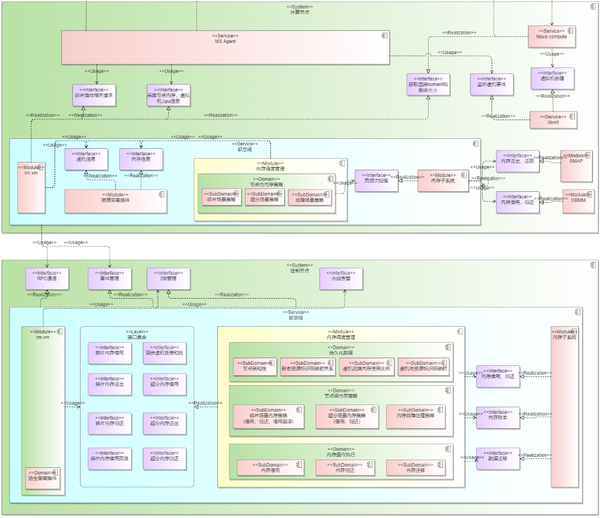

# RMRS 用户指南

# 介绍

OS加速的系统特性主要包括：虚机的超分/内存碎片、容器超分、分级内存流动、虚机确定性热迁移等特性。

> [!IMPORTANT] 须知
> 
> - 冷热依赖SMAP，LD/ST依赖OBMM，使用时需部署相关组件，部署配置参见《BeiMing 25.3.T1 UBS 安装指南》。
> - 文档配置需与《BeiMing 25.3.T1 UBS 安装指南》一致，涉及QEMU、Libvirt配置文件，配置错误会影响迁移可用性。

**表 1**  迁移方式新增特性说明

|迁移方式|说明|
|--|--|
|onecopy热迁移|新增支持内存一次性拷贝，以减少迁移中断时间和端到端时间。|
|HAM热迁移|新增onecopy功能。LD/ST通信语义迁移功能。迭代迁移冷热数据过滤功能。支持原生多线程迁移参数。|

# 约束限制

## SMAP约束限制

- 能够被迁移内存的进程需满足只使用了一个本地NUMA内存的条件。
    - 虚拟化场景绑定虚机cpu时，请使用cputune严格指定同一NUMA的核，体现在cpuset相关配置中，指定同一NUMA的cpu核。

        例如：

        ```shell
        <vcpupin vcpu='0' cpuset='76'/>
        <vcpupin vcpu='1' cpuset='77'/>
        <vcpupin vcpu='2' cpuset='78'/>
        <vcpupin vcpu='3' cpuset='79'/>
        ```

        其中，76、77、78、79都为NUMA0的cpu核。

    - 虚拟化场景绑定虚机内存的NUMA时，请在numatune选项中同时指定"memory"和"memnode"的亲和性绑定。

        例如要指定在NUMA0上分配虚机内存时使用配置：

        ```shell
        <memory mode='strict' nodeset='0'/>
        ```

        以及

        ```shell
        <memnode cellid='0' mode='strict' nodeset='0'/>
        ```

- 同一进程的内存只支持迁移到1个远端NUMA上。
- 虚拟化场景仅支持迁移2M大页内存。
- 用户调用SMAP组件需保证远端内存和本地内存安全性一样，用户管理的需要迁移的虚机或容器对应的用户权限应该和远端内存对应的用户权限保持一致。
- 非虚拟化的4K页面场景下使用SMAP迁移应用内存，若存在有保留页面则无法迁出。保留页面包含以下：
    - 大页内存页。
    - 透明大页内存页。
    - 不在LRU链表中的内存页。
    - 内核引用计数为0的内存页。
    - 共享内存页。

## 内存碎片通用约束限制

- 内存碎片场景和内存超分场景不共存。
- 内存借用只支持发生在直连邻居节点，节点可借用内存大于借用请求。
- 调用内存借用策略仅支持输入128M的正整数倍的借用内存大小，单位为KB。
- 单次内存借用执行仅支持128M的正整数倍，且不超过4G。
- 内存归还仅支持将整个远端NUMA节点上的内存归还，不支持按照部分归还。
- 虚拟机仅支持绑定一个本地NUMA节点，仅支持迁出到一个远端NUMA节点。
- 仅支持虚拟机内存分配模式为“immediate”的2M大页虚拟机。
- 更新反亲和性配置输入\{key:\[value\]\}，其中key代表节点且不能重复，value代表与其反亲和的节点。
- 需要输入不重复的全部节点的反亲和性节点列表。
- 内存迁出执行输入时间范围10s-3min，单位为ms。

# 参数对齐

## HAM和OpenStack参数对齐

**参数说明**

迁移flags具体参数说明如[表1](#table1)所示。

**表 1**  参数说明 <a id="table1"></a>

|参数名|参数值|参数说明|是否必需|
|--|--|--|--|
|VIR_MIGRATE_LIVE|1|开启热迁移。|必需|
|VIR_MIGRATE_PEER2PEER|2|开启p2p迁移。|必需|
|VIR_MIGRATE_UNSAFE|512|忽略安全校验。|必需|
|VIR_MIGRATE_PARALLEL|131072|开启多线程迁移。|必需|
|VIR_MIGRATE_ONECOPY|33554432|开启onecopy。|可选|
|VIR_MIGRATE_LDST|134217728|开启LDST迁移。|HAM场景必需|
|VIR_MIGRATE_ENABLE_COLD|536870912|开启冷热识别（仅支持迭代）。|可选|

**迁移配置**

当前迁移需满足以下性能场景：

1. 需要指定线程数8。

    ```shell
    params["parallel.connections"]
    ```

    对应迁移命令--parallel-connections，提升迁移效率。

2. 需要配置QEMU绑核。需要配置部分核给QEMU使用，XML示例如下：

    ```shell
    <vcpupin vcpu="0" cpuset="30" />
        <vcpupin vcpu="1" cpuset="31" />
        <emulatorpin cpuset="32-45" />
    ```

    也可通过params\["migration.pin"\] = "32-45"设置迁移绑核，尤其在性能场景下，QEMU应多绑核。

3. 迭代迁移需要在迁移前设置downtime小于50ms，须确保小于50，可设置30，对应API:domain.migrateSetMaxDowntime\(30,0\)。

# HAM热迁移

## 概述

云场景解决计划内停机（如安全补丁导致的系统重启）的方法是虚机热迁移。

当前虚机热迁移基于页表标脏技术，迁移时长取决于脏页率，时长不可控，体现在时延分布中的超长长尾，极端场景下脏页率导致迁移失败。

确定性虚机热迁移方式，基于灵衢总线的远端内存访问能力与大带宽的背景下，先迁移虚机冷数据，通过灵衢总线远端内存访问能力保活虚机，大部分冷数据迁移完成后，最后热数据部分停机一次性迁移完成。不依赖标脏，实现确定性时长迁移。

## 新增功能及使用说明

**表 1**  新增功能及使用说明

|功能特性|对应virsh参数|
|--|--|
|ld/st通信语义迁移功能|--ldst|

## HAM热迁移约束

### 迁移约束条件

- HAM仅支持2M虚机热迁移。
- HAM底层依赖OBMM&SMAP&内存子系统&MXE，需提前部署。
- 源端热迁移后，目的端虚机还原为最大规格。
- 虚机热迁移性能约束配置与QEMU极速热迁移保持一致。
- HAM仅支持guest\_numa和host\_numa数量都为1的虚机迁移。
- 由于obmm-ub提供进程级借出能力，所以确定性迁移仅支持UB环境。
- 确定性迁移针对各故障场景处理策略如下：（目前仅保证目的端OS Panic场景的可靠性，且故障节点需为MXE从节点）

    **表 1**  确定性迁移故障场景处理策略

|**故障场景**|阶段|**传统热迁移处理策略**|**UB确定性热迁移处理策略**|
|--|--|--|--|
|OS Panic（目的端节点）|迁移中|虚机迁移回滚。|虚机迁移回滚。|
|迁移后|虚机被终止。|虚机被终止。|
|节点异常掉电（目的端节点）|迁移中|虚机迁移回滚。|虚机被终止。|
|迁移后|虚机被终止。|虚机被终止。|
|通信链路异常|迁移中|虚机迁移回滚。|虚机被终止。|
|迁移后|虚机正常。|虚机正常。|

### 测试前置步骤

1. 下载QEMU和Libvirt的压缩包，解压后将全部rpm包上传至测试环境中。
2. 替换QEMU和Libvirt。

    ```shell
    rpm -ivh qemu-* --force --nodeps
    rpm -ivh libvirt-* --force --nodeps
    ```

## 使用方式

确定性迁移。

```shell
virsh migrate $vm_name --live qemu+tcp://$dst_ip/system tcp://$dst_ip/system  --verbose --unsafe --p2p --ldst
```

> [!NOTE] 说明
> 
>1. 其中参数项$vm\_name为虚机名，$dst\_ip为目的端IP地址。
>2. HAM底层调用Linux内核提供的migrate\_pages接口进行内存迁移，该接口不保证100%执行成功，执行失败时，HAM会在dmesg日志打印具体失败信息并将错误上报返回。

# SMAP内存分级

## 内存迁移

> [!IMPORTANT] 须知
> 
> - SMAP内存迁移依赖将远端内存借用到本地。
> - 已安装SMAP。
>    安装SMAP参见“《BeiMing 25.3.T1 UBS 安装指南》 \> 安装SMAP”。

### 概述

在虚拟化场景中，随着虚机内使用内存增加，NUMA内的内存使用率随之增加，当达到一定水线时，虚机的部分内存需要逃生到借用内存。此时SMAP提供能力，将虚机冷数据按照可控比例迁出至借用内存。在之后的时间内，SMAP周期性统计内存冷热信息，保证虚机内应用在使用远端内存时，性能可控。当NUMA内的内存使用率下降到一定水线时，SMAP支持按照借用的内存迁回虚机数据。

### 功能说明

- SMAP内存迁移功能目前只开放给rack\_manager组件使用，由rack\_manager调用“/usr/lib64/libsmap.so”提供的内存迁移功能。功能接口见“《BeiMing 25.3.T1 UBS turbo API参考》\> SMAP用户态API ”。
- SMAP底层使用内核函数migrate\_pages\(\)进行NUMA内存迁移，migrate\_pages\(\)保留内核原有能力，SMAP未对其进行修改。

## 虚拟化场景2M模式SMAP性能约束

虚拟化场景下SMAP为达成2M模式下轻载虚机性能跌落不高于5%，重载虚机性能跌落不高于10%，混布场景平均性能跌落不高于5%，需要满足以下约束：

- 虚机内存模式为立即分配模式。
- 虚拟化场景下，内存迁移及自适应场景需保证远端内存和近端内存的大页内存有余量（大于总的虚机规格的10%）。
- 虚拟机使用的热页总数不超过分配给虚拟机的本地页的80%。
- 虚机混合部署时，对于近端NUMA节点与远端NUMA节点相同的一组虚拟机，需满足轻载虚机总内存规格大于等于重载虚机总内存规格。
- 轻载场景包括：Redis典型用例（参见[Redis典型参数](#redis典型参数)）。
- 重载场景包括：MySQL典型用例、SPECint典型用例（参见[MySQL典型参数](#MySQL典型参数)和[SPECint典型参数](#SPECint典型参数)）。
- 多虚机场景，虚机总数量不高于4个，且测试性能时一个虚机中只能跑一种典型用例，其他场景性能不保证。
- 虚机规格核存比为1:2或1:4，典型虚机规格为4U8G（鲲鹏虚拟化场景）或8U32G。如需使用4U8G以外的规格进行测试，请遵循其他约束缩放推荐测试参数，其他规格场景性能不保证。
- 所有性能数据，至少测试3次，然后按照虚机内存规格计算算术平均值（SUM（虚拟机性能跌落百分比 \* 虚拟机内存规格）/SUM（虚拟机内存规格））。
- 部署SMAP的节点需要保证SMAP进程所在逻辑核与虚拟机所在逻辑核不相同。

在多虚机场景下，当不满足上述约束时，性能有不达标风险。当使用SMAP提供的CLI工具测试SMAP性能时，SMAP支持灵活可配置的方式来达成性能目标，首先通过以下命令关闭SMAP的多虚机自适应配比功能，设置正确的借用内存信息后，通过迁出命令调整每个虚机到合适的配比（总的本地内存使用与总的借用内存使用的比例与灵活配置前保持一致）：

```shell
smap smap_enable_adapt_mem  0
smap set_smap_remote_numa_info [src_nid] [dest_nid] [size]
smap smap_mig_out [dest_nid] [pid] [ratio] [pidType]
```

### Redis典型参数

其中Redis典型用例参数为，4U8G虚机场景下：

- Server

    ```shell
    taskset -c 1 redis-server --port [redis-server port] --protected-mode no
    ```

- Client

    ```shell
    redis-benchmark -t set -n 20000000 -c 128 -r 1640000 -d 2048 --threads 64 -h [redis-server ip] -p [redis-server port]
    ```

### MySQL典型参数

MySQL典型用例测试参数：

- Server侧启动MySQL的配置文件my.conf。

    ```shell
    [mysqld_safe]
    log-error=/data/mysql/log/mysql.log
    pid-file=/data/mysql/run/mysqld.pid
    
    [client]
    socket=/data/mysql/run/mysql.sock
    default-character-set=utf8
    
    [mysqld]
    basedir=/usr/local/mysql
    tmpdir=/data/mysql/tmp
    datadir=/data/mysql/data
    socket=/data/mysql/run/mysql.sock
    port=3306
    user=root
    default_authentication_plugin=mysql_native_password
    ssl=0 # 关闭ssl
    max_connections=2500  # 设置最大连接数
    back_log=1000  # 设置会话请求缓存个数
    performance_schema=OFF # 关闭性能模式
    max_prepared_stmt_count=1048576
    
    # file
    innodb_file_per_table #设置每个表一个文件
    innodb_log_file_size=1000M #设置logfile大小
    innodb_log_files_in_group=4 #设置logfile组个数
    innodb_open_files=3000 #设置最大打开表个数
    
    # buffers
    innodb_buffer_pool_size=4G # 适用于8G内存规格的虚拟机，设置buffer pool size,一般为服务器内存60%
    # innodb_buffer_pool_size=16G 适用于32G内存规格的虚拟机
    innodb_buffer_pool_instances=2 # 设置buffer pool instance个数，提高并发能力
    innodb_log_buffer_size=16M # 设置log buffer size大小
    
    # tune
    default_time_zone=+8:00
    thread_cache_size=100
    sync_binlog=1 # 设置每次sync_binlog事务提交刷盘
    innodb_flush_log_at_trx_commit=1 # 每次事务提交时MySQL都会把log buffer的数据写入log file，并且flush(刷到磁盘)中去
    innodb_use_native_aio=1 # 开启异步IO
    innodb_spin_wait_delay=20 # 设置spin_wait_delay 参数，防止进入系统自旋
    #innodb_sync_spin_loops=25  # 设置spin_loops 循环次数，防止进入系统自旋
    innodb_spin_wait_pause_multiplier=5 # 设置spin lock循环随机数
    innodb_flush_method=O_DIRECT # 设置innodb数据文件及redo log的打开、刷写模式
    innodb_io_capacity=12000 # 设置innodb后台线程每秒最大iops上限
    innodb_io_capacity_max=24000 # 设置压力下innodb后台线程每秒最大iops上限
    innodb_lru_scan_depth=9000 # 设置page cleaner线程每次刷脏页的数量
    innodb_page_cleaners=2  # 设置将脏数据写入到磁盘的线程数
    table_open_cache_instances=2 # 设置打开句柄分区数
    table_open_cache=18000 # 设置打开表的数量
    
    # perf special
    innodb_flush_neighbors=0 # 检测该页所在区(extent)的所有页，如果是脏页，那么一起进行刷新，SSD关闭该功能
    # innodb_write_io_threads=24 # 设置写线程数
    # innodb_read_io_threads=16 # 设置读线程数
    # innodb_purge_threads=32  # 设置回收已经使用并分配的undo页线程数
    # innodb_adaptive_hash_index=0
    sql_mode=STRICT_TRANS_TABLES,NO_ENGINE_SUBSTITUTION,NO_AUTO_VALUE_ON_ZERO,STRICT_ALL_TABLES
    # log-bin=mysql-bin  # 开binlog
    skip_log_bin    # 关binlog
    ```

- client侧的激励脚本read\_write.sh。

    ```shell
    #
    #!/bin/bash
    host=$1
    vm_name=$2
    max_threads=512
    threads_arr=(8 16 32 64 128 256 512)
    time=120
    run_test()
    {
            local threads=$1
            local time=$2
            echo "use ${threads} threads, run ${time}s"
            sysbench --db-driver=mysql --mysql-host=${host} --mysql-port=3306 --mysql-user=root --mysql-password=123456 --mysql-db=sbtest \
            --table_size=10000000 --tables=64 --time=${time} --threads=${threads} --percentile=95 --report-interval=1 oltp_read_write run > /home/mysql_test_results/${vm_name}/${threads}_run.log
    }
    run_loop()
    {
            for threads in ${threads_arr[@]}
            do
                    date
                    run_test ${threads} ${time}
                    sleep 3
            done
    }
    run_loop
    ```

### SPECint典型参数

SPECint典型用例测试参数，4U8G虚机场景：

```shell
HUGETLB_ELFMAP=RW runcpu --config=speccpu-gcc-best.cfg --iteration=1 --copies=4 intrate
```

获取 [speccpu-gcc-best.cfg](./resource/speccpu-gcc-best.cfg)

### Stream典型参数

此SMAP性能保证需要满足以下条件：

1. 计算虚机内部内存使用。

    执行**free -h**命令查看剩余内存量，那么虚机内部内存使用比例计算如下：

    虚机内部内存使用比例 = 1 - 剩余内存量 / 虚机规格

2. 外部计算本地内存占比。

    本地内存占比 = 本地内存 / 虚机规格

3. SMAP保证性能需满足以下条件：

    虚机内部内存使用比例  <= 本地内存占比

## Redis场景额外约束

针对Redis场景有memcpy优化，性能可相比基线提升2%，由于性能提升比例受基线波动率影响较大，因此约束测试环境基线性能波动率要小于5%。

### 测试前置条件

服务端虚机与客户端虚机均需要下电，确认服务端虚机与客户端虚机的配置文件XML中，已将网卡的MTU调至9000，调优网络收发包的基础性能。

- 虚机网卡MTU配置示例如下：

    ```shell
        <interface type='bridge'>
          <mac address='02:22:67:b3:f2:df'/>
          <source bridge='virbr0'/>
          <target dev='vnet7'/>
          <model type='virtio'/>
          <driver name='vhost' queues='4'/>
          <mtu size='9000'/>
          <alias name='net0'/>
          <address type='pci' domain='0x0000' bus='0x01' slot='0x00' function='0x0'/>
        </interface>
    ```

- 按照单虚机Redis内存池化场景，配置SMAP参数。

### 基础优化

启动服务端虚机与客户端虚机后，需要进行基础调优，保证基线性能稳定。

- 虚机vhost线程绑核

    查看服务端虚机和客户端虚机的vhost线程。

    ```shell
    ps -ef | grep vhost
    ```

    通过taskset -cp命令对服务端虚机和客户端虚机的vhost线程手动绑核，注意需要规避虚机占用的核。

- 服务端虚机网卡基础性能优化

    以虚机使用网卡为eth0示例，查看中断号。

    ```shell
    cat /proc/interrupts| grep virtio0
    ```

    将默认在0号核上的中断绑定在1号核（此处假设0号核涉及的中断号为62、63）。

    ```shell
    echo 1 > /proc/irq/62/smp_affinity_list
    echo 1 > /proc/irq/63/smp_affinity_list
    ```

    网卡队列不绑核。

    ```shell
    echo 0 > /sys/class/net/eth0/queues/rx-0/xps_cpus
    echo 0 > /sys/class/net/eth0/queues/rx-1/xps_cpus
    echo 0 > /sys/class/net/eth0/queues/rx-2/xps_cpus
    echo 0 > /sys/class/net/eth0/queues/rx-3/xps_cpus
    echo 0 > /sys/class/net/eth0/queues/tx-0/xps_cpus
    echo 0 > /sys/class/net/eth0/queues/tx-1/xps_cpus
    echo 0 > /sys/class/net/eth0/queues/tx-2/xps_cpus
    echo 0 > /sys/class/net/eth0/queues/tx-3/xps_cpus
    ```

- 客户端虚机网卡基础性能优化

    以虚机使用网卡为eth0示例，网卡队列不绑核。

    ```shell
    echo 0 > /sys/class/net/eth0/queues/rx-0/xps_cpus
    echo 0 > /sys/class/net/eth0/queues/rx-1/xps_cpus
    echo 0 > /sys/class/net/eth0/queues/rx-2/xps_cpus
    echo 0 > /sys/class/net/eth0/queues/rx-3/xps_cpus
    echo 0 > /sys/class/net/eth0/queues/tx-0/xps_cpus
    echo 0 > /sys/class/net/eth0/queues/tx-1/xps_cpus
    echo 0 > /sys/class/net/eth0/queues/tx-2/xps_cpus
    echo 0 > /sys/class/net/eth0/queues/tx-3/xps_cpus
    ```

### 测试步骤

- 基线测试：服务端虚机绑定0号核拉起Redis-server，客户端连续测试5次set，再连续测试5次get，统计均值。

    ```shell
    taskset -c 0 /home/redis-6.0.5/src/redis-server /home/redis-6.0.5/redis.conf --port 6379
    ```

- memcpy优化测试：服务端虚机加载算法优化库，绑0号核拉起Redis-server，客户端连续测试5次set，再连续测试5次get，统计均值。

    ```shell
    LD_PRELOAD=/usr/lib64/libksal_libc.so taskset -c 0 /home/redis-6.0.5/src/redis-server /home/redis-6.0.5/redis.conf --port 6379
    ```

## 规格说明

**表 1**  规格说明

|规格项|规格（虚拟化2M场景）|-|
|:---|:---|:---|
|单虚拟机最小规格|2U2G|同解决方案对齐最小规格。|
|单节点最大虚拟机数量|100（容器场景为300个进程）|按照2U2G最小虚机计算，内存最大为2TB，CPU型号1650，CPU核心数量192。|
|最大借用内存节点|7|RackServer最大邻居节点7个。|
|最大借用远端NUMA数|18|每个socket呈现1个远端NUMA。|
|本地最大NUMA数|4|-|
|迁出最大比例|100%|-|
|性能跌落|5%|同解决方案对齐性能指标：<ol><li>虚机使用远端内存3:1场景VS虚机全部使用本地内存，使用membench测试性能劣化<5%。</li><li>虚机使用远端内存3:1场景下虚机应用（Redis，MySQL，UnixBench、Nginx，Tomcat）性能劣化<5%。</li><li>容器MySQL场景（详见需求描述）。</li></ol>|
|可管理的最大进程数量|100（容器场景为300个进程）|-|

## 迁移周期和扫描周期配置

在SMAP用户态初始化完成后，会在/etc/smap/目录下生成period.config配置文件。

> [!NOTE] 说明
>若之前已生成或手动生成period.config配置文件，则初始化完成后不会覆盖，将继续沿用之前生成的配置文件。

### 配置文件说明

初始配置文件内容如下：

```shell
smap.scan.period = 100
smap.migrate.period = 1000
smap.remote.freq.percentile = 99
smap.slow.threshold = 2
smap.freq.wt = 0
smap.period.file.config.switch = false
```

配置文件说明如[表1](#table2)所示。

**表 1**  配置参数说明 <a id="table2"></a>

|序号|参数|取值|说明|
|--|--|--|--|
|1|smap.scan.period|默认值：100单位：ms取值范围：[50,60000]参数配置必须是50的倍数。|扫描周期。|
|2|smap.migrate.period|默认值：1000单位：ms取值范围：[500,60000]迁移周期不能小于扫描周期。|迁移周期。|
|3|smap.remote.freq.percentile|百分比。默认值：99取值范围：[1,100]|远端热页最大频次取值百分比。|
|4|smap.slow.threshold|默认值：2取值范围：[0,40]|冷热页面判定阈值。|
|5|smap.freq.wt|默认值：0取值范围：[0,65535]|冷热比较时本地页面缩放因子。|
|6|smap.period.file.config.switch|默认值：false取值范围：false：系统采用算法配置周期。true：使用配置文件配置的周期。|配置周期开关。|

> [!NOTE] 说明
>
>- 如果配置文件中缺任何一项，或者有一项出现配置错误，此处配置将不会生效，系统将会沿用上一次有效值（如果配置过，未配置将会用上述中的默认配置）。
>- 在不同场景下推荐调整配置以达到最佳效果：对于页面数量少的进程如果想要提升扫描精度，可以适当增大每次迁移的扫描次数，通过减小扫描周期并增大迁移周期来实现；对于页面数量多的进程，为了减少每次迁移的扫描开销，减少每次迁移周期的扫描次数，推荐增大扫描周期并减小迁移周期，例如可以进行如下配置：
>
>```shell
>smap.scan.period = 200
>smap.migrate.period = 500
>```

### 参数约束

迁移周期和扫描周期可配置值范围如下：

```shell
50 <= smap.scan.period <= 60000
500 <= smap.migrate.period <= 60000
1 <= smap.remote.freq.percentile <= 100
0 <= smap.slow.threshold <= 40
0 <= smap.freq.wt <= 65535
```

扫描周期配置必须是50的倍数，迁移周期不能小于扫描周期。

# 内存碎片部件

基于灵衢总线构建全局内存池，应用节点利用灵衢总线通过借用邻居节点内存碎片扩充本节点内存容量，从而提升虚机密度。

## mempooling组件

> [!IMPORTANT] 须知
> 
>- mempooling组件依赖OBMM预上线远端NUMA。
>- mempooling组件依赖SMAP。
>- mempooling组件依赖UBSE Engine框架。
>- mempooling组件依赖OSTurbo框架。
>- 已安装mempooling，参见“《BeiMing 25.3.T1 UBS 安装指南》 \> 安装mempooling”。

### 概述

Mempooling组件基于UBSE Engine框架，提供节点信息查询、NUMA信息查询、vm信息查询、内存借用策略、内存借用执行、内存迁移策略、内存迁移执行、内存归还、内存借用回滚、节点反亲和性配置等动态链接库接口给UBS Virt插件，由UBS Virt插件对外提供南向和北向接口。

**图 1**  业务框架  


### 功能说明

- Mempooling组件基于UBSE Engine遥测模块和ldc数据库实现数据的采集和存储，依赖UBSE Engine查询接口定义资源采集插件动态链接库接口，用户通过调用接口查询指定节点的状态信息和虚拟机信息。
- Mempooling组件提供内存借用策略和内存借用执行动态链接库接口，用户通过调用内存借用策略接口获得内存借用执行动作集、调用内存借用执行接口执行内存借用。
- Mempooling组件提供内存迁移策略和内存迁移动作动态链接库接口，用户通过调用内存迁移策略接口获得内存迁出动作集、调用内存迁出动作接口执行内存迁出动作。
- Mempooling组件提供内存归还动态链接库接口，用户通过调用内存归还接口归还借用的远端NUMA节点内存。
- Mempooling组件提供获取节点NUMA内存信息动态链接库接口，用户通过调用查询本节点NUMA内存信息动态链接库接口查询当前节点NUMA内存信息。
- Mempooling组件提供接收节点反亲和性列表动态链接库接口，用户可以调用亲和性配置接口传递节点反亲和性。
- Mempooling组件提供内存借用回滚动态链接库接口，用户可以调用接口实现borrowId级别的内存借用回滚。
- Mempooling组件提供内存调度管理模块新增持久化功能，节点反亲和性配置、虚机与资源映射符、borrowId新老资源映射符都具备持久化能力。
- Mempooling组件提供内存碎片和内存超分场景下采集功能融合成统一的资源采集模块，采集虚机规格，虚机cpu数量，虚机使用内存信息。
- Mempooling组件内存调度管理模块适配内存超分场景内存借用流程，适配内存超分场景下内存借用、归还、分配等需求。

# UCache部件

针对裸机容器场景，基于灵衢总线构建全局PageCache池，I/O敏感应用节点通过灵衢总线借用邻居节点扩充可用PageCache空间，并且在Linux内核PageCache顺序预取的基础上，优化不同文件顺序读场景的性能，提升存算一体型应用的I/O效率。

> [!IMPORTANT] 须知
> 
>- UCache组件依赖SMAP。
>- UCache组件依赖UBS Engine框架。
>- UCache组件依赖UB Turbo框架。
>- 已安装UCache，安装步骤参见“《BeiMing 26.0.RC1 UBS turbo安装指南》 \> 安装UCache”。

## 概述

1. 决策组件\(ucache\_master\)：用户态组件，包括负责监控信息管理、内存迁移策略、内存借用策略和应用瓶颈识别分类、事件管理。
    
    1. 应用瓶颈识别分类子组件，利用软总线的资源查询接口获取应用监控数据识别出应用的I/O瓶颈类型，供策略子组件使用。
    2. 内存迁移策略子组件，内置算法策略制定不同的内存迁移执行方案。
    3. 内存借用策略子组件，内置算法策略决策是否触发内存借入借出以及内存借用大小。
    4. 事件管理子组件，基于UBS Engine能力向UCache\_agent下发命令并获取结果。

2. 管理组件\(ucache\_agent\)：用户态组件，包括任务下发，将决策组件下发的任务转发给执行层，并返回结果。
3. 执行层（ucache\_turbo）：用户态组件，包括信息采集执行和迁移任务执行。
    1. 信息采集执行：采集本节点内的内存、容器等信息，上报结果到UCache\_master。
    2. 迁移任务执行：执行迁移任务，通过/dev/ucache调用内核接口执行迁移。

4. 内核执行层\(ucache\_driver\)：内核态组件，包括冷热识别和迁移执行。

**图 1**  业务框架  


## 功能说明

- UCache内存借用策略模块基于应用瓶颈分类的历史信息、节点拓扑视图，节点借用拓扑信息以及各节点内存使用情况，利用内置策略决策是否触发内存借入借出以及内存借用大小。
- UCache内存迁移策略模块基于节点内存信息、节点应用标签信息、节点内存借用拓扑，通过内置策略制定节点间的内存迁移方案。
- UCache支持对容器中运行的应用进行识别分类。通过周期性获取节点容器资源信息及节点信息，包括I/O、内存使用量、磁盘带宽和时延、PageCache用量和生成速率，结合标签决策策略，输出应用的PageCache标签，实现对应用瓶颈类型的识别分类。
- UCache向ubse注册任务执行接口。调用策略执行接口触发ucache\_agent、ucache\_turbo执行任务。
- ucache\_turbo支持通过/dev/ucache调用ucache内核模块执行pagecache迁移任务。
- ucache\_turbo支持查询节点、容器信息。
- ucache\_driver基于Linux PG\_flag冷热标记能力与文件页LRU链表实现对文件页的扫描与冷热识别功能。
- ucache\_driver支持文件页近远端迁移功能，实现文件页在NUMA节点间的迁移。
