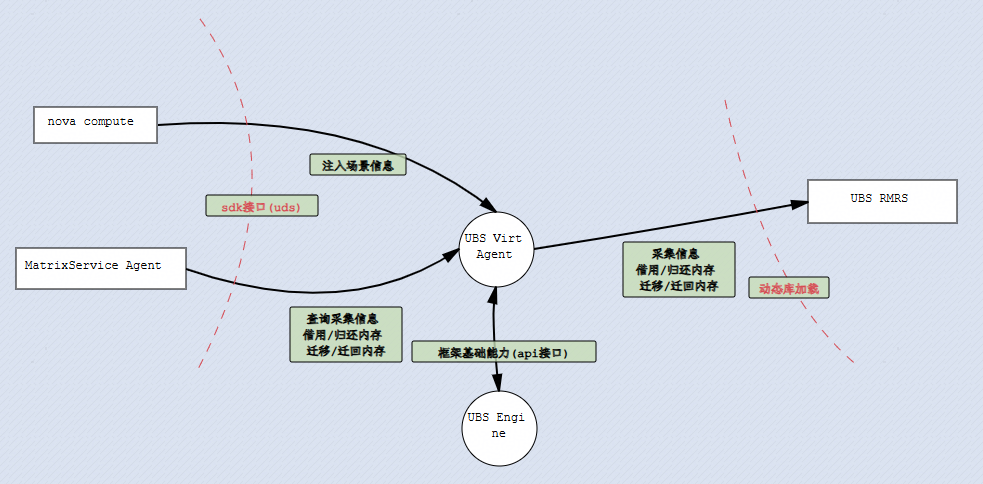
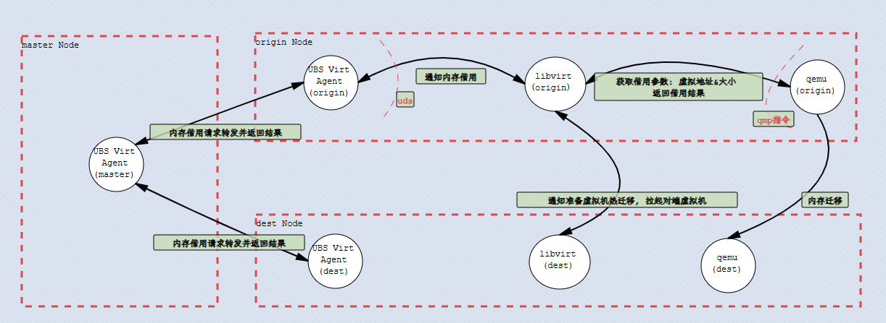
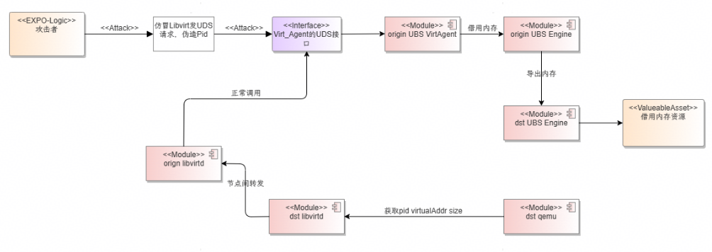

# UBS VirtAgent安全设计

## 安全架构说明

**安全设计目标:**

- UBS VirtAgent权限最小化
- UBS VirtAgent的暴露面满足安全要求
- UBS VirtAgent安全编译

### 安全威胁分析



**边界说明:**

- 边界1：UBS VirtAgent -- MatrixServiceAgent；VirtAgent向MatrixServiceAgent提供SDK接口，通过UDS通信方式实现。允许MatrixServiceAgent查询节点信息，执行内存借用、归还、迁移等操作
- 边界2：UBS VirtAgent -- UBS RMRS; RMRS向VirtAgent提供动态库。允许VirtAgent查询节点信息，执行内存借用、归还、迁移等操作

其中，由于UBS VirtAgent是UBS Engine运行框架上插件运行。在同一进程内，所以两者之间不存在信任边界。无攻击路径

## 最小化特权

### UBS VirtAgent相关文件及目录权限设计

| 元素                                       | 类型   | owner     | 权限  | 其它说明                  |
|------------------------------------------|------|-----------|-----|-----------------------|
| /etc/ubse/plugins/plugin_virt_agent.conf | 配置文件 | root:root | 644 | VirtAgent插件配置文件       |
| /etc/ubse/plugins/auth-virt_agent.conf   | 配置文件 | root:root | 644 | VirtAgent SDK接口鉴权配置文件 |
| /usr/lib64/libvirtagent.so               | 动态库  | root:root | 755 | 虚拟化插件动态库              |
| /usr/lib64/libstrategy.so                | 动态库  | root:root | 755 | 超分逃生决策算法动态库           |
| /usr/lib64/libubs-virt-agent.so.x.x.x    | 动态库  | root:root | 755 | SDK接口动态库              |
| /usr/include/virt_agent/                 | 目录   | root:root | 755 | C接口头文件目录              |
| /usr/include/virt_agent/*                | 头文件  | root:root | 644 | C接口头文件                |
| /usr/lib/python3.11/site-packages/ubse/  | 目录   | root:root | 755 | SDK接口文件目录             |             
| /usr/lib/python3.11/site-packages/ubse/* | 接口文件 | root:root | 644 | SDK接口文件               | 

## 暴露面安全设计

**UBS VirtAgent的暴露面安全设计:**

- 基于UBS Engine提供的SDK框架, 暴露的SDK接口

### 虚拟化通用接口

| 接口名称            | SDK                                                                                                         | 权限组          | 使用用户 |
|-----------------|-------------------------------------------------------------------------------------------------------------|--------------|------|
| 获取virtAgent场景配置 | `virt_agent_ret_t ubs_virt_agent_case_conf_get(case_conf_info_t *case_conf_info);`                            | vm.case_conf | nova |
| 设置VirtAgent场景配置 | `virt_agent_ret_t ubs_virt_agent_case_conf_set(const char *param, case_conf_set_info_t *case_conf_set_info);` | vm.case_conf | nova |
| 更新虚拟机迁移状态       | `int32_t update_page_flow_and_status(const char *opt, const char *uuid);`                                   | vm.migrate   | nova |

### 内存碎片场景接口

| 接口名称       | SDK                                                                                                                                | 权限组              | 使用用户          |
|------------|------------------------------------------------------------------------------------------------------------------------------------|------------------|---------------|
| 查询节点内存信息   | virt_agent_ret_t ubs_virt_agent_mem_fragmentation_node_info(numa_info_t **node_list, uint32_t *node_cnt);                          | vm.query         | ubs-scheduler |
| 查询节点虚拟机信息  | virt_agent_ret_t ubs_virt_agent_mem_fragmentation_vm_info(vm_domain_info_t **vm_info_list, uint32_t *vm_info_cnt);                 | vm.query         | ubs-scheduler |
| 设置节点亲和性配置  | virt_agent_ret_t ubs_virt_agent_mem_fragmentation_node_anti_affinity(const NodeAntiDictionary* dict);                              | vm.fragmentation | ubs-scheduler |
| 内存借用决策     | `virt_agent_ret_t ubs_virt_agent_mem_borrow_strategy(const src_memory_borrow_param* src_param, borrow_strategy_c* borrow_strategy);` | vm.fragmentation | ubs-scheduler |
| 内存借用执行     | `virt_agent_ret_t ubs_virt_agent_mem_borrow_execute(const borrow_setting_c *borrow_setting, mem_borrow_result_c *result);`           | vm.fragmentation | ubs-scheduler |
| 内存迁移决策     | `virt_agent_ret_t ubs_virt_agent_mem_migrate_strategy(const MemMigrateStrategySrcParam* srcParam, MemMigrateStrategy* strategy);`    | vm.fragmentation | ubs-scheduler |
| 内存迁移执行     | virt_agent_ret_t ubs_virt_agent_mem_migrate_execute(const MemMigrateExecuteSrcParam *srcParam);                                    | vm.fragmentation | ubs-scheduler |
| 归还节点借用内存   | virt_agent_ret_t ubs_virt_agent_mem_return(bool isAsync, char **task_id, uint32_t *task_id_len);                                   | vm.fragmentation | ubs-scheduler |
| 查询内存操作任务结果 | `virt_agent_ret_t ubs_virt_agent_sync_task_query(char *task_id, uint32_t task_id_len, async_task_info_c *result);`                | vm.fragmentation | ubs-scheduler |
| 借用失败后回滚    | virt_agent_ret_t ubs_virt_agent_mem_rollback(const RollbackSrcParam *srcParam);                                                    | vm.fragmentation | ubs-scheduler |

### 确定性热迁移接口

- 当前确定性热迁移流程中, libvirt与UBS VirtAgent通信; 通信使用接口SDK

| 接口名称         | SDK                                                                                                                                                                     | 权限组        | 使用用户 |
|--------------|-------------------------------------------------------------------------------------------------------------------------------------------------------------------------|------------|------|
| 迁移方式决策       | `virt_agent_ret_t ubs_virt_agent_make_migrate_decision(uint32_t vmMemoryMB, const char *uuid, const char *destHostName, uint32_t destNumaId, uint32_t *migrateStrategy);` | vm.migrate | nova |
| 设置IPC连接超时时间  | `virt_agent_ret_t RackStartIpcClientWithTimeout(uint16_t timeout);`                                                                                                       | vm.migrate | nova |
| 创建客户端，发送同步消息 | `int RackSyncSendForHam(HamComByteBuffer *request, HamComByteBuffer *response);`                                                                                       | vm.migrate | nova |
| 创建客户端，发送异步消息 | `int RackAsyncSendForHam(HamComByteBuffer *request, HamComCallbackDef *callback);`                                                                                       | vm.migrate | nova |

### 容器化场景接口

| 接口名称          | SDK                                                                                                                                                                     | 权限组          | 使用用户         |
|---------------|-------------------------------------------------------------------------------------------------------------------------------------------------------------------------|--------------|--------------|
| 查询容器内存信息      | `int32_t ubs_container_info_query(pid_param* param, pid_mem_info **pidInfos, uint32_t *InfoSize);`                                                                        | vm.container | matrixplugin |
| 设置/更新容器化告警水线  | `int32_t ubs_container_inject_waterLine(watermark_t* param);`                                                                                                             | vm.container | matrixplugin |
| 根据容器ID获取容器PID | `int32_t ubs_container_get_container_pids(container_id_list *containerIdList, container_pid_info **param, uint32_t *InfoSize);`                                           | vm.container | matrixplugin |
| 容器化场景内存借用     | `int32_t ubs_virt_agent_waterline_mem_borrow(mem_borrow_request_t *memBorrowRequest, char ***borrowIds, uint32_t *idsSize);`                                              | vm.container | matrixplugin |
| 容器化场景内存迁移     | `int32_t ubs_virt_agent_waterline_mem_migrate(mem_migrate_request_t *memMigrateRequest);`                                                                                 | vm.container | matrixplugin |
| 容器化场景内存归还     | `int32_t ubs_virt_agent_waterline_mem_return(return_request_t *returnRequest);`                                                                                           | vm.container | matrixplugin |
| 迁移方式决策        | `virt_agent_ret_t ubs_virt_agent_make_migrate_decision(uint32_t vmMemoryMB, const char *uuid, const char *destHostName, uint32_t destNumaId, uint32_t *migrateStrategy);` | vm.container | matrixplugin |

## 确定性热迁移安全设计



**边界说明:**

- origin Node
  - 边界1：UBS VirtAgent -- libvirt; 通过UDS方式通信, libvirt通知UBS VirtAgent准备确定性迁移, 迁移结束清理资源
  - 边界2：libvirt -- qemu; 通过qmp指令交互, 当前特性未对三方件原生边界做修改. 继承三方件安全特性
- origin Node -- dest Node
  - 边界3：libvirt(origin) -- libvirt(dest); 通过tcp通信交互, 当前特性未对三方件原生边界做修改. 继承三方件安全特性
  - 边界4：qemu(origin) -- qemu(dest); 使用UB通道实现内存迁移
- master Node -- slaver Node(origin/dest)
  - 边界5：UBS Engine框架提供节点间通信能力

### 攻击路径

当libvirtd发送消息给UBS VirtAgent时，携带了需要迁移虚拟机进程的PID与该虚拟机借用内存的虚拟地址和大小。当远端UDS权限被攻破后，仿冒PID发送消息。UBS VirtAgent无法校验PID合法性，会导致预期之外的进程触发内存借用，占用可借用内存资源，引起内存借用相关功能不可用。

**攻击路径**



**攻击时序**


## 安全编译

```text
# 安全编译选项CMakeList添加如下编译选项

-fPIC                                           # 实现动态库随机加载
-fstack-protector-strong                        # 启用栈保护，防止栈溢出攻击
-Wl,-z,noexecstack                              # 堆栈不可执行保护
-Wl,-z,relro,-z,now                             # GOT表全部重定位只读
-fPIE                                           # 生成位置无关可执行文件
```
