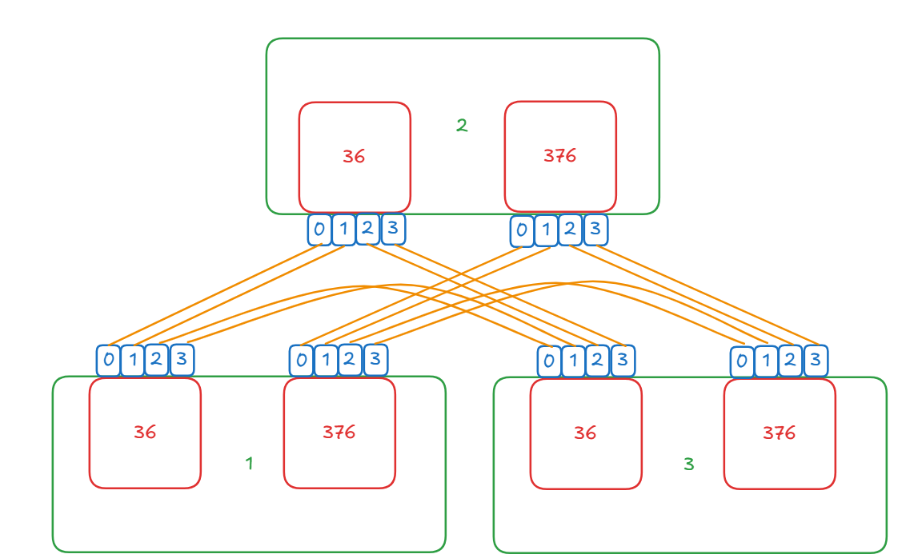

# UBSE CLI 使用指南

## ubsectl总体设计原则

UBS提供统一的命令行工具ubsectl，命令行风格整体遵从linux常规的命令行规范（UNIX风格和GNU风格）。

具体命令字格式：

```shell
ubsectl  <命令字>  <操作对象>  [{<参数名1>  [参数值1]}… …{<参数名1>  [参数值1]}]
```

**执行用户**

安装UBSE Engine后自动创建的ubse用户。

root用户可通过如下方式使用ubse用户发起请求。

```shell
sudo -u ubse ubsectl [-h | --help] COMMAND TYPE [-h | --help][OPTIONS] 
```

**命令字**

定义系统能够执行的功能，当前可选命令字如下：

| 关键字     | 关键字说明           |
|---------|-----------------|
| import  | 向UBSE导入信息       |
| remove  | 从UBSE中移除先前导入的信息 |
| create  | 在UBSE中创建资源      |
| delete  | 从UBSE中删除资源      |
| change  | 修改UBSE中的信息或资源   |
| display | 查看UBSE中的信息或资源   |
| attach  | 在UBSE中绑定资源      |
| detach  | 从UBSE中解绑资源      |

**操作对象**

用于指定命令字的操作对象，由UBSE中的能力决定，比如：memory、topo、cert等

**参数列表**

命令字执行时需要的参数，包括一对或多对参数名和参数值

参数名：可遵从长选项风格（两个连接符“--”后面紧跟完整参数名)，也可遵从短选项风格（单个连接符“-”后面紧跟缩写参数名）

参数值：与参数名用空格分开，表达具体的参数取值；参数名不可以没有参数值；单个参数值最大长度1024字符

**命令行举例**

```bash
# 查询内存借用账本详细信息
ubsectl display memory -t borrow_detail
# 触发内存借用
ubsectl create memory -t numa -s <size> -n <name>
```

**特性不支持错误信息**

当 UB 特性配置关闭对应能力时，相关命令返回固定错误信息。

| 命令范围 | 触发条件 | 错误信息 |
| -------- | -------- | -------- |
| memory 相关命令 | 内存借用和内存共享特性均不支持，或命令对应的内存类型特性不支持 | `ERROR: Memory feature is not supported.` |
| URMA 相关命令 | URMA 特性不支持 | `ERROR: URMA feature is not supported.` |

## 使能命令补齐

ubse内置ubsectl补全脚本，部署完成后脚本位置为：/etc/bash_completion.d/cli_commands.sh

**安装Bash Completion脚本库**

参见[安装Bash Completion脚本库](./ubse_installation.md#可选安装bash-completion脚本库)

**临时加载补全脚本**

该方法适用于希望在当前命令窗口立即使用补全脚本的用户。

```shell
    source /etc/bash_completion.d/cli_commands.sh
 ```

**永久加载补全脚本**

该方法适用于希望在所有命令窗口使用补全脚本的用户。

在~/.bashrc文件中添加`source /etc/bash_completion.d/cli_commands.sh`以永久启用脚本补全。

## 证书管理

### 导入证书

**描述**

向UBSE导入证书，用于节点间通信的认证与加密

**用法**

```shell
ubsectl import cert -c <ca-cert-file> -s <server-cert-file> -k <server-key-file> -l <ca-crl-file>
```

**参数**

| 参数                  | 说明                                     | 取值
| --------------------- | --------------------------------------- | -----
| -c/--ca-cert-file     | 必选参数，根证书文件完整路径及文件名       |字符串
| -s/--server-cert-file | 必选参数，身份证书文件完整路径及文件名     |字符串
| -k/--server-key-file  | 必选参数，身份证书私钥文件完整路径及文件名  |字符串
| -l/--ca-crl-file      | 可选参数，吊销证书列表文件完整路径及文件名  |字符串

**约束限制**

1. 只允许root和ubse用户使用，原始证书路径必须是ubsectl可访问
2. 导入可信机构颁发的证书时，需交互式输入私钥保护密码，密码不显示，输入完按Enter键确认即可，只支持回退键操作密码
3. 密码长度不能超过1000字符，不支持"\n"和"\b"等不可见字符
4. 文件路径只能是绝对路径（路径只允许大小写字母、数字、"-"、"_"、"."和"/"），不允许软硬链接
5. 文件大小不超过2MB

**输出信息说明**

执行成功/失败

**示例**

```bash
$ ubsectl import cert -c /usr/cert/trust.pem -s /usr/cert/server.pem -k /usr/cert/server_key.pem -l /usr/cert/crl.pem
Enter certificate password: 
Certificates imported successfully
```

### 移除证书

**描述**

从UBSE中移除证书信息

**用法**

```shell
ubsectl remove cert
```

**参数**

无

**约束限制**

只允许root和ubse用户使用，原始证书路径必须是ubsectl可访问

**输出信息说明**

执行成功/失败

**示例**

```bash
$ ubsectl remove cert
Certificates removed successfully
```

### 更新证书吊销列表

**描述**

向UBSE更新吊销证书信息

**用法**

```shell
ubsectl change cert -l <ca-crl-file>
```

**参数**

| 参数                  | 说明                                 |  取值
| --------------------- | ----------------------------------- |-----
| -l/--ca-crl-file      | 必选参数，根证书文件完整路径及文件名    | 字符串

**约束限制**

1. 只允许root和ubse用户使用，原始证书路径必须是ubsectl可访问 
2. 文件路径只能是绝对路径（路径只允许大小写字母、数字、"-"、"_"、"."和"/"），不允许软硬链接
3. 文件大小不超过2MB

**输出信息说明**

执行成功/失败

**示例**

```bash
$ ubsectl change cert -l /usr/cert/crl.pem
Certificate Revocation List changed successfully
```

## 内存池化

### 检查各节点内存池化功能健康状态

**描述**

检查各节点内存池化功能健康状态

**用法**

```shell
ubsectl check memory
```

**输入参数**

无

**约束限制**

ubsectl只能在root，ubse用户中运行

**输出信息说明**

| 字段名 | 字段描述                                                     | 取值范围                                                                                                        |
| ------ | ------------------------------------------------------------ |-------------------------------------------------------------------------------------------------------------|
| node   | 节点信息。例：computer1(1)<br/>节点信息由2部分组成：<br/>1.括号前部分：主机名<br/>2.括号内部分：节点的槽位号 | 字符串                                                                                                         |
| status | 节点的内存借用功能健康状态，当各组件健康状态均为ok时，取值ok                     | 可选值：[ ok \| nok ]                                                                                           |
| detail | 内存借用功能所依赖的各个组件的健康状态，包括节点集群状态、obmm 内核模块插入状态以及 sysSentry 服务状态。各状态的判定规则为：<br/> 1. 节点集群状态：ok，节点处于 Smoothing 或 Working 状态。  nok：节点处于其他非正常状态 <br/>2. obmm 内核模块状态：ok，模块已正确插入；nok：模块未插入；unknown：节点未上报状态，或集群状态为 Unknown（无法获取信息） <br/>3. sysSentry 服务状态：ok，服务运行正常；nok：服务运行异常；unknown：节点未上报状态，或集群状态为 Unknown（无法获取信息）                                  | cluster state: [ ok \| nok ]; <br/>obmm: [ ok \| nok \| unknown ]; <br/>sysSentry: [ ok \| nok \| unknown ] |

**示例**

#### 场景1：节点重启中，备节点无法连上master节点

- master节点

    ```bash
    $ ubsectl check memory
    -----------------------------------------------------------------------------------------------------
    node                  status                  detail
    -----------------------------------------------------------------------------------------------------
    computer01(1)         ok                      cluster state: ok; obmm: ok; sysSentry: ok
    -(2)                  nok                     cluster state: nok; obmm: unknown; sysSentry: unknown
    -----------------------------------------------------------------------------------------------------
    ```

- 备节点

    ```bash
    $ ubsectl check memory
    ERROR: Failed to obtain memory information
    ```

#### 场景2：节点启动稳定后

- master节点

    ```bash
    $ ubsectl check memory
    -----------------------------------------------------------------------------------------------------
    node                  status                  detail
    -----------------------------------------------------------------------------------------------------
    computer01(1)         ok                      cluster state: ok; obmm: ok; sysSentry: ok
    computer02(2)         ok                      cluster state: ok; obmm: ok; sysSentry: ok
    -----------------------------------------------------------------------------------------------------

    ```

- 备节点

    ``` bash
    $ ubsectl check memory
    -----------------------------------------------------------------------------------------------------
    node                  status                  detail
    -----------------------------------------------------------------------------------------------------
    computer01(1)         ok                      cluster state: ok; obmm: ok; sysSentry: ok
    computer02(2)         ok                      cluster state: ok; obmm: ok; sysSentry: ok
    -----------------------------------------------------------------------------------------------------

    ```

#### 场景3：只有主节点启动，备节点不启动

- master节点

    ```bash 
    $ ubsectl check memory
    -----------------------------------------------------------------------------------------------------
    node                  status                  detail
    -----------------------------------------------------------------------------------------------------
    computer01(1)         ok                      cluster state: ok; obmm: ok; sysSentry: ok
    -(2)                  nok                     cluster state: nok; obmm: unknown; sysSentry: unknown
    -----------------------------------------------------------------------------------------------------

    ```

- 备节点

    ```bash
    $ ubsectl check memory
    ERROR: Internal error with error code 5

    ```

#### 场景4：稳定后备节点停掉

- master节点

    ```bash 
    $ ubsectl check memory
    -----------------------------------------------------------------------------------------------------
    node                  status                  detail
    -----------------------------------------------------------------------------------------------------
    computer01(1)         ok                      cluster state: ok; obmm: ok; sysSentry: ok
    -(2)                  nok                     cluster state: nok; obmm: unknown; sysSentry: unknown
    -----------------------------------------------------------------------------------------------------

    ```

- 备节点

    ```bash  
    $ ubsectl check memory
    ERROR: Internal error with error code 5

    ```

#### 场景5：稳定后主节点停掉

- master节点

    ```bash  
    $ ubsectl check memory
    -----------------------------------------------------------------------------------------------------
    node                  status                  detail
    -----------------------------------------------------------------------------------------------------
    -(1)                  nok                     cluster state: nok; obmm: unknown; sysSentry: unknown
    computer02(2)         ok                      cluster state: ok; obmm: ok; sysSentry: ok
    -----------------------------------------------------------------------------------------------------

    ```

- 备节点

    ```bash  
    $ ubsectl check memory
    ERROR: Internal error with error code 5

    ```

#### 场景6：主节点集群状态、sysSentry服务状态正常，obmm内核模块未插入

- master节点

    ```bash  
    $ ubsectl check memory
    -----------------------------------------------------------------------------------------------------
    node                  status                  detail
    -----------------------------------------------------------------------------------------------------
    computer01(1)         nok                     cluster state: ok; obmm: nok; sysSentry: ok
    -(2)                  nok                     cluster state: nok; obmm: unknown; sysSentry: unknown
    -----------------------------------------------------------------------------------------------------

    ```

#### 场景7：主节点集群状态、obmm内核模块正确插入，sysSentry服务状态异常

- master节点

    ```bash 
    $ ubsectl check memory
    -----------------------------------------------------------------------------------------------------
    node                  status                  detail
    -----------------------------------------------------------------------------------------------------
    computer01(1)         nok                     cluster state: ok; obmm: ok; sysSentry: nok
    -(2)                  nok                     cluster state: nok; obmm: unknown; sysSentry: unknown
    -----------------------------------------------------------------------------------------------------

    ```

#### 场景8：备节点处于故障状态，obmm内核模块正确插入、sysSentry服务状态正常

- 备节点

    ```bash 
    $ ubsectl check memory
    -----------------------------------------------------------------------------------------------------
    node                  status                  detail
    -----------------------------------------------------------------------------------------------------
    computer01(1)         ok                      cluster state: ok; obmm: ok; sysSentry: ok
    computer02(2)         nok                     cluster state: nok; obmm: ok; sysSentry: ok
    -----------------------------------------------------------------------------------------------------

    ```

### 查询各节点内存借入信息

**描述**

查询当前集群中，各节点内存借入信息

**用法**

```shell
ubsectl display memory -t node_borrow
```

**输入参数**

无

**约束限制**

只显示集群中在位的节点，如果脱离集群或未启动，则不显示

ubsectl只能在root，ubse用户中运行，可管理所有内存资源

**输出信息说明**

显示信息中的字段说明：

| 字段名         | 字段描述                                                     | 字段取值 |
|-------------| ------------------------------------------------------------ | -------- |
| borrow_node | 借入节点信息。例：computer1(1)<br>节点信息由2部分组成：<br>1.括号前部分：主机名<br>2.括号内部分：节点的槽位号    | 字符串   |
| lend_node   | 借出节点信息。例：computer1(1)<br/>节点信息由2部分组成：<br/>1.括号前部分：主机名<br/>2.括号内部分：节点的槽位号 | 字符串   |
| size | 借用内存总量，单位: MB                                       | 整数     |

**示例**

```bash
$ ubsectl display memory -t node_borrow
--------------------------------------------
borrow_node   lend_node        size   
--------------------------------------------
node-1(1)     node-2(2)        450   
node-1(1)     node-3(3)        450   
node-4(4)     node-3(3)        100   
--------------------------------------------
```

### 查询各节点内存借出信息

**描述**

查询当前集群中，各节点内存借出信息

**用法**

```shell
ubsectl display memory -t node_lend
```

**输入参数**

无

**约束限制**

只显示集群中在位的节点，如果脱离集群或未启动，则不显示

ubsectl只能在root，ubse用户中运行，可管理所有内存资源

**输出信息说明**

显示信息中的字段说明：

| 字段名         | 字段描述                                                     | 字段取值 |
|-------------| ------------------------------------------------------------ | -------- |
| lend_node   | 借出节点信息。例：computer1(1)<br>节点信息由2部分组成：<br>1.括号前部分：主机名<br>2.括号内部分：节点的槽位号 | 字符串   |
| borrow_node | 借入节点信息。例：computer1(1)<br/>节点信息由2部分组成：<br/>1.括号前部分：主机名<br/>2.括号内部分：节点的槽位号 | 字符串   |
| size        | 借用内存总量，单位: MB                                       | 整数     |

**示例**

```bash
$ ubsectl display memory -t node_lend
--------------------------------------------
lend_node     borrow_node      size   
--------------------------------------------
node-1(1)     node-2(2)        450   
node-1(1)     node-3(3)        450   
node-4(4)     node-3(3)        100   
--------------------------------------------
```

### 查询内存借用账本详细信息

**描述**

查询当前集群中，所有内存借用账本详细信息, 并支持根据内存名和内存类型过滤查询账本

**用法**

```shell
ubsectl display memory -t borrow_detail [-bt <type>] [-n <name>]
```

**输入参数**

| 字段名                | 字段描述                                                     | 字段取值                                                     |
| --------------------- | ------------------------------------------------------------ | ---------------------------------------------------------- |
| -bt<br/>--borrow-type | 可选，根据借用类型过滤                                       | 可选值：[ numa \| fd \| share ]                                    |
| -n<br/>--name         | 可选，根据内存名过滤<br/>各个节点、各个类型的同名内存都会显示 | 字符串，长度为1~47，仅可包括大小写字母、数字、"."、":"、"-"以及"_" |

**约束限制**

只显示集群中在位的节点，如果脱离集群或未启动，则不显示

ubsectl只能在root，ubse用户中运行，可管理所有内存资源

`fd`和`numa`类型的name在本节点唯一，`share`类型的name在集群内唯一

**输出信息说明**

显示信息中的字段说明：

| 字段名       | 字段描述                                                     | 字段取值                                                                                                                                      |
| ----------- | ------------------------------------------------------------ |-------------------------------------------------------------------------------------------------------------------------------------------|
| name        | 一次内存借用的名称                                             | 字符串                                                                                                                                       |
| type        | 内存借用的类型                                                | 可选值：[ numa \| fd \| share ]                                                                                                                     |
| borrow_node | 借入节点信息。例：computer1(1)<br>节点信息由2部分组成：<br>1.括号前部分：主机名<br>2.括号内部分：节点的槽位号 | 字符串                                                                                                                                       |
| lend_node   | 借出节点信息。例：computer1(1)<br/>节点信息由2部分组成：<br/>1.括号前部分：主机名<br/>2.括号内部分：节点的槽位号 | 字符串                                                                                                                                       |
| lend_numa | 借出numa信息。例：1(216)<br/>numa信息由2部分组成：<br/>1.括号前部分：numaId<br/>2.括号内部分：socketId | 字符串                                                                                                                                       |
| lend_size   | numa节点的借用内存总量，单位: MB                             | 整数                                                                                                                                        |
| status      | 借用状态                                                    | 可选值：<br>done：借用完成<br>exporting：借出节点正在执行导出<br>importing：代入节点正在执行导入<br>unexporting：借出节点正在取消导出<br>unimporting：代入节点正在取消导入<br>fault：当次借用请求出现故障 |
| handle | 资源操作句柄<br/>句柄含义：<br/>numa类型：远端numaId<br/>fd、share类型：内存块标识信息集合 | numa-id: 整数<br/>mem-ids: 整数数组，用,分隔                                                                                                        |

**示例**

查询全量账本

```bash
$ ubsectl display memory -t borrow_detail
------------------------------------------------------------------------------------------------
name         type    borrow_node   lend_node   lend_numa   lend_size       status       handle    
------------------------------------------------------------------------------------------------
memory1      numa    node-1(1)     node-3(3)   1(216)      100             done         5
memory2      share   node-1(1)     node-3(3)   1(216)      200             done         1,2
memory2      share   node-2(2)     node-3(3)   1(216)      1200            done         3,4
memory3      share                 node-3(3)   1(216)      1200            done         -
memory4      numa    node-2(2)     node-3(3)   1(216)      1300            exporting    -
memory5      fd      node-1(1)     node-3(3)   1(216)      1400            importing    -
memory6      numa                  node-3(3)   1(216)      1300            unexporting  -
memory7      fd      node-1(1)     node-3(3)   1(216)      1400            unimporting  -
memory8      numa    node-2(2)                             1500            fault        -
memory9      fd                    node-3(3)   1(216)      1500            fault        -
------------------------------------------------------------------------------------------------
```

根据类型过滤

```bash
$ ubsectl display memory -t borrow_detail -bt numa
--------------------------------------------------------------------------------------
  name    type   borrow_node     lend_node   lend_numa   lend_size   status   handle   
--------------------------------------------------------------------------------------
  test1   numa   controller(1)   node01(2)   0(36)       128         done     2        
                                                                                      
  test2   numa   controller(1)   node01(2)   0(36)       128         done     2        
                                                                                      
  test    numa   controller(1)   node01(2)   0(36)       2048        done     2        
--------------------------------------------------------------------------------------
```

根据内存名过滤

```bash
$ ubsectl display memory -t borrow_detail -n test
--------------------------------------------------------------------------------------
  name    type   borrow_node     lend_node   lend_numa   lend_size   status   handle   
--------------------------------------------------------------------------------------
  test    fd     controller(1)   node01(2)   0(36)       128         done     1      
                                                                                      
  test    numa   controller(1)   node01(2)   0(36)       128         done     2   
                                                                                       
  test    share  controller(1)   node01(2)   0(36)       512         done     4,5,6,7
  
  test    numa   node02(3)       node01(2)   0(36)       128         done     4  
--------------------------------------------------------------------------------------
```

根据类型和内存名过滤

```bash
$ ubsectl display memory -t borrow_detail -bt numa -n test
-------------------------------------------------------------------------------------
  name   type   borrow_node     lend_node   lend_numa   lend_size   status   handle   
-------------------------------------------------------------------------------------
  test   numa   controller(1)   node01(2)   0(36)       2048        done     2        
-------------------------------------------------------------------------------------
```

### 查询numa状态信息

**描述**

查询当前集群中，所有numa设备的信息

**用法**

```shell
ubsectl display memory -t numa_status
```

**输入参数**

无

**约束限制**

ubsectl只能在root，ubse用户中运行，可管理所有内存资源

**输出信息说明**

- 显示信息中的字段说明：

| 字段名       | 字段描述                                                                   | 字段取值 |
| ------------ |------------------------------------------------------------------------| -------- |
| node         | 节点信息。例：computer1(1)<br/>节点信息由2部分组成：<br/>1.括号前部分：主机名<br/>2.括号内部分：节点的槽位号 | 字符串   |
| numa         | numa id                                                                | 整数     |
| total        | NUMA的内存总量，单位: MB                                                       | 整数     |
| used         | NUMA的内存使用量，单位: MB                                                      | 整数     |
| free         | NUMA的内存空闲量，单位: MB                                                      | 整数     |
| used_percent | 内存使用比例, 保留一位小数                                                         | 浮点数   |

**示例**

```bash
$ ubsectl display memory -t numa_status
-------------------------------------------------------
node         numa    total   used   free   used_percent
node-1(1)    0       1024    128    896    12.5       
node-1(1)    1       8192    256    7936   3.1
node-2(2)    0       1024    128    896    12.5   
```

### 查询全量节点是否可借用内存信息

**描述**

查询全量节点是否可借用内存信息

**用法**

```shell
ubsectl display memory -t config
```

**输入参数**

无

**约束限制**

ubsectl只能在root，ubse用户中运行，可管理所有内存资源

**输出信息说明**

- 显示信息中的字段说明：

| 字段名      | 字段描述                                                     | 字段取值                  |
|----------| ------------------------------------------------------------ |-----------------------|
| node     | 节点信息。例：computer1(1)<br/>节点信息由2部分组成：<br/>1.括号前部分：主机名<br/>2.括号内部分：节点的槽位号 | 字符串                   |
| isLender | 此节点是否可以作为内存借出方                                            | 可选值：[ true \| false ] |

**示例**

```bash
$ ubsectl display memory -t config
-------------------------------------------------------
node         isLender    
-------------------------------------------------------
node-1(1)    true       
node-2(2)    false
-------------------------------------------------------       
```

### 触发内存借用

**描述**

在本节点借用指定类型的内存

**用法**

```shell
# NUMA 类型
ubsectl create memory -t numa -s <size> -n <name> [-l <linkInfo>]
# FD 类型
ubsectl create memory -t fd -s <size> -n <name>
# 共享内存类型
ubsectl create memory -t share -s <size> -n <name> [-r <regionList>]
```

**输入参数说明**

- 输入参数说明：

| 字段名              | 字段描述                         | 字段取值                                          |
|------------------|------------------------------|-----------------------------------------------|
| -t<br>--type     | 借用类型                         | 可选值：[ numa \| fd \| share ]                       |
| -n<br/>--name    | 本次借用的唯一标识                    | 字符串<br/>长度为1~47，仅可包括大小写字母、数字、"."、":"、"-"以及"_" |
| -s<br/>--size    | 借用内存大小<br/>单位: MB/GB，不能小于4MB | 整数 + M/G                          |
| -l<br/>--link-id | 可选参数, 链路id，仅numa类型支持，其他类型不生效 | 字符串                                           |
| -r<br/>--region  | 可选参数，共享域节点列表，仅共享借用支持，其他类型不生效 | 用,分隔的**节点槽位号**                                |

**约束限制**

ubsectl只能在root，ubse用户中运行，可管理所有内存资源

`fd`和`numa`类型的name在本节点唯一，`share`类型的name在集群内唯一

`-r`仅`share`类型有效，`-l`仅`numa`类型有效

**输出信息说明**

- **numa类型：**

    | 字段名      | 字段描述               | 字段取值 |
    | ----------- | ---------------------- | -------- |
    | name        | 本次借用的唯一标识     | 字符串   |
    | size        | 借用内存大小，单位: MB | 整数     |
    | numa-id     | 远端numaId             | 整数     |
    | import-node | 借入节点id             | 整数     |
    | export-node | 借出节点id             | 整数     |

- **fd类型：**

    | 字段名      | 字段描述               | 字段取值          |
    | ----------- | ---------------------- | ----------------- |
    | name        | 本次借用的唯一标识     | 字符串            |
    | size        | 借用内存大小，单位: MB | 整数              |
    | mem-ids     | 内存标识信息           | 整数数组，用,分隔 |
    | import-node | 借入节点id             | 整数              |
    | export-node | 借出节点id             | 整数              |

- **share类型：**

    | 字段名      | 字段描述               | 字段取值          |
    | ----------- | ---------------------- | ----------------- |
    | name        | 本次借用的唯一标识     | 字符串            |
    | size        | 借用内存大小，单位: MB | 整数              |
    | export-node | 借出节点id             | 整数              |
    | region      | 共享域                 | 整数数组，用,分隔 |

**示例**

- **numa 类型**

    ```bash
    $ ubsectl create memory -t numa -l 1/36/0-2/36/0 -s 128M -n testName
    name:testName
    size:128M
    numa-id:5
    import-node:1
    export-node:2
    ```

- **fd 类型**

    ```bash
    $ ubsectl create memory -t fd -s 128M -n testName
    name:testName
    size:128M
    mem-ids:1,2,3
    import-node:1
    export-node:2
    ```

- **share 类型**

    ```bash
    $ ubsectl create memory -t share -s 128M -n testName -r 1,2
    name:testName
    size:128M
    export-node:2
    region:1,2
    ```

### 删除内存借用

**描述**

删除命令行调用节点的内存借用记录，释放借用的内存。

**用法**

```shell
ubsectl delete memory [-t <borrow-type>] -n <name>
```

**输入参数说明**

- 输入参数说明：

    | 字段名           | 字段描述                                                     | 字段取值                                 |
    |---------------| ------------------------------------------------------------ |--------------------------------------|
    | -t<br/>--type | 借用类型<br/>默认值: "numa"                                  | 可选值: [ numa \| fd \| share \| addr ] |
    | -n<br/>--name | 借用的唯一标识<br/>长度为1~47，仅可包括大小写字母、数字、"."、":"、"-"以及"_" | 字符串                                  |

**输出信息说明**

Delete successfully

**示例**

```bash
$ ubsectl delete memory -t share -n testName
Delete successfully
```

### 查询进程内存配置信息

**描述**

查询当前进程中，所有已配置的进程内存阈值信息

**用法**

```shell
ubsectl display process-mem -t <type>
```

**输入参数说明**

| 参数名 | 说明 | 取值 |
|------|------|------|
| -t<br/>--type | 必选，查询的进程内存配置信息类型 | config |

**约束限制**

1. ubsectl只能在root，ubse用户中运行
2. 需要目标节点的 process_mem 插件正常启动，否则无法获取已纳管进程信息

**输出信息说明**

| 字段名                | 字段描述                | 字段取值 |
| -------------------- | ----------------------- | -------- |
| pid                  | 进程ID                  | 整数     |
| evictThreshold       | 迁出阈值(%)              | 整数     |
| targetEvictThreshold | 预期迁出比例(%)           | 整数     |
| reclaimThreshold     | 迁回阈值(%)              | 整数     |
| totalMemoryUsage     | 进程期望总内存大小         | 整数     |
| srcNuma              | 本地NUMA节点ID（可选）      | 整数     |

**示例**

```bash
$ ubsectl display process-mem -t config
---------------------------------------------------------------------------------------------------
pid         evictThreshold   targetEvictThreshold   reclaimThreshold   totalMemoryUsage   srcNuma
---------------------------------------------------------------------------------------------------
1234        80               50                     30                 1073741824         1
5678        80               50                     30                 1073741824         N/A
---------------------------------------------------------------------------------------------------
```

### 修改进程内存配置

**描述**

修改指定进程的内存配置信息，包括迁出阈值、预期迁出比例、迁回阈值以及进程的期望内存大小。当进程存在子进程时，子进程会继承父进程的内存使用配置。

**用法**

```shell
ubsectl change process-mem -p <pid> -e <evict-thresh> -t <target-evict-thresh> -r <reclaim-thresh> -s <size> [--src-numa <numa-id>]
```

**输入参数说明**

| 参数名 | 说明 | 取值 |
|------|------|------|
| -p<br/>--pid | 必选，目标进程的PID | 整数，范围 1-4194304 |
| -e<br/>--evict-thresh | 必选，迁出阈值(%)。当进程总内存使用超过此比例时，触发迁出动作 | 整数，范围 1-100 |
| -t<br/>--target-evict-thresh | 必选，预期迁出比例(%)。迁出后远端内存占总内存的目标比例 | 整数，范围 1-100 |
| -r<br/>--reclaim-thresh | 必选，迁回阈值(%)。当进程总内存使用低于此比例时，将远端内存全部迁回并释放 | 整数，范围 1-100，需比--evict-thresh至少小5 |
| -s<br/>--size | 必选，进程期望总内存大小 | 格式为数字+单位(B/K/M/G)，支持最多两位小数，范围 128M~32G，如 512M、1G、1.5G |
| -sn<br/>--src-numa | 可选，本地NUMA节点ID。同平面socket会被选为借出socket | 整数 |

**约束限制**

1. ubsectl只能在root，ubse用户中运行
2. 需要目标节点的 process_mem 插件正常启动，否则配置无法生效
3. evict-thresh必须比reclaim-thresh至少大5，避免震荡
4. 当进程已有子进程时，子进程会继承该配置

**输出信息说明**

Set successfully / 错误信息

**示例**

```bash
# 配置PID为1234的进程，迁出阈值80%，预期迁出比例50%，迁回阈值30%，期望内存1G
$ ubsectl change process-mem -p 1234 -e 80 -t 50 -r 30 -s 1G
Set successfully

# 指定本地NUMA节点
$ ubsectl change process-mem -p 1234 -e 80 -t 50 -r 30 -s 1G --src-numa 0
Set successfully

# 参数校验失败
$ ubsectl change process-mem -p 1234 -e 80 -t 50 -r 76 -s 1G
evict-thresh must be at least 5 higher than reclaim-thresh to avoid oscillation
```

### 移除进程内存配置

**描述**

移除指定进程的内存配置信息。移除前会将进程已借用的远端内存全部迁回并归还，配置移除后进程将不再进行内存迁出/迁入管理。

**用法**

```shell
ubsectl remove process-mem -p <pid>
```

**输入参数说明**

| 参数名 | 说明 | 取值 |
|------|------|------|
| -p<br/>--pid | 必选，目标进程的PID | 整数，范围 1-4194304 |

**约束限制**

1. ubsectl只能在root，ubse用户中运行
2. 需要目标节点的 process_mem 插件正常启动，否则配置移除操作无法执行

**输出信息说明**

Unset successfully

**示例**

```bash
$ ubsectl remove process-mem -p 1234
Unset successfully
```

### 导入共享内存

**描述**

在本节点导入共享形态的远端内存。

**用法**

```bash
ubsectl attach memory -n <name>
```

**输入参数说明**

| 字段名        | 字段描述       | 字段取值                                                     |
| ------------- | -------------- | ------------------------------------------------------------ |
| -n<br/>--name | 借用的唯一标识 | 字符串<br/>长度为1~47，仅可包括大小写字母、数字、"."、":"、"-"以及"_" |

**输出信息说明**

| 字段名      | 字段描述               | 字段取值          |
| ----------- | ---------------------- | ----------------- |
| name        | 本次借用的唯一标识     | 字符串            |
| size        | 借用内存大小，单位: MB | 整数              |
| mem-ids     | 内存标识信息           | 整数数组，用,分隔 |
| import-node | 借入节点id             | 整数              |
| export-node | 借出节点id             | 整数              |
| region      | 共享域                 | 整数数组，用,分隔 |

**示例**

```bash
$ ubsectl attach memory -n testName
name:testName
size:128M
mem-ids:1,2,3
import-node:1
export-node:2   
region:1,2
```

### 删除导入共享内存

**描述**

删除本节点导入的共享形态的远端内存。

**用法**

```bash
ubsectl detach memory -n <name>
```

**输入参数说明**

| 字段名        | 字段描述       | 字段取值                                                     |
| ------------- | -------------- | ------------------------------------------------------------ |
| -n<br/>--name | 借用的唯一标识 | 字符串<br/>长度为1~47，仅可包括大小写字母、数字、"."、":"、"-"以及"_" |

**输出信息说明**

```bash
Detach successfully
```

## topo链接

### 查询拓扑链接信息

**描述**

查询集群内所有节点的静态拓扑链接信息

**用法**

```shell
ubsectl display topo -t <OPTIONS>
```

**输入参数**

| 字段名     | 字段描述        | 字段取值    |
|---------|-------------|---------|
| -t      | 必选，根据节点类型过滤 | 可取值：[ cpu ] |

**约束限制**

1. 当前只支持CPU类型节点的硬件连线关系
2. 该命令只回显UBM上报的静态topo链接关系

**输出信息说明**

1. 规格说明：

   a. 表内每一行表示两个CPU设备之间的链接信息，显示的链接对不重复，排序后展示。

   b. 表内列信息说明如下

   | 表头                  | 说明                                                                                                                                         | 取值 
   |---------------------|--------------------------------------------------------------------------------------------------------------------------------------------| ----------
   | link-id             | 表示一条链接的ID。<br>1.显示为“-”时，表示该链路不可用                                                                                                           | 字符串
   | node                | 排序较小一端的节点信息。例：computer1(1)，由2部分组成：<br/>1.括号前部分：主机名<br/>2.括号内部分：节点的槽位号<br>3.显示为“-”时，表示该节点的UBSE尚未被划入本节点UBSE所在的集群                         | 字符串
   | socket              | 排序较小一端的节点信息内，OS上标识某一个CPU的socketId值，例：36<br>1.当该节点的UBSE上报信息失败时，显示“-”来表示缺乏信息                                                                 | 整数
   | port                | 排序较小一端的节点信息内，CPU硬件上的端口值，例：0 <br>1.当该节点的UBSE上报信息失败时，显示“-”来表示缺乏信息                                                           | 整数
   | interface-name      | 排序较小一端的端口名称。例：400GUB1/1/1。<br>1.当无法获取到端口名称时，显示"-"来表示缺乏信息；<br>2.此名称与UBM配置命令、告警、性能指标中的端口名称对应                                                 | 字符串
   | peer-node           | 排序较大一端的节点信息。例：computer2(2)，由2部分组成：<br>1.括号前部分：主机名<br/>2.括号内部分：节点的槽位号<br>3.显示为“-”时，表示该节点的UBSE尚未被划入本节点UBSE所在的集群 | 字符串
   | peer-socket         | 排序较大一端的节点内，OS上标识某一个CPU的socketId值，例：36 <br>1.当该节点的UBSE上报信息失败时，显示“-”来表示缺乏信息                                                                  | 整数
   | peer-port           | 排序较大一端的节点内，CPU硬件上的端口值，例：0 <br>1.当该节点的UBSE上报信息失败时，显示“-”来表示缺乏信息                                                             | 整数
   | peer-interface-name | 排序较大一端的端口名称。例：400GUB2/1/1。<br>1.当无法获取到端口名称时，显示"-"来表示缺乏信息；<br>2.此名称与UBM配置命令、告警、性能指标中的端口名称对应                                                 | 字符串

   c. 链接显示完成后，最后两行会显示当前集群的已知总链接数：**Total Links**，和可用链接数：**Available Links**。

**示例**

以3节点如下组网场景为例：



场景1：Ubse能够获取全量各节点信息场景：

```bash
$ ubsectl display topo -t cpu
cpu topo：
------------------------------------------------------------------------------------------------------------------------
link-id         node           socket  port  interface-name    peer-node       peer-socket peer-port peer-interface-name
------------------------------------------------------------------------------------------------------------------------
1/36/0-2/36/0   computer1(1)   36      0     400GUB1/1/1       computer2(2)    36          0          400GUB2/1/1
1/36/1-2/36/1   computer1(1)   36      1     400GUB1/1/2       computer2(2)    36          1          400GUB2/1/2
1/36/2-3/36/0   computer1(1)   36      2     400GUB1/1/3       computer3(3)    36          0          400GUB3/1/1
1/36/3-3/36/1   computer1(1)   36      3     400GUB1/1/4       computer3(3)    36          1          400GUB3/1/2
1/376/0-2/376/0 computer1(1)   376     0     400GUB1/2/1       computer2(2)    376         0          400GUB2/2/1
1/376/1-2/376/1 computer1(1)   376     1     400GUB1/2/2       computer2(2)    376         1          400GUB2/2/2
1/376/2-3/376/0 computer1(1)   376     2     400GUB1/2/3       computer3(3)    376         0          400GUB3/2/1
1/376/3-3/376/1 computer1(1)   376     3     400GUB1/2/4       computer3(3)    376         1          400GUB3/2/2
2/36/2-3/36/2   computer2(2)   36      2     400GUB2/1/3       computer3(3)    36          2          400GUB3/1/3
2/36/3-3/36/3   computer2(2)   36      3     400GUB2/1/4       computer3(3)    36          3          400GUB3/1/4
2/376/2-3/376/2 computer2(2)   376     2     400GUB2/2/3       computer3(3)    376         2          400GUB3/2/3
2/376/3-3/376/3 computer2(2)   376     3     400GUB2/2/4       computer3(3)    376         3          400GUB3/2/4
------------------------------------------------------------------------------------------------------------------------
Total Links: 12
Available Links: 12
```

场景2：当某一节点不在当前集群时，显示为“-”。具体如下，以缺少2节点信息为例。

```sh
$ ubsectl display topo -t cpu
cpu topo：
------------------------------------------------------------------------------------------------------------------------
link-id         node            socket  port  interface-name    peer-node       peer-socket peer-port peer-interface-name
------------------------------------------------------------------------------------------------------------------------
-               computer1(1)    36      0     400GUB1/1/1       -               -           -          -
-               computer1(1)    36      1     400GUB1/1/2       -               -           -          -
1/36/2-3/36/0   computer1(1)    36      2     400GUB1/1/3       computer3(3)    36          0          400GUB3/1/1
1/36/3-3/36/1   computer1(1)    36      3     400GUB1/1/4       computer3(3)    36          1          400GUB3/1/2
-               computer1(1)    376     0     400GUB1/2/1       -               -           -          -
-               computer1(1)    376     1     400GUB1/2/2       -               -           -          -
1/376/2-3/376/0 computer1(1)    376     2     400GUB1/2/3       computer3(3)    376         0          400GUB3/2/1
1/376/3-3/376/1 computer1(1)    376     3     400GUB1/2/4       computer3(3)    376         1          400GUB3/2/2
-               -               -       -     -                 computer3(3)    36          2          400GUB3/1/3
-               -               -       -     -                 computer3(3)    36          3          400GUB3/1/4
-               -               -       -     -                 computer3(3)    376         2          400GUB3/2/3
-               -               -       -     -                 computer3(3)    376         3          400GUB3/2/4
------------------------------------------------------------------------------------------------------------------------
Total Links: 12
Available Links: 4
```

场景3：当链接两端节点上报链接状态不同时，端口状态为down的一端socket、port、interface-name显示为“-”。具体如下，以1、2节点上报链接状态不同为例。

```bash
$ ubsectl display topo -t cpu
cpu topo：
------------------------------------------------------------------------------------------------------------------------
link-id         node           socket  port  interface-name    peer-node       peer-socket peer-port peer-interface-name
------------------------------------------------------------------------------------------------------------------------
-               computer1(1)   -       -     -                 computer2(2)    36          0          400GUB2/1/1
-               computer1(1)   36      1     400GUB1/1/2       computer2(2)    -           -          -          
1/36/2-3/36/0   computer1(1)   36      2     400GUB1/1/3       computer3(3)    36          0          400GUB3/1/1
1/36/3-3/36/1   computer1(1)   36      3     400GUB1/1/4       computer3(3)    36          1          400GUB3/1/2
1/376/0-2/376/0 computer1(1)   376     0     400GUB1/2/1       computer2(2)    376         0          400GUB2/2/1
1/376/1-2/376/1 computer1(1)   376     1     400GUB1/2/2       computer2(2)    376         1          400GUB2/2/2
1/376/2-3/376/0 computer1(1)   376     2     400GUB1/2/3       computer3(3)    376         0          400GUB3/2/1
1/376/3-3/376/1 computer1(1)   376     3     400GUB1/2/4       computer3(3)    376         1          400GUB3/2/2
2/36/2-3/36/2   computer2(2)   36      2     400GUB2/1/3       computer3(3)    36          2          400GUB3/1/3
2/36/3-3/36/3   computer2(2)   36      3     400GUB2/1/4       computer3(3)    36          3          400GUB3/1/4
2/376/2-3/376/2 computer2(2)   376     2     400GUB2/2/3       computer3(3)    376         2          400GUB3/2/3
2/376/3-3/376/3 computer2(2)   376     3     400GUB2/2/4       computer3(3)    376         3          400GUB3/2/4
------------------------------------------------------------------------------------------------------------------------
Total Links: 12
Available Links: 10
```

### 查询集群内所有节点的信息

**功能**

查询集群内所有节点的信息

**用法**

```shell
ubsectl display cluster
```

**输入参数**

无

**约束限制**

无

**输出信息说明**

| 字段名      | 字段描述                                                     | 取值范围                         |
| ----------- | ------------------------------------------------------------ | -------------------------------- |
| node        | 节点信息。例：computer1(1)<br/>节点信息由2部分组成：<br/>1.括号前部分：主机名<br/>2.括号内部分：节点的槽位号 | 字符串  |
| role        | 节点在集群中的角色                                           | 可选值：[ master \| standby \| agent ] |
| bonding-eid | 节点bonding配置的eid                                         | 字符串                           |
| guid        | 节点全局唯一标识符                                        | 字符串                           |

**示例**

#### 场景1：集群各节点健康状态

```bash         
$ ubsectl display cluster
---------------------------------------------------------------------------------------------------------------------
node                  role          bonding-eid                               guid
---------------------------------------------------------------------------------------------------------------------
computer01(1)         master        4245:4944:0000:0000:0000:0000:0100:0000   CC08-A000-0-0-000000-0000000800800100
computer02(2)         standby       4245:4944:0000:0000:0000:0000:0200:0000   CC08-A000-0-0-000000-0000000801800100
computer03(3)         agent         4245:4944:0000:0000:0000:0000:0300:0000   CC08-A000-0-0-000000-0000000802000000
---------------------------------------------------------------------------------------------------------------------

```

#### 场景2：节点重启中，备节点无法连上master节点

- master节点

   ```bash 
   $ ubsectl display cluster
   ---------------------------------------------------------------------------------------------------------------------
   node                  role          bonding-eid                               guid
   ---------------------------------------------------------------------------------------------------------------------
   computer01(1)         master        4245:4944:0000:0000:0000:0000:0100:0000   CC08-A000-0-0-000000-0000000800800100
   -(2)                  -             4245:4944:0000:0000:0000:0000:0200:0000   -
   ---------------------------------------------------------------------------------------------------------------------
   ```

- 备节点

   ```bash 
   $ ubsectl display cluster
   ERROR: Failed to obtain cluster information
   ```

#### 场景3：节点启动稳定后

- master节点

   ```bash 
   $ ubsectl display cluster
   ---------------------------------------------------------------------------------------------------------------------
   node                  role          bonding-eid                               guid
   ---------------------------------------------------------------------------------------------------------------------
   computer01(1)         master        4245:4944:0000:0000:0000:0000:0100:0000   CC08-A000-0-0-000000-0000000800800100
   computer01(2)         standby       4245:4944:0000:0000:0000:0000:0200:0000   CC08-A000-0-0-000000-0000000801800100
   ---------------------------------------------------------------------------------------------------------------------

   ```

- 备节点

   ```bash 
   $ ubsectl display cluster
   ---------------------------------------------------------------------------------------------------------------------
   node                  role          bonding-eid                               guid
   ---------------------------------------------------------------------------------------------------------------------
   computer01(1)         master        4245:4944:0000:0000:0000:0000:0100:0000   CC08-A000-0-0-000000-0000000800800100
   computer01(2)         standby       4245:4944:0000:0000:0000:0000:0200:0000   CC08-A000-0-0-000000-0000000801800100
   ---------------------------------------------------------------------------------------------------------------------
   ```

#### 场景4：只有主节点启动，备节点不启动

- master节点

   ```bash 
   $ ubsectl display cluster
   ---------------------------------------------------------------------------------------------------------------------
   node                  role          bonding-eid                               guid
   ---------------------------------------------------------------------------------------------------------------------
   computer01(1)         master        4245:4944:0000:0000:0000:0000:0100:0000   CC08-A000-0-0-000000-0000000800800100
   -(2)                  -             4245:4944:0000:0000:0000:0000:0200:0000   -
   ---------------------------------------------------------------------------------------------------------------------

   ```

- 备节点

   ```bash 
   $ ubsectl display cluster
   ERROR: Internal error with error code xx

   ```

#### 场景5：稳定后备节点停掉

- master节点

   ```bash 
   $ ubsectl display cluster
   ---------------------------------------------------------------------------------------------------------------------
   node                  role          bonding-eid                               guid
   ---------------------------------------------------------------------------------------------------------------------
   computer01(1)         master        4245:4944:0000:0000:0000:0000:0100:0000   CC08-A000-0-0-000000-0000000800800100
   -(2)                  -             4245:4944:0000:0000:0000:0000:0200:0000   -
   ---------------------------------------------------------------------------------------------------------------------

   ```

- 备节点

   ```bash 
   $ ubsectl display cluster
   ERROR: Internal error with error code xx

   ```

#### 场景6：稳定后主节点停掉

- master节点

   ```bash 
   $ ubsectl display cluster
   ---------------------------------------------------------------------------------------------------------------------
   node                  role          bonding-eid                               guid
   ---------------------------------------------------------------------------------------------------------------------
   -(1)                  -             4245:4944:0000:0000:0000:0000:0100:0000   -
   computer02(2)         master        4245:4944:0000:0000:0000:0000:0200:0000   CC08-A000-0-0-000000-0000000801800100
   ---------------------------------------------------------------------------------------------------------------------

   ```

- 备节点

   ```bash 
   $ ubsectl display cluster
   ERROR: Internal error with error code xx

   ```

### 查询集群中节点的详细信息
 
**功能**
 
查询集群中指定节点的详细信息，当不指定参数时显示当前节点的信息。
 
**用法**
 
```shell
# 显示节点的详细信息
ubsectl display node [-n <node_id>]
```

**输入参数**

| 参数名      | 必填  | 参数描述                        | 取值范围          |
| ----------- | --- | -------------------------------- |---------------|
| -n, --node  | 否 | 指定要查询的节点ID | 数字，取值范围 1-255 |

**约束限制**

1. 当指定 -n参数时，必须确保指定的节点ID存在于集群中
2. 该命令需要节点间网络通信正常才能获取完整的节点信息
3. 在故障场景下，如果目标节点不可达，命令将返回相应的错误信息
4. 每次只能查询一个节点的信息，需要查询多个节点时请使用 display cluster命令

**输出信息说明**

1. 规格说明
   该命令返回的数据是 ubsectl display cluster命令的子集，包含以下字段：

   | 字段名      | 字段描述                                                     | 取值范围                         |
   | ----------- | ------------------------------------------------------------ | -------------------------------- |
   | node        | 节点信息。例：computer1(1)<br/>节点信息由2部分组成：<br/>1.括号前部分：主机名<br/>2.括号内部分：节点的槽位号 | 字符串   |
   | role        | 节点在集群中的角色                                           | 可选值：[ master \| standby \| agent ] |
   | bonding-eid | 节点bonding配置的eid                                         | 字符串                           |
   | guid        | 节点全局唯一标识符                                        | 字符串                           |

2. 注意事项
   a. 该命令是 display cluster命令的精简版，专注于单个节点的详细信息<br/>
   b. 当目标节点不可达时，命令会尝试返回最近已知的节点信息（包括bonding-eid）<br/>
   c. 返回的节点名称格式与 display cluster命令保持一致<br/>
   d. 错误处理逻辑与集群其他命令保持一致

**示例**

#### 场景1：查询当前节点的信息

```bash         
$ ubsectl display node
---------------------------------------------------------------------------------------------------------------------
node                  role          bonding-eid                               guid
---------------------------------------------------------------------------------------------------------------------
computer01(1)         master        4245:4944:0000:0000:0000:0000:0100:0000   CC08-A000-0-0-000000-0000000800800100
---------------------------------------------------------------------------------------------------------------------
 
```

#### 场景2：查询指定节点的信息（节点正常）

```bash 
$ ubsectl display node -n 2
---------------------------------------------------------------------------------------------------------------------
node                  role          bonding-eid                               guid
---------------------------------------------------------------------------------------------------------------------
computer02(2)         standby       4245:4944:0000:0000:0000:0000:0200:0000   CC08-A000-0-0-000000-0000000801800100
---------------------------------------------------------------------------------------------------------------------

$ ubsectl display node -n 3
---------------------------------------------------------------------------------------------------------------------
node                  role          bonding-eid                               guid
---------------------------------------------------------------------------------------------------------------------
computer03(3)         agent         4245:4944:0000:0000:0000:0000:0300:0000   CC08-A000-0-0-000000-0000000802000000
---------------------------------------------------------------------------------------------------------------------
 
```

#### 场景3：查询当前节点的信息（当前节点是standby）

```bash 
$ ubsectl display node
---------------------------------------------------------------------------------------------------------------------
node                  role          bonding-eid                               guid
---------------------------------------------------------------------------------------------------------------------
computer02(2)         standby       4245:4944:0000:0000:0000:0000:0200:0000   CC08-A000-0-0-000000-0000000801800100
---------------------------------------------------------------------------------------------------------------------
 
```

#### 场景4：指定不存在的节点

```bash 
$ ubsectl display node -n 99
ERROR: Node 99 does not exist in the cluster
 
```

#### 场景5：只有主节点启动，主节点查询备节点信息

```bash
$ ubsectl display node -n 2
ERROR: Node 2 is not active
---------------------------------------------------------------------------------------------------------------------
node                  role          bonding-eid                               guid
---------------------------------------------------------------------------------------------------------------------
-(2)                  -             4245:4944:0000:0000:0000:0000:0200:0000   -
---------------------------------------------------------------------------------------------------------------------
 
```

#### 场景6：稳定后备节点停掉，主节点查询备节点信息

```bash 
$ ubsectl display node -n 2
ERROR: Node 2 is not responding
---------------------------------------------------------------------------------------------------------------------
node                  role          bonding-eid                               guid
---------------------------------------------------------------------------------------------------------------------
-(2)                  -             4245:4944:0000:0000:0000:0000:0200:0000   -
---------------------------------------------------------------------------------------------------------------------
 
```

#### 场景7：稳定后主节点停掉，备节点（现为主节点）查询原主节点信息

```bash
$ ubsectl display node -n 1
ERROR: Node 1 is not responding
---------------------------------------------------------------------------------------------------------------------
node                  role          bonding-eid                               guid
---------------------------------------------------------------------------------------------------------------------
-(1)                  -             4245:4944:0000:0000:0000:0000:0100:0000   -
---------------------------------------------------------------------------------------------------------------------
 
```

## URMA

### 提供查询URMA设备

- **用法**

```shell
ubsectl display urma [--node <node-id>] [--dev <urma_name>]
```

- **输入参数**

| 字段名           | 字段描述          | 字段取值                           |
|---------------|---------------|--------------------------------|
| --node<br/>-n | 可选，指定要查询的节点ID | 数字，取值范围 1-255                      |
| --dev<br/>-d  | 可选，设备名称       | 字符串列表，批量查询用逗号分隔，如urma_1,urma_2 |

- **输出信息说明**
支持分页

| 字段名       | 字段描述                     | 取值范围                  |
|-----------| ---------------------------- |-----------------------|
| urma-name | bonding设备的名称           | 字符串                   |
| dev-eid   | bonding设备的 Eid            | 字符串                   |
| dev1_name | bonding设备绑定的fe名称     | 字符串                   |
| dev2_name | bonding设备绑定的fe名称     | 字符串                   |
| dev1_eid  | bonding设备绑定的fe1 Eid    | 字符串                   |
| dev2_eid  | bonding设备绑定的fe2 Eid    | 字符串                   |
| status    | urma设备状态                 | 可选值： [ active \| inactive ] |

- **示例**

查询指定节点的所有URMA设备：

```shell
$ ubsectl display urma --node 1
----------------------------------------------------------------------------------------------------------
urma-name      dev-eid     dev1-name         dev2-name         dev1-eid         dev2-eid        status 
----------------------------------------------------------------------------------------------------------
urma_1         eid0         udma1            udma49             eid1            eid2            active
urma_2         eid3         udma2            udma50             eid4            eid5            inactive
urma_3         eid6         udma3            udma51             eid7            eid8            active
...
----------------------------------------------------------------------------------------------------------
```

查询指定名称的URMA设备：

```shell
$ ubsectl display urma --dev urma_1,urma_2
----------------------------------------------------------------------------------------------------------
urma-name      dev-eid     dev1-name         dev2-name         dev1-eid         dev2-eid        status 
----------------------------------------------------------------------------------------------------------
urma_1         eid0         udma1            udma49             eid1            eid2            active
urma_2         eid3         udma2            udma50             eid4            eid5            inactive
----------------------------------------------------------------------------------------------------------
```
