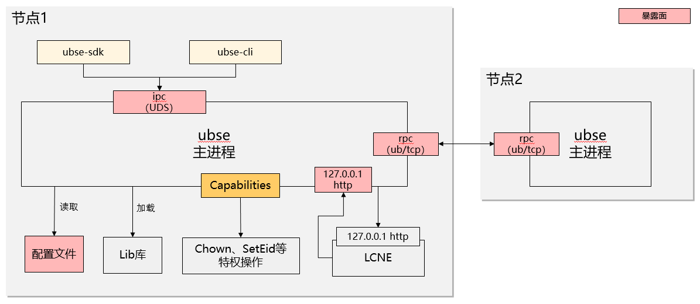

# 安全管理与加固

## 安全设计

### 安全架构

UBS Engine整体的安全目标是，实现权限最小化，同时保证各个暴露面的安全
基于上述目标，UBS Engine的安全架构(如下图)：


- 最小化特权使用：UBSE服务以ubse用户作为运行用户，通过持有必要的Capablities，并且使用时按需开启，实现最小化的特权使用
- 暴露面安全设计：暴露面包括北向uds、东西向rpc通信、配置文件、lib库，这些暴露面通过不同的安全策略，实现暴露面安全，具体策略参考后续章节

### 最小化特权

UBSE服务以ubse用户作为运行用户，特权的使用遵从最小化使用原则，该原则有两层含义：

- 所有的特权都是必需的，没有冗余的特权使用
- 特权按需开启，即使用前开启，特权使用后关闭

#### 程序特权清单

| 序号 | 功能                       | 非root运行需要特权    | 备注                                                         |
| ---- | -------------------------- | --------------------- | ------------------------------------------------------------ |
| 1    | 提升线程优先级（性能要求） | CAP_SYS_NICE          |                                                              |
| 2    | 写Linux审计日志            | CAP_AUDIT_WRITE       |                                                              |
| 3    | 借用内存                   | CAP_DAC_OVERRIDE      | ioctl：/dev/obmm                                             |
| 4    | 修改文件权限               | CAP_FOWNER  CAP_CHOWN | 借用内存完成后，调整借到的设备文件的权限，使用户可用（如果不改权限，设备文件为root 600，用户无法使用）<br />/dev/obmm_shmdev1 |
| 5    | 设置bonding eid            | CAP_NET_ADMIN         | ioctl：/dev/uburma/*<br />ioctl执行后，会额外检查特权CAP_NET_ADMIN |
| 6    | UDS的sock文件创建          | CAP_DAC_OVERRIDE      | 在/run目录下创建 ubse/ubse.sock， 而/run目录是内存文件系统，重启后其子目录会清除，故重启后/run/ubse/ubse.sock需要重建，需要override权限<br/> ubse/ubse.sock 可否放在ubse有权创建的目录下，或者systemd起来时，自动创建. |
| 7    | urma通信                   | CAP_DAC_OVERRIDE      | 依赖关系urma->udma->ummu<br/>ummu依赖下述两个文件：<br/>1）/dev/ummu/tid root:root 600 存储urma通信需要的tokenid，属于敏感信息. <br/>2）/usr/lib64/libummu.so root:root 600 -> 755 |

#### 文件及目录权限设计

UBS Engine主要由三个发布件组成，用于不同的用途，各发布件的文件权限各不相同

| RPM包                                                   | 说明                                   |
| ------------------------------------------------------- | -------------------------------------- |
| ubs-engine-\<version>-\<release>.aarch64.rpm              | 主程序包，包含服务、CLI、配置等        |
| ubs-engine-client-libs-\<version>-\<release>.aarch64.rpm  | 客户端运行时库（供第三方程序动态链接） |
| ubs-engine-client-devel-\<version>-\<release>.aarch64.rpm | 开发包（含头文件与静态库）             |

#### 主程序权限设计

ubs-engine-\<version>-\<release>.aarch64.rpm安装后的权限如下：

| 元素                                 | 类型       | owner     | 权限 | 其它说明                                          |
| ------------------------------------ | ---------- | --------- | ---- | ------------------------------------------------- |
| /usr/bin/ubse                        | 可执行文件 | root:root | 755  |                                                   |
| /usr/bin/ubsectl                     | 可执行文件 | root:root | 755  |                                                   |
| /usr/lib/systemd/system/ubse.service | 配置文件   | root:root | 644  |                                                   |
| /etc/ubse/                           | 目录       | root:root | 755  | 内部文件权限：644                                 |
| /var/log/ubse                        | 目录       | ubse:ubse | 750  | 正在写的日志文件：640 已经记录完毕的日志文件：440 |
| /var/lib/ubse                        | 目录       | ubse:ubse | 750  | 内部文件权限：640 内部目录（cert除外）权限：750   |
| /var/lib/ubse/cert                   | 目录       | ubse:ubse | 700  | 内部文件权限：600                                 |
| /var/run/ubse                        | 目录       | ubse:ubse | 750  | 内部动态创建socket文件，权限：660                 |

#### 户端运行库权限设计

ubs-engine-client-libs-\<version>-\<release>.aarch64.rpm安装后的权限如下：

| 文件                                 | 类型         | owner       | 权限  | 其它说明                                          |
| ------------------------------------ | ------------ | ----------- | ----- | ------------------------------------------------- |
| `/usr/lib64/libubse-client.so.1.0.0` | 动态库二进制 | `root:root` | `755` | 二进制动态库实体                                  |
| `/usr/lib64/libubse-client.so.1`     | 软链接       | `root:root` | `777` | 软链接，指向 `/usr/lib64/libubse-client.so.1.0.0` |

#### 客户端开发包权限设计

ubs-engine-client-devel-\<version>-\<release>.aarch64.rpm安装后的权限如下：

| 文件/目录                      | 类型         | owner       | 权限  | 其它说明                                     |
| ------------------------------ | ------------ | ----------- | ----- | -------------------------------------------- |
| `/usr/include/ubse`            | 目录         | `root:root` | `755` | 目录下头文件（`*.h`）权限：`644`             |
| `/usr/lib64/libubse-client.so` | 软链接       | `root:root` | `777` | 软链接，指向`/usr/lib64/libubse-client.so.1` |
| `/usr/lib64/libubse-client.a`  | 静态库二进制 | `root:root` | `644` | 二进制静态库                                 |

### 暴露面安全设计

UBS Engine的暴露面安全设计，主要分为:

- 基于UDS的对外接口安全设计
- 基于UB/TCP节点间通信安全设计
- UBM对接安全设计
- 配置文件的读取安全设计
- lib库的加载安全设计

#### 基于UDS的对外接口安全设计

**安全策略：**
UBS Engine对外接口的访问入口，是sock文件/run/ubse/ubse.sock，
sock文件的安全访问，基于文件权限控制，其属主为ubse，mode为660，如下：

``` shell
srw-rw---- ubse ubse /run/ubse/ubse.sock
```

- 加入ubse group的用户，才能访问UDS的对外接口
- 同一个资源的管理操作只属于唯一用户：UBSE提供了资源的管理接口，包括创建、修改、删除资源等操作，同一个资源的管理操作，只属于创建该资源的用户

**用户侧的安全配置：**

- 用户需要将app的运行用户通过加入ubse group

**注意事项：**

- 在灵衢通算数据库解决方案中，UBSE组件提供UB远端内存管理代理功能，通过UID/GID等控制最终应用内存权限，和最终应用之间通过内存缓存代理，缓存代理进程通过UDS获取最终应用进程的uid/gid，通过UDS进程间消息发送给UBSE进程，该架构存在一个约束，UBSE无法校验最终应用进程的uid/gid合法性，需要保证UBSE进程和缓存代理进程在同一个信任域。
- UBSE进程和缓存代理进程之间的UDS，需要用户权限控制，支持进程信任域扩展。将内存缓存代理进程所在的用户配置到UBSE的用户组中，控制UDS通信权限来排除非授权进程访问，需要在资料中提示，加入用户组的缓存代理进程需要是可信的，需要保证UDS传入的UID/GID等外部参数合法、有效。

#### 节点间通信安全设计

**安全策略：**

- UBSE默认提供UB(URMA)+TLS的安全建链方式，消减仿冒攻击、信息泄漏等安全风险；

- 同时提供TCP+TLS的安全建链方式、不带安全证书的TCP和不带安全证书的UB(URMA)作为通信协议；

**用户侧的安全配置：**

- 用户在UBSE的配置文件中，切换UB和TCP通信
- 在使用安全证书的情况下，用户需要额外导入身份证书，作为TLS协议的证书凭据
- UBSE提供证书导入工具，方便系统管理员将证书导入UBSE可访问的目录
- UBSE只是证书的使用者，并不提供证书的管理能力(过期检查、更新等)，需要由系统的Owner自行构建证书管理系统 

**安全风险提示：**

- 不开启的TLS的UB(URMA)通信以及纯TCP通信，没有认证和加密，存在仿冒、消息泄漏等安全风险，请确保UBSE运行的软硬件环境是可信的；

#### UBM对接安全设计

**安全策略：**

- 当前安全策略：受UBM仅支持TCP+HTTP、不支持HTTPS的约束，当前UBSE与UBM间通信采用本地回环通信，存在仿冒、消息篡改等威胁，需要客户保证UBSE运行的软硬件环境是可信的；
- 后续安全策略： 待UBM实现UDS通信能力后，UBSE与UBM间通信采用UDS通信机制，通过uds的sock文件权限控制来达成安全访问.

**用户侧的安全配置：**

- 当前安全策略下，无相关安全配置

#### 配置文件读取安全设计

**安全策略：**

- 配置文件的安全，通过文件权限访问控制达成，配置文件的属主为ubse，mode为660

#### Lib库加载安全设计

**安全策略：**UBSE加载lib需保证不会发生非预期的篡改，故只加载下述类型的lib库

- root属主的lib库
- ubse用户属主的lib库
- 其他用户属主的lib库，且mode必须小于等于750

#### 重要安全声明

- UBSE在其安装脚本将/dev/obmm文件的属主改成ubse，获得/dev/obmm的完整控制权
- 默认通信UB(URMA)，没有认证和加密，存在仿冒、消息泄漏等安全风险，需要客户保证UBSE运行的软硬件环境是可信的
- 受UBM仅支持TCP+HTTP、不支持HTTPS的约束，当前UBSE与UBM间通信采用本地回环通信，存在仿冒、消息篡改等威胁，需要客户保证UBSE运行的软硬件环境是可信的；

## 通信矩阵

|源设备|源IP|源端口|目的设备|目的IP|目的端口（侦听）|协议|端口说明|侦听端口是否可更改|认证方式|加密方式|所属平面|版本|特殊场景|备注|
|:----|:----|:----|:----|:----|:----|:----|:----|:----|:----|:----|:----|:----|:----|:----|
|计算节点的控制面IP|1024-65535|计算节点|计算节点的控制面IP|1901|TCP|UBS Engine与UBS Engine之间通信，用于TCP建链之后的心跳和数据传输|是|证书/无|TLS/无|控制平面|:----|:----|:----|双向|
|client端的EID（自动生成分配）|系统随机分配的一个jettyid（1024~10240）|计算节点|Server端的EID（自动生成分配）|公知jettyid：999|UB|UBS Engine与UBS Engine之间通信，用于UB自举建链（UB控制面）|否|NA|NA|控制平面|:----|:----|:----|双向|
|client端的EID（自动生成分配）|系统随机分配的一个jettyid（1024~10240）|计算节点|Server端的EID（自动生成分配）|系统随机分配的一个jettyid（1024~10240）|UB|UBS Engine与UBS Engine之间通信，用于传输数据（UB数据面）|否|NA|NA|控制平面|:----|:----|:----|双向|
