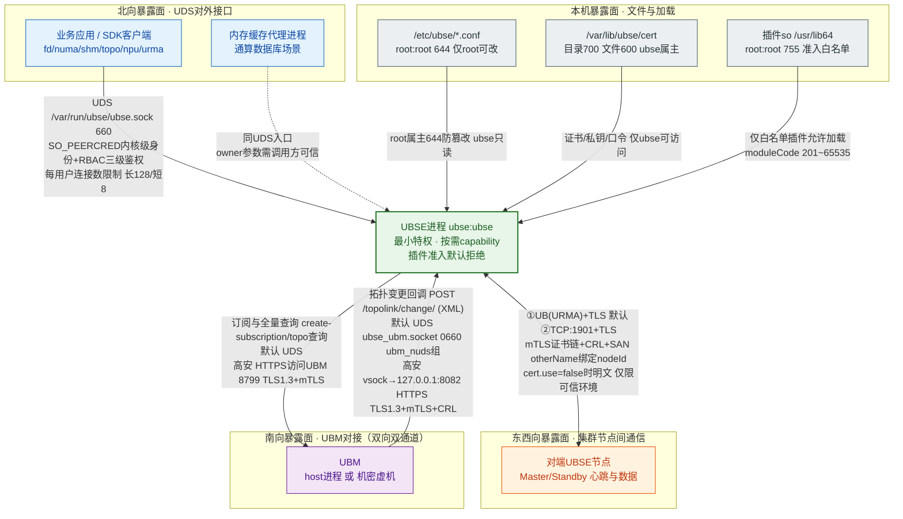

# 安全管理与加固

## 安全设计

### 安全架构

UBS Engine整体的安全目标是，实现权限最小化，同时保证各个暴露面的安全
基于上述目标，UBS Engine的安全架构(如下图)：



- 最小化特权使用：UBSE服务以ubse用户作为运行用户，通过持有必要的Capablities，并且使用时按需开启，实现最小化的特权使用
- 暴露面安全设计：暴露面包括北向UDS、东西向节点间通信、UBM对接、配置文件、lib库，这些暴露面通过不同的安全策略，实现暴露面安全，具体策略参考后续章节

### 最小化特权

UBSE服务以ubse用户作为运行用户，特权的使用遵从最小化使用原则，该原则有两层含义：

- 所有的特权都是必需的，没有冗余的特权使用
- 特权按需开启，即使用前开启，特权使用后关闭

特权收敛由`UbseSecurityModule`在进程初始化时完成（`src/framework/security/`）：

- systemd通过`AmbientCapabilities`授予8个能力：CAP_SYS_NICE、CAP_DAC_OVERRIDE、CAP_FOWNER、CAP_CHOWN、CAP_AUDIT_WRITE、CAP_NET_ADMIN、CAP_SYS_PTRACE、CAP_DAC_READ_SEARCH；`CapabilityBoundingSet`额外保留CAP_SETUID、CAP_SETGID（仅供SEI降级sudo切换uid/gid，见下表第8项）
- 进程启动后，`SetInitialCapabilities`将permitted集收敛为上述8个能力，effective集仅保留5个常驻能力：CAP_SYS_NICE、CAP_DAC_READ_SEARCH、CAP_AUDIT_WRITE、CAP_NET_ADMIN、CAP_SYS_PTRACE
- CAP_DAC_OVERRIDE等非常驻能力保留在permitted集中，业务使用前通过`ChangeOverrideCapability(true)`临时加入effective集，使用完毕后立即移除（内存借用、rmrs页面文件/smap/libvirt操作等路径均遵循该模式）

此外，systemd单元还配置了`MemoryMax`、`CPUQuota`、`CPUAffinity`、`Restart=on-failure`等资源约束；对sysSentry、xalarm等周边组件socket的访问通过`setfacl`按需授权（ExecStartPre），不引入额外特权。

#### 程序特权清单

| 序号 | 功能                       | 非root运行需要特权    | 开启方式         | 备注                                                         |
| ---- | -------------------------- | --------------------- | ---------------- | ------------------------------------------------------------ |
| 1    | 提升线程优先级（性能要求） | CAP_SYS_NICE          | 常驻             |                                                              |
| 2    | 写Linux审计日志            | CAP_AUDIT_WRITE       | 常驻             | 日志路径 /var/log/audit                                      |
| 3    | 借用内存等跨属主文件访问   | CAP_DAC_OVERRIDE      | 按需开启/关闭    | ioctl：/dev/obmm；rmrs page file、smap、libvirt等操作前临时开启，用后关闭 |
| 4    | 修改文件权限               | CAP_FOWNER  CAP_CHOWN | 按需开启/关闭    | 借用内存完成后，调整借到的设备文件的权限，使用户可用（如果不改权限，设备文件为root 600，用户无法使用）<br />/dev/obmm_shmdev1 |
| 5    | 设置bonding eid            | CAP_NET_ADMIN         | 常驻             | ioctl：/dev/uburma/*<br />ioctl执行后，会额外检查特权CAP_NET_ADMIN |
| 6    | 读取其他进程信息           | CAP_DAC_READ_SEARCH  CAP_SYS_PTRACE | 常驻 | 允许读取其他进程的 /proc/* 文件，如 /proc/pid/numa_maps      |
| 7    | urma通信                   | CAP_DAC_OVERRIDE      | 按需开启/关闭    | 依赖关系urma->udma->ummu<br/>ummu依赖下述两个文件：<br/>1）/dev/ummu/tid root:root 600 存储urma通信需要的tokenid，属于敏感信息. <br/>2）/usr/lib64/libummu.so root:root 600 -> 755 |
| 8    | SEI降级执行sysctl提权       | CAP_SETUID  CAP_SETGID | 仅保留在CapabilityBoundingSet | 通过sudo执行sysctl修改内核参数kernel.arm64_sync_sei（命令固定为`sudo /usr/sbin/sysctl -w kernel.arm64_sync_sei=0/1`），sudo为setuid-root二进制，内核执行时需这两个capability允许uid/gid切换；免密范围由/etc/sudoers.d/ubse-sei严格限定为上述两条命令 |
| 9    | UDS的sock目录重建           | CAP_DAC_OVERRIDE      | 按需开启/关闭    | /var/run/ubse安装时由RPM脚本创建并chown为ubse:ubse（755）；/run为内存文件系统，重启后目录被清除，UBSE启动时临时开启该特权重建目录，完成后立即关闭 |

#### 文件及目录权限设计

UBS Engine主要由以下发布件组成，用于不同的用途，各发布件的文件权限各不相同

| RPM包                                                   | 说明                                   |
| ------------------------------------------------------- | -------------------------------------- |
| ubs-engine-\<version>-\<release>.aarch64.rpm              | 主程序包，包含服务、CLI、配置等        |
| ubs-engine-client-libs-\<version>-\<release>.aarch64.rpm  | 客户端运行时库（供第三方程序动态链接） |
| ubs-engine-client-devel-\<version>-\<release>.aarch64.rpm | 开发包（含头文件与静态库）             |
| python3-ubs-engine-\<version>-\<release>.noarch.rpm       | Python SDK                             |
| ubs-engine-virtagent / ucache / rmrs / processmem 子包    | 插件子包（插件so、插件配置、插件头文件） |

#### 主程序权限设计

ubs-engine-\<version>-\<release>.aarch64.rpm安装后的权限如下：

| 元素                                  | 类型       | owner     | 权限  | 其它说明                         |
|-------------------------------------| ---------- | --------- |-----|------------------------------|
| /usr/bin/ubse                       | 可执行文件 | root:root | 755 |                              |
| /usr/bin/ubsectl                    | 可执行文件 | root:root | 755 |                              |
| /usr/lib/systemd/system/ubse.service | 配置文件   | root:root | 644 |                              |
| /etc/ubse/                          | 目录       | root:root | 755 | 内部conf/json文件权限：644；含plugins、topo子目录 |
| /etc/bash_completion.d/cli_commands.sh | 配置文件 | root:root | 644 | CLI补全脚本                   |
| /etc/sudoers.d/ubse-sei             | 配置文件   | root:root | 440 | SEI降级sysctl提权，仅授予ubse用户执行sysctl的免密权限 |
| /var/log/ubse                       | 目录       | ubse:ubse | 750 | 正在写的日志文件：640 已经记录完毕的日志文件：440 |
| /var/lib/ubse                       | 目录       | ubse:ubse | 750 | 内部文件权限：640                   |
| /var/lib/ubse/cert                  | 目录       | ubse:ubse | 700 | TLS证书目录，内部文件权限：600 |
| /var/lib/ubse/data                  | 目录       | ubse:ubse | 750 | 内部文件权限：600                   |
| /var/lib/ubse/lcne_cert             | 目录       | ubse:ubse | 700 | 内部文件权限：600                   |
| /var/run/ubse                       | 目录       | ubse:ubse | 755 | 内部动态创建socket文件，权限：660        |
| /lib/modules/ubse/bandbridge.ko     | 内核模块   | root:root | 644 | 仅AI场景加载，用于和带外UBM通信            |

#### 客户端运行库权限设计

ubs-engine-client-libs-\<version>-\<release>.aarch64.rpm安装后的权限如下：

| 文件                                 | 类型         | owner       | 权限  | 其它说明                                          |
| ------------------------------------ | ------------ | ----------- | ----- | ------------------------------------------------- |
| `/usr/lib64/libubse-client.so.xx.xx.xx` | 动态库二进制 | `root:root` | `755` | 二进制动态库实体                                  |
| `/usr/lib64/libubse-client.so.1`     | 软链接       | `root:root` | `777` | 软链接，指向 `/usr/lib64/libubse-client.so.xx.xx.xx` |

#### 客户端开发包权限设计

ubs-engine-client-devel-\<version>-\<release>.aarch64.rpm安装后的权限如下：

| 文件/目录                      | 类型         | owner       | 权限  | 其它说明                                     |
| ------------------------------ | ------------ | ----------- | ----- | -------------------------------------------- |
| `/usr/include/ubse`            | 目录         | `root:root` | `755` | 目录下头文件（`*.h`）权限：`644`             |
| `/usr/lib64/libubse-client.so` | 软链接       | `root:root` | `777` | 软链接，指向`/usr/lib64/libubse-client.so.1` |
| `/usr/lib64/libubse-client.a`  | 静态库二进制 | `root:root` | `644` | 二进制静态库                                 |

插件子包（virtagent、ucache、rmrs、processmem）安装的插件so位于/usr/lib64（root:root 755），插件配置位于/etc/ubse/plugins/（root:root 644），权限模型与主程序一致。

### 暴露面安全设计

UBS Engine的暴露面安全设计，主要分为:

- 基于UDS的对外接口安全设计
- 基于UB/TCP节点间通信安全设计
- UBM对接安全设计
- 配置文件的读取安全设计
- lib库的加载安全设计

#### 基于UDS的对外接口安全设计

**安全策略：**
UBS Engine对外接口的访问入口，是sock文件/var/run/ubse/ubse.sock，
sock文件的安全访问，基于文件权限控制，其属主为ubse，mode为660，如下：

``` shell
srw-rw---- ubse ubse /var/run/ubse/ubse.sock
```

- 加入ubse group的用户，才能访问UDS的对外接口
- 客户端身份由内核保证：服务端通过SO_PEERCRED获取连接方的uid/gid/pid，不可伪造，不信任报文中的自报身份
- 基于用户-角色-对象的RBAC鉴权（`UbseApiServerAuthManager`）：
  - 每个IPC接口注册时绑定一个权限对象（如mem.shm、mem.fd、topo等），请求到达时按"用户→角色→对象"三级映射校验，无权限则拒绝
  - 内置用户ubse、root映射为admin角色，拥有全部对象权限；自定义用户不允许配置admin角色，自定义角色不允许引用all对象
  - 鉴权配置位于/etc/ubse/ubse_auth_default.conf（[auth.user.default]/[auth.role.default]段），可扩展[auth.user]/[auth.role]段
- 同一个资源的管理操作只属于唯一用户：UBSE提供了资源的管理接口，包括创建、修改、删除资源等操作，同一个资源的管理操作，只属于创建该资源的用户（按uid/用户名比对，root/ubse用户在资源的导入导出相关节点具有管理豁免权）
- 按用户维度的连接数限制：每用户长连接上限128、短连接上限8，防止资源耗尽
- 响应按uid匹配会话下发，防止跨用户消息串扰

**用户侧的安全配置：**

- 用户需要将app的运行用户通过加入ubse group
- 如需限制app可调用的接口范围，在鉴权配置中为该用户分配角色，并为角色分配最小对象集合

**注意事项：**

- 在灵衢通算数据库解决方案中，UBSE组件提供UB远端内存管理代理功能，通过SDK的fd/shm类内存接口（如ubs_mem_fd_create、ubs_mem_fd_permission、ubs_mem_shm_attach）支持调用方通过owner参数（uid/gid/pid）指定资源属主，用于代理场景：由代理进程（如UCache等由中间组件代管最终应用内存的场景）代替最终应用创建/挂载共享内存，并在owner中传入最终应用的uid/gid/pid。UBSE通过SO_PEERCRED校验连接方身份并进行RBAC鉴权，但资源属主以请求中的owner为准，因此需要保证加入ubse用户组的调用方（含各类代理进程）是可信的，保证其传入的owner等外部参数合法、有效。

#### 节点间通信安全设计

**安全策略：**

- 通信协议由配置决定：配置[ubse.rpc] cluster.ipList时使用TCP通信，未配置且环境支持URMA时使用UB(URMA)通信；
- UBSE默认开启TLS（[ubse.rpc] cert.use，缺省值为true），提供UB(URMA)+TLS、TCP+TLS的安全建链方式，消减仿冒攻击、信息泄漏等安全风险；同时支持通过cert.use=false关闭TLS（不带证书的TCP/UB通信）；
- TLS握手阶段的自定义校验（`CertVerifyCallback`，证书链+CRL校验由mTLS基线保障）：
  - 本端身份自校验：解析本端身份证书（/var/lib/ubse/cert/server.pem）SAN扩展字段的otherName（OID 1.3.6.1.4.1.2011.999.1），与本节点nodeId比对，不一致则拒绝握手；
  - 对端证书链与CRL校验：证书链验证失败或证书已吊销则拒绝握手，实现双向身份确认防仿冒；
- 证书相关文件位于/var/lib/ubse/cert/：server.pem（身份证书）、server_key.pem（私钥，0600）、trust.pem（信任CA）、ca.crl（CRL，可选）、key_pwd.txt（私钥口令，0600）

**用户侧的安全配置：**

- 用户在UBSE的配置文件中，通过cluster.ipList切换UB和TCP通信，通过cert.use开关TLS
- 在使用安全证书的情况下，用户需要额外导入身份证书，作为TLS协议的证书凭据
- UBSE提供证书导入工具（ubsectl import cert），方便系统管理员将证书导入UBSE可访问的目录，导入后文件属主ubse、权限0600
- UBSE只是证书的使用者，并不提供证书的管理能力(过期检查、更新等)，需要由系统的Owner自行构建证书管理系统
- 证书的SAN扩展字段otherName（OID 1.3.6.1.4.1.2011.999.1）需要与导入证书所属节点的nodeId保持一致，否则TLS握手会被拒绝

##### 证书 otherName OID 传 nodeId 示例

> 适用于第三方/自建 CA 自行生成节点证书的场景。OID 固定 `1.3.6.1.4.1.2011.999.1`（UTF8String），值必须=本节点 nodeId；引擎握手时用 `VerifyLocalCertOtherName` 比对，不一致拒绝建链。

```bash
NODE_ID=node1                    # ← 必须等于该节点在集群中的 nodeId
CA_CERT=shared_ca/CA/cacert.pem  # 全集群共用同一份 CA
CA_KEY=shared_ca/CA/cakey.pem    # 仅签发机持有

# 1) 生成节点私钥（2048 为最低可接受值，推荐 3072，NIST SP 800-57 建议 2030 年后使用 3072）
openssl genrsa -out certs_node1/server_key.pem 3072

# 2) openssl 配置：把 nodeId 填入 otherName（关键步骤）
cat > certs_node1/san.cnf <<EOF
[ req ]
distinguished_name = dn
req_extensions = v3_req
prompt = no
[ dn ]
CN = ubse-server-${NODE_ID}
[ v3_req ]
basicConstraints = CA:FALSE
keyUsage = critical, digitalSignature, keyEncipherment
extendedKeyUsage = serverAuth, clientAuth
subjectAltName = @alt_names
[ alt_names ]
otherName.1 = 1.3.6.1.4.1.2011.999.1;UTF8:${NODE_ID}
DNS.1 = localhost
EOF

# 3) 生成 CSR（SAN otherName 已携带 nodeId）
openssl req -new -key certs_node1/server_key.pem -config certs_node1/san.cnf \
  -out certs_node1/server.csr

# 4) 用 CA 签发（保留 SAN）
openssl x509 -req -in certs_node1/server.csr -CA "$CA_CERT" -CAkey "$CA_KEY" \
  -CAcreateserial -days 3650 -sha256 \
  -extfile certs_node1/san.cnf -extensions v3_req \
  -out certs_node1/server.pem

# 5) 校验 otherName 已含 nodeId
openssl x509 -in certs_node1/server.pem -noout -text | grep -A6 "Subject Alternative Name"
```

- **单行法**（openssl ≥ 1.1.1）：`openssl req -new -key key.pem ... -addext "subjectAltName=otherName:1.3.6.1.4.1.2011.999.1;UTF8:${NODE_ID}"`。
- **老版本 openssl** 需注册 OID：配置顶部加 `[ new_oids ]` 段 `UBSE_NodeId = 1.3.6.1.4.1.2011.999.1`，再写 `otherName.1 = UBSE_NodeId;UTF8:${NODE_ID}`。
- 导入：`ubsectl import cert -s certs_node1/server.pem -c shared_ca/CA/cacert.pem -k certs_node1/server_key.pem -l shared_ca/CA/ca.crl`。
- 约束：每节点各写各的 nodeId，不得复制同一张证书；otherName ≠ 本节点 nodeId 时握手被拒。

**安全风险提示：**

- 通过cert.use=false关闭TLS后，UB(URMA)通信以及TCP通信没有认证和加密，存在仿冒、消息泄漏等安全风险，请确保UBSE运行的软硬件环境是可信的；

#### UBM对接安全设计

**安全策略：**

- 默认采用UDS通信：UBSE在本端/var/run/ubse/ubse_ubm.socket上提供HTTP over UDS服务，socket属组设置为ubm_nuds、权限0660，仅UBM可访问；UBSE作为客户端通过UDS（/run/ubm/socket/ubm_nuds/restconf.sock）访问UBM，RPM安装时自动将ubse用户加入ubm_nuds组（组不存在时告警并提示手工加入）
- 可选TCP(HTTPS)模式：配置[ubse.ubfm] ubm.server.cid后启用。UBSE本端HTTPS服务仅监听127.0.0.1（端口ubse.server.port，默认8082），作为客户端访问UBM的HTTPS服务（ubm.server.hostname默认localhost，端口ubm.server.port默认8799，需与UBM侦听端口一致）；双向mTLS：最低TLS1.3、强制客户端证书校验、启用CRL校验，启动前对证书/私钥/信任CA/CRL做完整性校验

**用户侧的安全配置：**

- 默认UDS模式无需额外安全配置
- TCP模式需导入证书并配置ubm.server.cid、ubm.server.port、ubse.server.port等参数

#### 配置文件读取安全设计

**安全策略：**

- 配置文件位于/etc/ubse/，属主root:root、权限644，目录755，仅root可修改，UBSE以ubse用户只读访问，防篡改由root属主与系统包管理共同保障
- 敏感文件（TLS证书、私钥、私钥口令）位于/var/lib/ubse/cert/，目录700、文件600，属主ubse:ubse，仅UBSE运行用户可访问

#### Lib库加载安全设计

**安全策略：**

- 插件so的加载路径来自插件配置（/etc/ubse/plugins/plugin_*.conf）中声明的pkg路径，配置文件root:root 644，仅root可修改；
- 插件采用准入白名单机制：仅[ubse_plugin_admission]段中登记的插件（插件名=moduleCode，取值范围201~65535）允许加载并初始化，未登记的插件拒绝加载；
- 插件so由各插件子RPM安装至/usr/lib64，属主root:root、权限755，仅root可写入，保证不会被非预期篡改。

#### 重要安全声明

- UB(URMA)/TCP通信默认开启TLS，但通过cert.use=false关闭TLS后，通信没有认证和加密，存在仿冒、消息泄漏等安全风险，需要客户保证UBSE运行的软硬件环境是可信的
- UBM对接默认使用UDS通信，安全依赖socket文件权限（ubm_nuds组）控制；TCP模式依赖证书体系
- /dev/obmm等设备文件的访问特权由UBSE进程按需开启CAP_DAC_OVERRIDE完成，UBSE安装脚本不修改系统设备文件属主

## 通信矩阵

|源设备|源IP|源端口|目的设备|目的IP|目的端口（侦听）|协议|端口说明|侦听端口是否可更改|认证方式|加密方式|所属平面|版本|特殊场景|备注|
|:----|:----|:----|:----|:----|:----|:----|:----|:----|:----|:----|:----|:----|:----|:----|
|计算节点的控制面IP|1024-65535|计算节点|计算节点的控制面IP|1901|TCP|UBS Engine与UBS Engine之间通信，用于TCP建链之后的心跳和数据传输|是|证书/无|TLS/无|控制平面|:----|:----|:----|双向|
|client端的EID（自动生成分配）|系统随机分配的一个jettyid（1024~10240）|计算节点|Server端的EID（自动生成分配）|公知jettyid：999|UB|UBS Engine与UBS Engine之间通信，用于UB自举建链（UB控制面）|否|NA|NA|控制平面|:----|:----|:----|双向|
|client端的EID（自动生成分配）|系统随机分配的一个jettyid（1024~10240）|计算节点|Server端的EID（自动生成分配）|系统随机分配的一个jettyid（1024~10240）|UB|UBS Engine与UBS Engine之间通信，用于传输数据（UB数据面）|否|NA|NA|控制平面|:----|:----|:----|双向|

## 系统账号说明

ubs engine的运行账号是ubse，所属的用户组是ubse，用户无密码不可登录（/sbin/nologin），用户和用户组在rpm包安装时创建（支持通过UBSE_USER_UID/UBSE_USER_GID环境变量指定UID/GID）。

| 用户          | 描述                                     | 初始密码                                  | 密码修改方法  |
| ------------| ----------------------------- | --------------------------------| ----------------|
| root          | UBS Engine安装用户。         | 用户自定义。                           |使用passwd命令修改。 |
| ubse         | UBS Engine服务所属用户。  |系统用户，无密码，不可登录。 | -                                  |

ubse用户的附加用户组（按安装的子包自动加入）：

| 用户组      | 加入时机                 | 用途                                          |
| ----------- | ------------------------ | --------------------------------------------- |
| ubm_nuds    | 主程序包安装时（组存在时） | 访问UBM的UDS socket（/run/ubm/socket/ubm_nuds/restconf.sock） |
| ubturbo     | rmrs子包安装时           | rmrs插件访问turbo相关资源                     |
| libvirt     | rmrs子包安装时           | rmrs插件访问libvirt                           |
