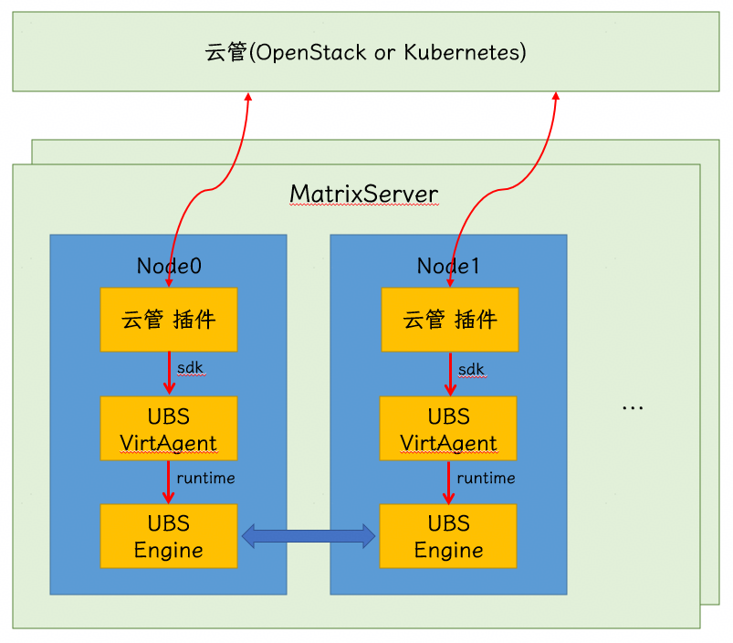
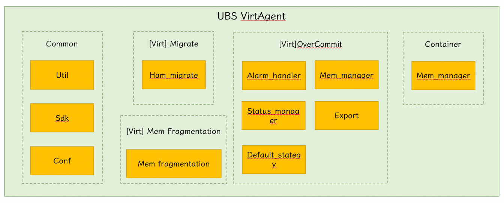
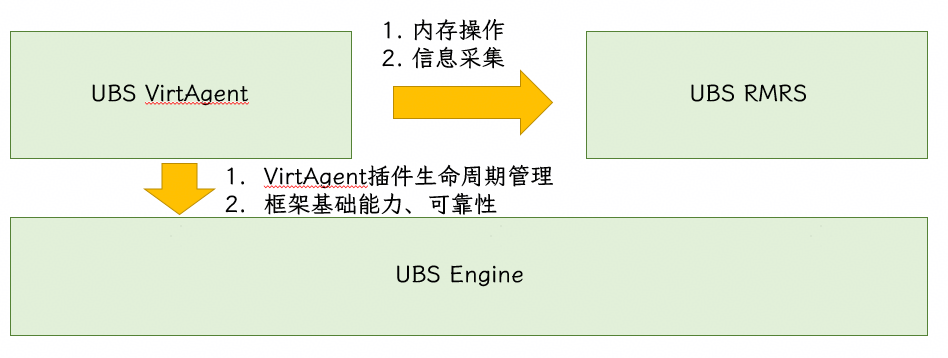

# UBS VirtAgent架构设计

## 1. 软件定位

UBS VirtAgent是UB场景下提供虚拟化（或容器化）特性的核心组件，仅适用于通用计算场景；其包含虚拟化、容器化两大核心场景。具体提供以下特性：

- 虚拟化：内存超分逃生、内存碎片整理、虚拟机确定性热迁移
- 容器化：内存无感借用、容器内存共享

其中，内存相关的借用、归还、冷热页流动等能力，依赖UBS Engine与UBS RMRS等UB生态中其他组件提供。UBS VirtAgent组件，定位是直接与云管生态交互的中间件，让云管生态能轻松的使用UB生态特性，实现更多上述场景下的高级特性。

## 2. 软件部署

在部署形态上，虚拟化与容器化场景大同小异。在说明部署形态之前，需要引入MatrixServer的概念，MatrixServer是构建虚拟化特性的最小部署单元，其中包含云管生态的插件服务、提供UB生态特性并封装高级特性的VirtAgent组件、以及封装UB生态特性的UBS Engine框架。一个云管集群，一般可以对接一个或多个MatrixServer集群。

在形态上，UBS VirtAgent将以UBS Engine的插件形式运行。服务按照去中心化的原则设计，服务能力以节点为单位管理。

## 3. 关键模块

UBS VirtAgent关键特性模块介绍

- **内存超分逃生**
  - Export：定时获取节点采集信息模块，包括节点内存信息、节点虚拟机信息
  - Alarm_handler：告警处理模块，定时采集，如果内存超过告警阈值，则会产生告警，由告警处理模块处理
  - Mem_manager：虚拟化场景下内存管理模块，负责管理借用内存
  - Status_manager：状态管理模块，负责维护虚拟机状态与内存使用状态
  - Default_strategy：默认逃生算法，告警处理时，逃生策略
- **内存碎片整理**
  - Mem_fragmentation：内存碎片转发模块，负责内存碎片场景下转发内存操作接口
- **虚拟机确定性热迁移**
  - Ham_migrate：确定性热迁移管理模块，负责管理虚拟机确定性热迁移流程与借用内存生命周期管理
- **容器化内存借用**
  - Mem_manager：容器化场景下内存管理模块，负责实现内存借用、归还等流程

## 4. 外部依赖

UBS VirtAgent依赖相对来说比较简单，由于是直接对接云管生态的服务。只有两个低层依赖：

1. 依赖UBS Engine：管理VirtAgent插件生命周期、提供基础节点能力、可靠性能力、节点间通信能力
2. 依赖UBS RMRS：提供信息采集接口，内存借用、归还、内存页迁移的能力
