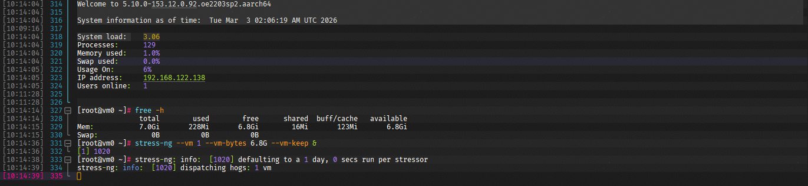
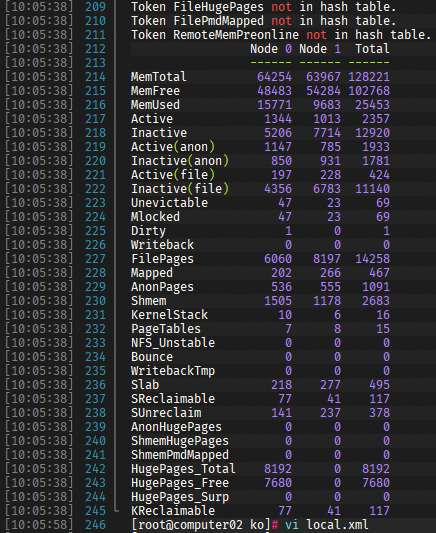
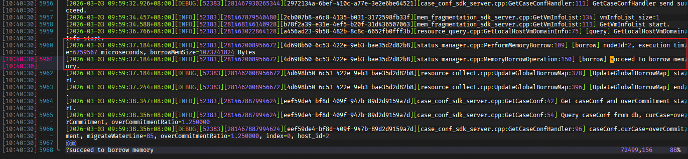
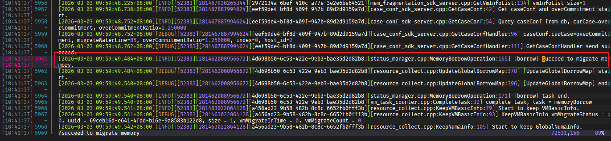
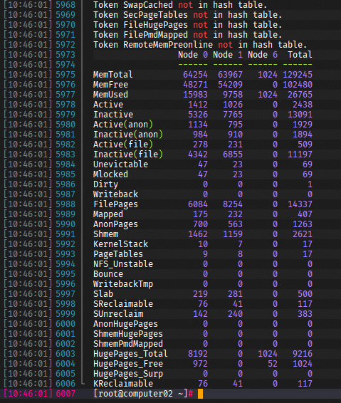

# UBS VirtAgent最佳实践

> UBS VirtAgent基于不同使用场景，提供定制的UB能力特性。本篇内容旨在帮助开发者根据使用场景，快速完成参数配置，避免常见问题。

## 0. 前置步骤

- 按照部署手册, 安装MatrixServer相关服务

## 1. 通用权限配置

- auth-virtagent.conf

```ini
# Authentication configuration file
# Defines base user-role and role-permission mappings with priority flags.

[auth.user]
# Section for user-to-role mappings.
nova=vm_nova
ubs-scheduler=vm_op
matrixplugin=vm_k8s

[auth.role]
# Section for role-to-permission mappings.
vm_nova=vm.migrate,vm.case_conf
vm_op=topo,vm.query,vm.fragmentation,vm.case_conf
vm_k8s=mem.numa,topo,vm.container
```

## 2. 虚拟化 - 内存超分逃生

### 2.1. 修改配置

- plugin_vm.conf

```ini
# Name of the vm plugin. Fixed value: vm.
ubse.plugin.name=vm
# Name of the SO file on which the vm module depends. Fixed value: libvm.so.
ubse.plugin.pkg=libvm.so
# Collection period of the VM module, in seconds. The value range is [1, 60].Any invalid value will be reset to 2.
ubse.plugin.vm.export.interval=2

# Decision configuration item
# Second escape watermark of the decision-making module. A value greater than the second escape watermark will trigger memory borrowing. The value range is [70, 95](and borrow.watermark >= high.watermark + 5).Any invalid value will be reset to 92.
borrow.watermark=92
# High and low watermark percentage configuration with a value range of [0, 100]. A high watermark triggers borrowing or migration, and a low watermark triggers returning. The value is configured to the memory subsystem and used for decision-making modules.
# [Only for virtualization scenario] High watermark percentage configuration with a value range of [65, 90](and high.watermark >= low.watermark + 5)
# [Only for virtualization scenario] Low watermark percentage configuration with a value range of [60, 80]
high.watermark=85
low.watermark=80

# Maximum borrowed memory of a single block, in MB. The value range is {1024, 2048, 3072, 4096} (enumerated values).Any invalid value will be reset to 4096.
borrow.maxMemPerBorrowSize=4096
# Minimum borrowed memory of a single block, in MB. The value range is {1024, 2048, 3072, 4096} (enumerated values). The value of minMemPerBorrowSize should be less than that of maxMemPerBorrowSize.Any invalid value will be reset to 1024.
borrow.minMemPerBorrowSize=1024
# Maximum memory borrowed each time, in MB. The value range is [4096, 20480] ([4G, 20G]). default 16384 (16G).
borrow.maxPerTotalMemBorrowSize=16384
# oom event borrow mem size, in MB. The value range is [1024, 4096].Any invalid value will be reset to 1024.
borrow.oomBorrowMemSize=1024
# Absolute path of the SO file of the customized escape strategy algorithm. The default value is '/usr/lib64/libstrategy.so'.
escape.algorithm.dir=/usr/lib64/libstrategy.so

virt.pageType=1
# Current scenario. The value can be 0 or 1. The value 0 indicates the container scenario, and the value 1 indicates the VM scenario. The default value is 1.
virt.sceneType=1
```

### 2.2. 重启服务

```sh
systemctl restart ubse.service
```

### 2.3. 业务触发场景

- 在已创建或者新建的虚拟机中，持续运行业务，节点大页使用内存持续上涨。（本例中，通过`stress-ng`指令模拟内存使用）



- 当大页内存使用量超过配置文件中`borrow.watermark`时，将触发内存告警逃生。（可以通过`numactl`指令，查看当前大页内存使用情况）



- 此时，可以观察VirtAgent组件日志，就会发现，由于内存上涨，触发告警处理。并完成了内存借用、冷页迁出的逃生动作。




- 再观察大页内存使用，可以发现，新增了一个NUMA（remoteNuma）。虚拟机本地使用的大页减少了，并在新增的NUMA上，使用了内存（代表使用了远端的借用内存）。



## 3. 虚拟化 - 内存碎片

### 3.1. 修改配置

- plugin_vm.conf

```ini
# Name of the vm plugin. Fixed value: vm.
ubse.plugin.name=vm
# Name of the SO file on which the vm module depends. Fixed value: libvm.so.
ubse.plugin.pkg=libvm.so
# Collection period of the VM module, in seconds. The value range is [1, 60].Any invalid value will be reset to 2.
ubse.plugin.vm.export.interval=2

virt.pageType=1
# Current scenario. The value can be 0 or 1. The value 0 indicates the container scenario, and the value 1 indicates the VM scenario. The default value is 1.
virt.sceneType=1
```

### 3.2. 重启服务

```sh
systemctl restart ubse.service
```

### 3.3. 业务触发场景

业务流程主要有云管侧插件管理，请参考MatrixService服务最佳实践

## 4. 虚拟化 - 虚拟机确定性热迁移

### 4.1. 修改配置

```ini
# Name of the vm plugin. Fixed value: vm.
ubse.plugin.name=vm
# Name of the SO file on which the vm module depends. Fixed value: libvm.so.
ubse.plugin.pkg=libvm.so
# Collection period of the VM module, in seconds. The value range is [1, 60].Any invalid value will be reset to 2.
ubse.plugin.vm.export.interval=2

# Maximum timeout for single VM ham migration, in seconds. The value range is [10-10800]. Any invalid value will be reset to 60.
mig.ham.maxTimeout=60
# Current environment whether is ub scene.The default value is true.
mig.isUbScene=true
# Current environment whether using ham migration.The default value is false.
mig.isEnableHamMigrate=false
# Vm memory bound to get migrate strategy,in MB. The value range is [256, 4096].Any invalid value will be reset to 4096.
mig.migrateOneCopyMemoryBound=4096

# Page type configuration, which is used to set the page unit when the cold memory is migrated out. The value can be 0 or 1. The value 0 indicates the 4 KB page, and the value 1 indicates the 2 MB huge page. The default value is 1.
virt.pageType=1
# Current scenario. The value can be 0 or 1. The value 0 indicates the container scenario, and the value 1 indicates the VM scenario. The default value is 1.
virt.sceneType=1
```

### 4.2. 重启服务

```sh
systemctl restart ubse.service
```

### 4.3. 业务触发场景

- 创建允许确定性热迁移条件的虚拟机。即内存规格大于配置文件中`mig.migrateOneCopyMemoryBound`配置项指定大小（小于此配置内存的虚机，会使用OneCopy方式迁移）

- 使用virsh指令进行确定性热迁移

```sh
# vm_name: 虚拟机名称
# vm_node_ip: 虚拟机迁移目标节点IP
virsh migrate {vm_name} --live qemu+tcp://{dest_node_ip}/system tcp://{dest_node_ip}/system  --verbose --unsafe --p2p --ldst
```

- 观察VirtAgent日志，可以发现，触发了内存借用流程

**待补充**

- 虚拟机最终完成了确定性热迁移，观察VirtAgent日志，可以发现，完成迁移后，触发了借用内存的归还流程

**待补充**

## 5. 容器化 - 内存无感借用

### 5.1. 修改配置

```ini
# Name of the vm plugin. Fixed value: vm.
ubse.plugin.name=vm
# Name of the SO file on which the vm module depends. Fixed value: libvm.so.
ubse.plugin.pkg=libvm.so
# Collection period of the VM module, in seconds. The value range is [1, 60].Any invalid value will be reset to 2.
ubse.plugin.vm.export.interval=2

# Page type configuration, which is used to set the page unit when the cold memory is migrated out. The value can be 0 or 1. The value 0 indicates the 4 KB page, and the value 1 indicates the 2 MB huge page. The default value is 1.
virt.pageType=0
# Current scenario. The value can be 0 or 1. The value 0 indicates the container scenario, and the value 1 indicates the VM scenario. The default value is 1.
virt.sceneType=0
```

### 5.2. 重启服务

```sh
systemctl restart ubse.service
```

### 5.3. 业务触发场景

业务流程主要有云管侧插件管理，请参考MatrixService服务最佳实践
