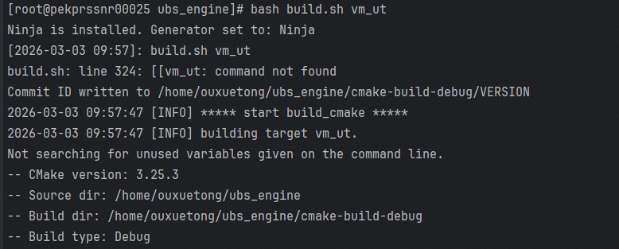

# 单元测试开发指南

>本指南旨在帮助开发者为 `virt_agent` 插件编写高质量的 C++ 单元测试（Unit Test, UT）。我们将介绍整体测试框架、环境搭建、用例编写规范以及运行与覆盖率分析方法，确保代码质量可控、可维护。

## 1 测试框架说明

我们采用 **Google Test (GTest)** 作为核心单元测试框架，并结合 **MockCpp** 实现对外部依赖的行为模拟，以支持复杂模块的隔离测试。

### 1.1 技术栈

| 工具                                                         | 用途                                           |
| ------------------------------------------------------------ | ---------------------------------------------- |
| [GoogleTest](https://google.github.io/googletest/)           | C++ 单元测试框架，提供断言、测试套件管理等功能 |
| [MockCpp](https://github.com/sinojelly/mockcpp)              | 轻量级 C++ Mock 框架，用于接口打桩与行为验证   |
| CMake                                                        | 构建系统，自动化编译与链接测试目标             |
| Bash Script                                                  | 封装构建脚本 (`build.sh`)，简化操作流程        |

### 1.2 编译构建

单元测试使用cmake进行构建和管理，详细内容在`test/UT/`及`test/UT/exclusive_executable/virt_agent`目录下可以进行查看

## 2 环境准备

1. 开发环境搭建参考《UBSE构建指导》

2. 推荐在 `openEuler Linux (ARM64)`下执行项目构建，进入ubs_engine所在目录

   

3. 执行以下命令

```shell
bash build.sh virtagent_ut
```

## 3 增加单元测试用例

详见UBSE的[单元测试开发指南.md](../../../../../docs/test/%E5%8D%95%E5%85%83%E6%B5%8B%E8%AF%95%E5%BC%80%E5%8F%91%E6%8C%87%E5%8D%97.md) 对应章节。

## 4 单元测试用例执行粒度

### 4.1 执行全部单元测试

```shell
bash build.sh virtagent_ut
```

>📌 输出汇总所有测试结果，统计通过/失败数量。




### 4.2 运行单组单元测试

详见UBSE的[单元测试开发指南.md](../../../../../docs/test/%E5%8D%95%E5%85%83%E6%B5%8B%E8%AF%95%E5%BC%80%E5%8F%91%E6%8C%87%E5%8D%97.md) 对应章节。

### 4.3 运行单个测试用例

详见UBSE的[单元测试开发指南.md](../../../../../docs/test/%E5%8D%95%E5%85%83%E6%B5%8B%E8%AF%95%E5%BC%80%E5%8F%91%E6%8C%87%E5%8D%97.md) 对应章节。

## 5 单元测试报告生成

如果只需要生成virt_agent的覆盖率报告，需要将根目录下的`.lcovrc`文件末尾的`include = src/`修改为`include = src/addons/virt_agent`

>⚠️ 注意：只有当所有单元测试 **100% 通过**时，才允许生成覆盖率报告（CI 流水线强制校验）。

```shell
# 生成覆盖率报告，cmake-build-debug/coverage 下
bash build.sh virtagent_ut -C
```

> 📁 默认路径：`./cmake-build-debug/coverage/index.html`

将生成的测试报告使用`scp`或者`xftp`等工具下载到本地进行查看
