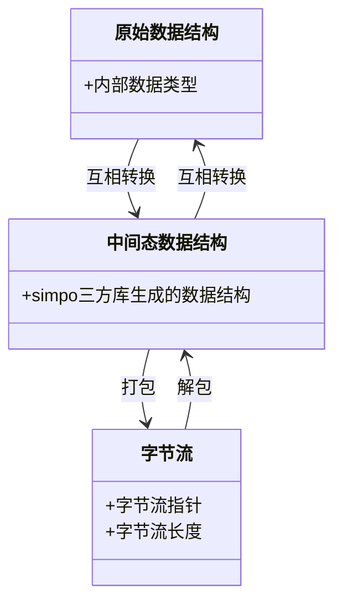

# 基于simpo组件的序列化和反序列化模块设计和使用
## 1.消息序列化简介
### A.是什么
序列化：就是将数据类型转化成字节序列的过程。  
反序列化：就是讲字节序列转化成数据类型的过程。  
序列化成的字节序列会包含对象的类型信息、对象的数据等，说白了就是包含了描述这个对象的所有信息，能根据这些信息“复刻”出一个和原来一模一样的对象。
### B.为什么
持久化：将内存中的各种数据类型转换为字节序列以便于存储介质存储。在读取存储数据时进行反序列化成内存中的数据类型。  
网络传输：网络直接传输数据，但是无法直接传输数据类型，可在传输前序列化，传输完成后反序列化成数据类型。所以所有可在网络上传输的数据类型都必须是可序列化的。
## 2.华为simpo三方库组件的使用介绍
### A:华为simpo三方库处理逻辑与使用流程
首先需要安装simpo三方库，其位于deps下：

#### 处理逻辑

如图，simpo三方库完成两个功能：**生成中间态数据结构；生成将中间态数据结构与字节流互相转化的处理方法**。其中，我们自己需要实现“互相转化”部分的内容以及最后调用“打包”，“解包”的流程。
#### 使用流程
1. 在你工作的目录下根据需要序列化的类型编写.simpo文件，其基本语法[点这里](#a:.simpo的idl文件的基本语法简介)
2. 在你工作的目录下编写CMakeList：
   
   首先调用第一行的`build_message(模块名)`，然后最后一行`add_dependencies(ubse_http_message build_http_message)`用于保证优先编译.simpo文件。**注意要保证本编译目标（在样例中是ubse_http_message）被编译，否则不会执行三方库的simpo文件的生成。**
   然后执行编译，若出现如下的cmake信息：
     
   表示华为simpo三方库找到了你编写的.simpo文件，并构建了所需的中间态的相关文件，其位于cmake缓存目录中：  
   
3. 在simpo库生成的后缀为reader文件中，找到你需要转换的中间数据类型，中间态数据类型名称取决于simpo文件中的命名。  
     
   ↑simpo文件命名，
   ↓对应的类型名称，将`UbseHttpRequest`转换为`ubse_http_UbseHttpRequest_struct`，中间态类型名称规则：命名空间+原类型名+struct  
   
4. 最后，参考simpo库生成的注释，我们需要编写类型互相转换的文件，可参考[点这里](#3.序列化和反序列化举例)来编写相应的类。
### B:.simpo基本语法与中间态数据类型
#### a:.simpo的idl文件的基本语法简介
Simpo序列化工具通过解析后缀名为.simpo的idl文件，生成对应的序列化桩文件，idl文件书写时需要遵循以下基本语法。
1. 包含其他文件  
   可以在当前模式中包含其他模式文件，用于引用文件定义的类型。  
   举例： include "dophi.simpo"; 注意包含文件名后加分号
2. 命名空间  
   帮助程序代码生成相应的命名空间，以避免和他人的结构体冲突。  
   举例：namespace dophi;
3. 注释  
   使用 // 注释或/* */ 注释
4. 简单变量定义  
   变量名: 变量类型，以冒号分隔，以分号结尾。  
   举例： name:string;  
   举例： name:[int32]; 表示int32变长数组，在[]中填入数据类型。
5. 自定义默认值  
   基础类型字段的值等于默认值时，该字段不会产生序列化数据，以减少数据膨胀。用户可以自己定义默认值，定义格式如下：  
   mana:short = 188; 其中188为为字段mana的默认值，如果用户设置mana为188，则不会产生序列化数据；反之若设置mana为0，会产生相关序列化数据。
   如果IDL文件省略不赋值，则mana默认为 0 / NULL。  
   只有table的基础类型字段可以设置默认值。
#### b:中间态数据类型简介
外层结构体定义使用struct 和 table。table是最外层的结构，序列化/反序列化以table为对象。  
**table**  
table 是在 Simpo 中定义对象的主要方式，由一个名称和一个字段列表组成。每个字段都有一个名称，一个类型和一个可选的默认值。  
table 中支持的字段类型如下：

-  基本数据字段类型：int、bool、byte、char、int8、long、uint、float、int32、int16、int64、ubyte、uint8、ulong、short、double、uint32、uint16、uint64、ushort、float32、float64

-  字符串字段类型：string

-  复合类型：table、union、struct、enum

-  以上类型的变长数组和定长数组

**struct**  
struct 和 table 非常相似，只是 struct 没有任何字段是可选的（所以也没有默认值），也不能添加字段。struct只能包含基础类型、枚举、struct以及它们的定长数组。如果确定以后不会进行任何更改，可以使用struct定义。

struct定义要求结构体大小已知，不允许出现变长数组，字符串，table类型。

struct需要自然对齐，对齐规则和C语言的struct对齐规则一样，这是为了在32位和64位机器上的struct大小相同。struct内必须要有字段，不能为空。

**enum**

定义一系列命名常量，每个命名常量可以分别给一个定值，也可以默认的从前一个值增加一。默认的第一个值是 0。指定枚举的基本整型，然后确定用这个枚举类型声明的每个字段的类型。

通常，只应添加枚举值，不要去删除枚举值。

枚举类型是用户必须设定的，且只能为整型和bool；为bool时最多有两个枚举值（0和1）。另外，char不能作为枚举类型，因为C语言中char类型的符号是不确定的。

枚举变量的值必须在枚举类型的范围内；若枚举类型是有符号的，枚举值可以为负值。按照定义顺序，枚举变量的值必须保持递增，不能有相同的枚举值。enum内必须要有字段，不能为空。

## 3.序列化和反序列化举例
1. 文件位置和结构  
   序列化和反序列化的代码放在“你的项目路径/message”下面，一般需要两个文件：序列化对象对应的.simpo文件和提供序列化/反序列化方法的
   文件。
2. 序列化和反序列化方法的书写  
   书写完对应的.simpo文件后，编译会在build/output/message目录下生成如下桩文件：  
   ubse_resource_config_builder.h  //序列化函数实现。  
   ubse_resource_config_reader.h   //table、struct、union、enum的C语言定义，以及反序列化函数实现。
3. 实现流程与代码样例
   流程图：
   [simpo](https://clouddragon.huawei.com/cloudmodeling/myspace/diagram?diagramId=596438f7eb424879a4c0e234c67a470a)
   代码样例：
```c++
class UbseResourceConfigSimpo : public UbseBaseMessage {
public:
    UbseResourceConfigSimpo() = default;

    explicit UbseResourceConfigSimpo(UbseResourceConfigMessage messageInput) : message(messageInput){};

    ~UbseResourceConfigSimpo();

    explicit UbseResourceConfigSimpo(uint8_t *rawData, uint32_t size);

    UbseResult PreSerialize();

    UbseResult Serialize() override;

    UbseResult Deserialize() override;

    UbseResult TransDeserialize();

    void Free();
    void FreeUbseConfigTable();

    UbseResourceConfigMessage GetMessage();

//成员声明
private:
    UbseResourceConfigMessage message; // 原始数据类型
    ubse_resource_mgr_message_UbseResourceConfigMessage_t rootTable{}; // 中间态数据类型
    ubse_resource_mgr_message_UbseResourceConfigMessage_t *outputTable = nullptr;
    ubse_resource_mgr_message_UbseConfig_t ubseConfigTable{};
};

//函数实现
namespace ubse::resource_mgr::message {
UBSE_DEFINE_THIS_MODULE("ubse");

UbseResourceConfigSimpo::UbseResourceConfigSimpo(uint8_t *rawData, uint32_t size)
{
    SetInputRawData(rawData, size);
}

UbseResourceConfigSimpo::~UbseResourceConfigSimpo()
{
    SafeDeleteArray(mOutputRawData, sizeof(mOutputRawData)); // 析构时safedelete
    ubse_resource_mgr_message_UbseResourceConfigMessage_free_unpacked(&rootTable);
}

// 序列化总流程：将结构体转化为中间态，再转化成字节流
UbseResult UbseResourceConfigSimpo::Serialize()
{
    UbseResult ret = PreSerialize(); // 将结构体转化为rootTable
    if (ret != UBSE_OK) {
        Free();
        return ret;
    }
    mOutputRawDataSize = ubse_resource_mgr_message_UbseResourceConfigMessage_get_packed_size(&rootTable);
    if (mOutputRawDataSize == 0) {
        Free();
        return UBSE_ERROR;
    }

    mOutputRawData = new (std::nothrow) uint8_t[mOutputRawDataSize];
    if (mOutputRawData == nullptr) {
        UBSE_LOG_ERROR << "UbseResourceConfigMessage mOutputRawData new failed.";
        Free();
        return UBSE_ERROR_NULLPTR;
    }
    // 调用builder函数,将rootTable转化为字节流
    VOS_UINT32 writeSize =
        ubse_resource_mgr_message_UbseResourceConfigMessage_pack(mOutputRawData, mOutputRawDataSize, &rootTable);
    if (writeSize == 0) {
        UBSE_LOG_ERROR << "UbseResourceConfigMessage mOutputRawData new failed.";
        Free();
        return UBSE_ERROR;
    }
    Free();
    return UBSE_OK;
}

// 具体序列化，结构体转换为roottable
UbseResult UbseResourceConfigSimpo::PreSerialize()
{
    (void)memset_s(&rootTable, sizeof(rootTable), 0, sizeof(rootTable));

    // vector的长度
    rootTable.configs_len = message.configs.size();

    rootTable.configs = new (std::nothrow) ubse_resource_mgr_message_UbseConfig_t[rootTable.configs_len];

    if (!rootTable.configs) {
        UBSE_LOG_ERROR << "UbseResourceConfigMessage Serial new failed!";
        return UBSE_ERROR;
    }
    // 序列化vector，每个vector元素各自序列化
    // 填充具体数据
    for (size_t j = 0; j < message.configs.size(); ++j) {
        // 转换元素的类型
        UbseResult ret = UbseConfigPreSerialize(message.configs[j], ubseConfigTable);
        if (ret != UBSE_OK) {
            UBSE_LOG_ERROR << "UbseResourceConfigMessage pre Serial new failed!";
            FreeUbseConfigTable();
            return UBSE_ERROR;
        }
        // 转换结果赋值
        rootTable.configs[j] = ubseConfigTable;
    }
    UBSE_LOG_INFO << "UbseResourceConfigSimpo PreSerialize Success";
    return UBSE_OK;
}
// 反序列化：调用builder.h中的反序列化方法unpack将字节流转化为中间状态rootTable
UbseResult UbseResourceConfigSimpo::Deserialize()
{
    outputTable =
        ubse_resource_mgr_message_UbseResourceConfigMessage_unpack(mInputRawData, mInputRawDataSize, &rootTable);
    if (outputTable == nullptr) {
        return UBSE_ERROR;
    }
    UbseResult ret = TransDeserialize();
    if (ret != UBSE_OK) {
        UBSE_LOG_ERROR << "UbseResourceConfig deserialize failed, err code:" << ret;
    }
    Free();
    return ret;
}
// 反序列化赋值，将中间数据类型转化为原始数据
UbseResult UbseResourceConfigSimpo::TransDeserialize()
{
    (void)memset_s(&message, sizeof(message), 0, sizeof(message));

    for (uint32_t i = 0; i < rootTable.configs_len; i++) {
        UbseOrchestrationConfig tempUbseConfig({ rootTable.configs[i].name, rootTable.configs[i].kind,
            rootTable.configs[i].node, rootTable.configs[i].ref, rootTable.configs[i].spec,
            rootTable.configs[i].status });
        message.configs.push_back(tempUbseConfig);
    }
    return UBSE_OK;
}

// free rootTable.configs的内存
void UbseResourceConfigSimpo::Free()
{
    if (rootTable.configs == nullptr) {
        return;
    }
    for (size_t i = 0; i < rootTable.configs_len; i++) {
        SafeDelete(rootTable.configs[i].name);
        SafeDelete(rootTable.configs[i].kind);
        SafeDelete(rootTable.configs[i].node);
        SafeDelete(rootTable.configs[i].ref);
        SafeDelete(rootTable.configs[i].spec);
        SafeDelete(rootTable.configs[i].status);
    }
}

// free ubseConfigTable的内存
void UbseResourceConfigSimpo::FreeUbseConfigTable()
{
    SafeDelete(ubseConfigTable.name);
    SafeDelete(ubseConfigTable.kind);
    SafeDelete(ubseConfigTable.node);
    SafeDelete(ubseConfigTable.ref);
    SafeDelete(ubseConfigTable.spec);
    SafeDelete(ubseConfigTable.status);
}

UbseResourceConfigMessage UbseResourceConfigSimpo::GetMessage()
{
    return this->message;
}
}
```
## 4.序列化类的使用
在ubse项目中，在经由通信模块收发信息的过程中需要注册该类型以进行序列化和反序列化。  
具体的，以使用Rpc通信为例，需要调用该函数来注册：  
  
在Treq和TRsp部分声明本章编写的序列化类型，例如，你需要发的请求的类型为A，你为他编写了类型ASimpo,那么你可以这样注册：
```cpp
ret = RegRpcService<ASimpo, BSimpo>(handlerPtr);
```
注意：通信框架收消息会自动调用该类中的序列化，反序列化函数。因此注意时调用时按需使用。
详情可参考：https://3ms.huawei.com/hi/group/3957217/wiki_7899521.html?for_statistic_from=all_group_wiki#Com 查看通信模块使用注意事项。