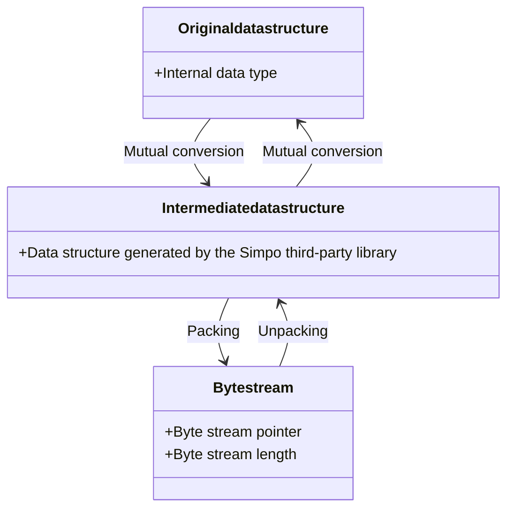

# Design and Usage of the Serialization and Deserialization Modules Based on the Simpo Component

## 1. Introduction to Message Serialization

### A. What?

Serialization is a process of converting a data type into a byte sequence. 
Deserialization is a process of converting a byte sequence into a data type. 
The serialized byte sequence contains the object's type information, its data, and essentially all the details that describe the object. In other words, it includes everything needed to recreate an object identical to the original.

### B. Why?

Persistence: Various data types in memory are converted into byte sequences for storage in storage media. When the stored data is read, it is deserialized into the data type in memory. 
Network transmission: Data is directly transmitted over the network, but data types cannot be directly transmitted. Data can be serialized before transmission and deserialized into data types after transmission. Therefore, all data types that can be transmitted over the network must be serializable.

## 2. Usage of Huawei Simpo Third-Party Library Components

### A: Processing Logic and Usage Process of the Huawei Simpo Third-Party Library

First, install the Simpo third-party library, which is located in the **deps** directory.


#### Processing logic



As shown in the figure, the Simpo third-party library provides two functions: **generating intermediate data structures and generating methods to convert between intermediate data structures and byte streams**. We need to implement the "mutual conversion" part and finally invoke the "packing" and "unpacking" processes.

#### Usage Process

1. Write a `.simpo` file based on the type to be serialized in your working directory. For its basic syntax, see [a. Basic Syntax of `.simpo` IDL Files](#a-basic-syntax-of-simpo-idl-files).
2. Write a CMakeLists file in your working directory.
   
   First, invoke `build_message(module name)` in the first line and then `add_dependencies(ubse_http_message build_http_message)` in the last line to preferentially compile the `.simpo` file. **Ensure that the compilation target (ubse_http_message in the example) is compiled. Otherwise, the `.simpo` file of the third-party library will not be generated.**
   Then, perform the compilation. If the following CMake information is displayed:
     
   It indicates that the Huawei Simpo third-party library has located the `.simpo` file you wrote and generated the necessary intermediate files, which are stored in the CMake cache directory. 
   
3. Locate the intermediate data type to be converted in the `.reader` file generated by the Simpo library. The name of the intermediate data type depends on the naming defined in the `.simpo` file. 
     
   ↑ Naming of the `.simpo` file
   ↓ Corresponding type name, converting `UbseHttpRequest` to `ubse_http_UbseHttpRequest_struct`. The name of an intermediate data type is in the format of namespace + original type name + struct. 
   

4. Finally, based on the comments generated by the Simpo library, we need to write the file for type conversion. For details about how to write the corresponding class, [click here](#3._Serialization_and_Deserialization_Examples).

### B. Basic Syntax and Intermediate Data Types of `.simpo` Files

#### a. Basic Syntax of `.simpo` IDL Files

The Simpo serialization tool parses `.simpo` IDL files and generates the corresponding serialization stub files. When writing IDL files, the following basic syntax rules must be followed:

1. Including other files 
   Other schema files can be included in the current schema to reference types defined in those files. 
   Example: include "dophi.simpo"; (Note that the file name is followed by a semicolon.)
2. Namespace 
   Helps the program code generate the corresponding namespace to avoid conflicts with other structures. 
   Example: namespace dophi;
3. Comments 
   Use // for single-line comments or /* */ for block comments.
4. Simple variable definition 
   Variable name and type are separated by a colon, ending with a semicolon. 
   Example: name:string; 
   Example: name:[int32]; (This indicates a variable-length array of int32.) The data type is specified inside the brackets ([]).
5. Custom default values 
   When the value of a basic type field is equal to its default value, no serialization data is generated, reducing data expansion. Users can define default values in the following format: 
   mana:short = 188; In this example, 188 is the default value of the mana field. If mana is set to 188, no serialization data is generated. If mana is set to 0, serialization data is generated.
   If the IDL file omits assignment, mana defaults to 0 / NULL. 
   Default values can be set only for basic type fields in tables.

#### b: Introduction to Intermediate Data Types

The outer structure is defined using struct and table. A table is the outermost structure, and serialization/deserialization is performed with the table as the object. 
**table**  
A table is the primary way to define objects in Simpo. It consists of a name and a list of fields. Each field has a name, a type, and an optional default value. 
Supported field types in a table include:

- Basic data types: int, bool, byte, char, int8, long, uint, float, int32, int16, int64, ubyte, uint8, ulong, short, double, uint32, uint16, uint64, ushort, float32, float64

- String type: string

- Composite types: table, union, struct, enum

- Variable-length arrays and fixed-length arrays of the preceding types

**struct**  
A struct is very similar to a table, except that a struct has no fields are optional (so there are no default values), and no fields can be added. A struct can only contain basic types, enums, other structs, and their fixed-length arrays. If you are certain that no changes will be made later, you can use a struct.

Struct definitions require the struct size to be known. Variable-length arrays, strings, and table types are not allowed.

Structs must be naturally aligned, following the same alignment rules as C language structs, ensuring identical struct sizes on both 32-bit and 64-bit machines. A struct must contain fields and cannot be empty.

**enum**

An enum defines a series of named constants. Each named constant can be assigned a fixed value, or by default incremented by one from the previous value. The first value defaults to 0. You specify the basic integer type of the enum, which determines the type of each field declared with this enum.

Typically, you should only add enum values, not delete them.

Enum types must be specified by the user and can only be integer or bool. For bool, there can be at most two values (0 and 1). In addition, char cannot be used as an enum type because its signedness is undefined in C.

Enum variable values must fall within the defined range. If the enum type is signed, values may be negative. Enum values must increase in definition order and cannot be duplicated. An enum must contain fields and cannot be empty.

## 3. Serialization and Deserialization Examples

1. File location and structure 
   The serialization and deserialization code is stored in the "your project path/message" directory. Typically, two files are required: the `.simpo` file corresponding to the serialized object and the file providing the serialization/deserialization methods.
    
2. Writing serialization and deserialization methods 
   After the corresponding `.simpo` file is written, compilation will generate the following stub files in the "build/output/message" directory: 
   ubse_resource_config_builder.h // serialization function implementation 
   ubse_resource_config_reader.h // C language definitions of table, struct, union, and enum, as well as deserialization function implementation
3. Implementation process and code samples
   Flowchart:
   [simpo](https://clouddragon.huawei.com/cloudmodeling/myspace/diagram?diagramId=596438f7eb424879a4c0e234c67a470a)
   Code sample:

```c++
class UbseResourceConfigSimpo : public UbseBaseMessage {
public:
    UbseResourceConfigSimpo() = default;

    explicit UbseResourceConfigSimpo(UbseResourceConfigMessage messageInput) : message(messageInput){};

    ~UbseResourceConfigSimpo();

    explicit UbseResourceConfigSimpo(uint8_t *rawData, uint32_t size);

    UbseResult PreSerialize();

    UbseResult Serialize() override;

    UbseResult Deserialize() override;

    UbseResult TransDeserialize();

    void Free();
    void FreeUbseConfigTable();

    UbseResourceConfigMessage GetMessage();

// Member declaration
private:
    UbseResourceConfigMessage message; // Original data type
    ubse_resource_mgr_message_UbseResourceConfigMessage_t rootTable{}; // Intermediate data type
    ubse_resource_mgr_message_UbseResourceConfigMessage_t *outputTable = nullptr;
    ubse_resource_mgr_message_UbseConfig_t ubseConfigTable{};
};

// Function implementation
namespace ubse::resource_mgr::message {
UBSE_DEFINE_THIS_MODULE("ubse");

UbseResourceConfigSimpo::UbseResourceConfigSimpo(uint8_t *rawData, uint32_t size)
{
    SetInputRawData(rawData, size);
}

UbseResourceConfigSimpo::~UbseResourceConfigSimpo()
{
    SafeDeleteArray (mOutputRawData, sizeof (mOutputRawData)); // Safe delete during destruction
    ubse_resource_mgr_message_UbseResourceConfigMessage_free_unpacked(&rootTable);
}

// General serialization process: Convert the structure to an intermediate state and then to a byte stream.
UbseResult UbseResourceConfigSimpo::Serialize()
{
    UbseResult ret = PreSerialize(); // Convert the structure into a root table.
    if (ret != UBSE_OK) {
        Free();
        return ret;
    }
    mOutputRawDataSize = ubse_resource_mgr_message_UbseResourceConfigMessage_get_packed_size(&rootTable);
    if (mOutputRawDataSize == 0) {
        Free();
        return UBSE_ERROR;
    }

    mOutputRawData = new (std::nothrow) uint8_t[mOutputRawDataSize];
    if (mOutputRawData == nullptr) {
        UBSE_LOG_ERROR << "UbseResourceConfigMessage mOutputRawData new failed.";
        Free();
        return UBSE_ERROR_NULLPTR;
    }
    // Invoke the builder function to convert the root table into a byte stream.
    VOS_UINT32 writeSize =
        ubse_resource_mgr_message_UbseResourceConfigMessage_pack(mOutputRawData, mOutputRawDataSize, &rootTable);
    if (writeSize == 0) {
        UBSE_LOG_ERROR << "UbseResourceConfigMessage mOutputRawData new failed.";
        Free();
        return UBSE_ERROR;
    }
    Free();
    return UBSE_OK;
}

// Serialize the structure to a root table.
UbseResult UbseResourceConfigSimpo::PreSerialize()
{
    (void)memset_s(&rootTable, sizeof(rootTable), 0, sizeof(rootTable));

    // Vector length
    rootTable.configs_len = message.configs.size();

    rootTable.configs = new (std::nothrow) ubse_resource_mgr_message_UbseConfig_t[rootTable.configs_len];

    if (!rootTable.configs) {
        UBSE_LOG_ERROR << "UbseResourceConfigMessage Serial new failed!";
        return UBSE_ERROR;
    }
    // Serialize vectors. Each vector element is serialized separately.
    // Fill in specific data.
    for (size_t j = 0; j < message.configs.size(); ++j) {
        // Convert the element type.
        UbseResult ret = UbseConfigPreSerialize(message.configs[j], ubseConfigTable);
        if (ret != UBSE_OK) {
            UBSE_LOG_ERROR << "UbseResourceConfigMessage pre Serial new failed!";
            FreeUbseConfigTable();
            return UBSE_ERROR;
        }
        // Assign the conversion result.
        rootTable.configs[j] = ubseConfigTable;
    }
    UBSE_LOG_INFO << "UbseResourceConfigSimpo PreSerialize Success";
    return UBSE_OK;
}
// Deserialization: Invoke the unpack method in builder.h to convert the byte stream into the intermediate state rootTable.
UbseResult UbseResourceConfigSimpo::Deserialize()
{
    outputTable =
        ubse_resource_mgr_message_UbseResourceConfigMessage_unpack(mInputRawData, mInputRawDataSize, &rootTable);
    if (outputTable == nullptr) {
        return UBSE_ERROR;
    }
    UbseResult ret = TransDeserialize();
    if (ret != UBSE_OK) {
        UBSE_LOG_ERROR << "UbseResourceConfig deserialize failed, err code:" << ret;
    }
    Free();
    return ret;
}
// Deserialize the value and convert the intermediate data type into the original data.
UbseResult UbseResourceConfigSimpo::TransDeserialize()
{
    (void)memset_s(&message, sizeof(message), 0, sizeof(message));

    for (uint32_t i = 0; i < rootTable.configs_len; i++) {
        UbseOrchestrationConfig tempUbseConfig({ rootTable.configs[i].name, rootTable.configs[i].kind,
            rootTable.configs[i].node, rootTable.configs[i].ref, rootTable.configs[i].spec,
            rootTable.configs[i].status });
        message.configs.push_back(tempUbseConfig);
    }
    return UBSE_OK;
}

// Free the memory of rootTable.configs.
void UbseResourceConfigSimpo::Free()
{
    if (rootTable.configs == nullptr) {
        return;
    }
    for (size_t i = 0; i < rootTable.configs_len; i++) {
        SafeDelete(rootTable.configs[i].name);
        SafeDelete(rootTable.configs[i].kind);
        SafeDelete(rootTable.configs[i].node);
        SafeDelete(rootTable.configs[i].ref);
        SafeDelete(rootTable.configs[i].spec);
        SafeDelete(rootTable.configs[i].status);
    }
}

// Free the memory of ubseConfigTable.
void UbseResourceConfigSimpo::FreeUbseConfigTable()
{
    SafeDelete(ubseConfigTable.name);
    SafeDelete(ubseConfigTable.kind);
    SafeDelete(ubseConfigTable.node);
    SafeDelete(ubseConfigTable.ref);
    SafeDelete(ubseConfigTable.spec);
    SafeDelete(ubseConfigTable.status);
}

UbseResourceConfigMessage UbseResourceConfigSimpo::GetMessage()
{
    return this->message;
}
}
```

## 4. Usage of Serialization Classes

In the UBSE project, this type needs to be registered for serialization and deserialization during the process of sending and receiving information through the communication module. 
Specifically, using RPC communication as an example, you need to invoke the following function to register: 
  
In the Treq and TRsp parts, declare the serialization types written in this chapter. For example, if the request type you need to send is A and you have written the ASimpo type for it, you can register it as follows:

```cpp
ret = RegRpcService<ASimpo, BSimpo>(handlerPtr);
```

Note: The communication framework automatically invokes the serialization and deserialization functions in this class when receiving messages. Therefore, use them as needed when invoking.
For details, see the precautions for using the communication module at https://3ms.huawei.com/hi/group/3957217/wiki_7899521.html?for_statistic_from=all_group_wiki#Com.
